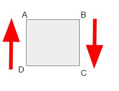
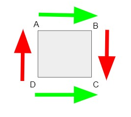
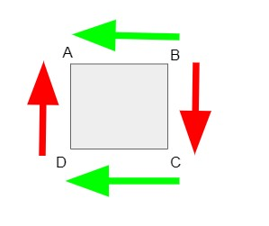
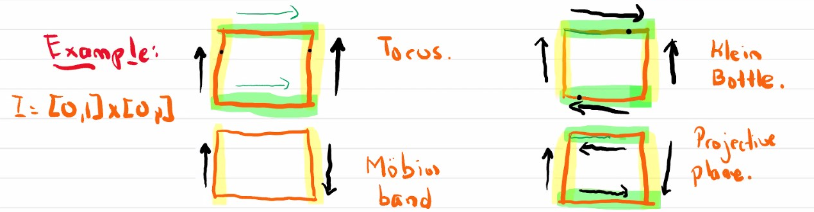

## Question

Consider a Mobius band $M$. Its boundary is a loop.

Glue the first half of the boundary with
the second half with the same orientation to get some new space $K$. Prove that $K$ is a Klein bottle.

Give a hand waving proof of this fact, this means, make drawings and brief comments that are convincing
and careful but you do not have to provide the explicit quotient maps.

## Solution

Given a mobius band M, with its boundary, we first choose an orientation, and we have its boundary split into first half $AB$, and second half $BC$ where $C=A$. We cut the band across $AB$ so that the whole band is still one piece.

We claim that, and we have already known, according to the lecture note, the following square with "gluing annotation" stands for cutted mobius , where $D=B$. 

*Note 1: If we start from the square, after gluing mobius, we will notice that, $B = D, A = C$, and it is natural to see there is only one boundary, since $\vec{AB}$ continues to $\vec{DC}$ which eventually goes back to $A$. So we can claim after cutting, we can get this square.* 

*Note 2: Because there is another orientation, where we starts from $A(C)$ first go to $D(B)$ then go back to A*.

According to the problem, we need to start with $A$ and "attach the first half to the second half in same **orientation**." According to the above discussion, we either goes like $AB(D)C$ or $A(C)D(B)A$.  That means attach $\vec{AB}$ with $\vec{DC}$ or attaching $\vec{BA}$ to $\vec{CD}$.

This will result the following two annotated squares.

Look back at the given definiion of Klein Bottle in the lecture: 

We can conclude both of the attach notation are equivalent to the given definition modulo some rotation. The first drawing can be done by rotating given definition to the right; the second one can be done by rotating to the left. The hand waves the proof.