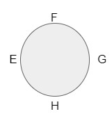

## Question
Consider a Mobius Band $M$ and the closed unit disk $D$ in $\reals^2$

Glue the boundary of $D$ to
the boundary of $M$. 

The boundary of $D$ should go around the boundary of M exactly once. Prove that
the space you obtain is the projective plane $\reals \mathbb{P}^2$.

Give a hand waving proof of this fact, this means, make drawings and brief comments that are convincing
and careful but you do not have to provide the explicit quotient maps.

### Solution:

Given arbitrary mobius band $M$.

We have already known, according to the lecture note, and reasoning in Q3, after we cut mobius band in half, we get the following square with "gluing annotation" stands for mobius. 

We can see there is only one boundary, with two kinds of orientation -- $AB(D)C$ and $A(C)D(B)A$.

Now given the disc $D$, with two points annotated on it, we also have two orientation -- $EFGH$ or $EHGF$.

Since the two boundary will need to glue to each other "exactly once", that means we will stick to one orientation through the gluing -- We need to glue $EFGH$ to $AB(D)C$ or to $A(C)D(B)A$, this is the only two possibilities. 

To make things clear, let's cut the disc into two and first glue each semicircle onto the square and then glue the semicirlces back. In other words, we would have the following two semicircles:

We have two ways to glue:

(Note, in the following, all the sequence of points has order information, i.e. $AB$ is just $\vec{AB}$)
#### glue $EFGH$ to $AB(D)C$

That means we will glue $E_1FG_1$ to $AB$ and $G_2HE_2$ to $DC$, and then we will need to glue $E_1G_1$ to $E_2G_2$ as well.

And we will have the following picture:

The two different green arrow explains how $E_1FG_1$ to $AB$ and $G_2HE_2$ to $DC$.  As the next step, we will need to glue $E_1G_1$ back to $E_2G_2$, where the blue arrows indicate the gluing strategy. 

After the two semi-circles are glued, we can see that this is whole picture is exactly the definition of Projective Space, module rotations.

#### glue $EFGH$ to $A(C)D(B)A$

This means we need to glue $E_1FG_1$ to $CD$; $G_2HE_2$ to $BA$. and finally $E_2G_2$ to $E_1G_1$ (in blue arrow)

This turns out to be a projective space as well.

This hand waves the proof.