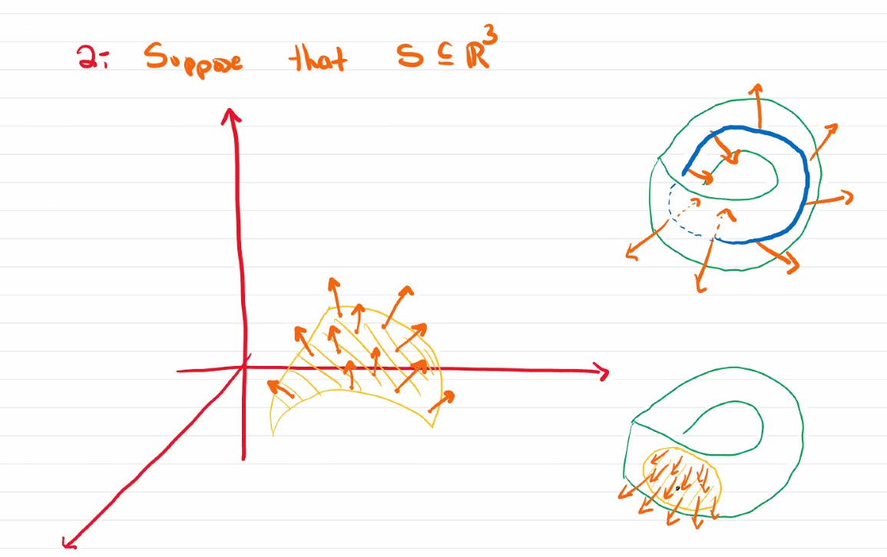

# UofT MAT327-Lec11
1.  Office hour: the TA will have some office hours next week.
    1.  At the regular office hours (Wednesday, Friday)

# Covers!

A motivation: In topology, we care about global properties, and local properties. Global properties are those dependending on the whole space. While local properties are those occur in neighbourhood around each point.

There are several properties that occur for a space according to two things: 
1. They occur locally (i.e. around each point)
2. There is an agreement of how property changes as we change the neighbourhood

Basically cover connects local and global.

### Example
1. In a topologial space, an open set  $U \subseteq X$ (subspace) is called euclidean if it is homeomorphic to an open set of some $\mathbb{R}^n$ (as subspace topology)
   1. This is an example called local euclidean space
2. Suppose that $S \subseteq \reals^3$, 
   1. 
   2. We can see that euclidean is "local-able", but orientability is not "local-able"
   3. something is locally orientable, but not globally orientable

***

What these examples are showing -- is that gluing "properties" in a topological space is not that easy. 

### Definition
Let $X$ be a topological space, and $\{U_\alpha\}_{\alpha \in \Lambda}$ is just a cover (not necessarily open). **A cover** $\{V_\beta\}_{\beta \in \Gamma}$ is a refinement if for every $V_\beta$, there is a $U_\alpha$ s.t. $V_\beta \subseteq U_\alpha$

### Definition
A cover $\{U_\alpha\}_{\alpha \in \Lambda}$ is locally finite if
*  for every point $x \in X$ there is a neighbourhood $U \ni x$ s.t.
   *  $U \cap U_\alpha \neq \emptyset$ for a finite number $\alpha \in \Lambda$
   *  Example: the balls centered at 0 in R^2 wouldn't be locally finite at 0

### Example

Actually above it is $\{U_\epsilon\}_{\epsilon > 0}$. 

Locally finite is stronger than the element is inside finite number of covers.

### Definition

Let $X$ be a topological space. We say $X$ is **paracompact** if every open cover admits a locally finite refinement (of open sets).

#### Remark: vs Compact
1. refinement vs. subcover
2. locally finite vs. finite

### Proposition:
All compact spaces are paracompact.

#### Paracompact is important since $\mathbb{R}^n$ is not compact.

### Theorem:
Every second countable locally compact Hausdorff space is paracompact.

#### Example
$\mathbb{R}^n$ is paracompact.

Metric space is not paracompact because it is not necessarily second countable.

***
## Why do we want compactness or paracompact-ness?

### Compactness
is a way to recover the properties of finite spaces.
1. This allows us to have maximum and minimums. Compactness tells you that there is only finite number of critical points, which ensure you halting.
   1. a feeling is that around critical point there is no other critical point (a neightbourhood with only one critical points); and compactness tells us these neighbourhoods construct a finite subcover; and this causing the finite critical points (each from one cover)
2. Representation Theorem
3. Fourier Analysis : combine of waves
   1. it can work because there is a compact space

***

The property that paracompact spaces have is that they allow us to glue : the tool is called **partitions of unity**. 

### Definition
Let $X$ be a topological space, and $\{U_\alpha\}_{\alpha \in \Lambda}$ be an open cover of $X$.
*  We say a family of functions $\{ \phi_\alpha : U_\alpha \rightarrow \reals\}_{\alpha}$ is a **partition of unity** *subordinated to $\{U_\alpha\}_{\alpha \in \Lambda}$* if
   1. $0 \le \phi_\alpha \le 1 \forall \alpha \in \Lambda$
   2. supp $\phi_\alpha \subseteq U_\alpha$
   3. { supp $\phi_\alpha$ }  is locally finite

<!-- 
 -->

That bar is taking closure.
1),2)
Visually

These functions are detecting $U_\alpha$.

3)

4) all of the detecter detects exactly once.

####  Example
Let $X$ be a topological space that admits partition of unity. (Every open cover will have a suboridinated parition of unity)

Let $\{U_\alpha\}_\alpha$ a cover of eucidean neighbourhood (of dim 2).

$\xi_\alpha$ is homeomoprhism from $X$ to euclidean space.

$\psi$ is the one that glues