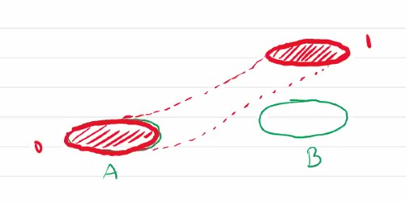
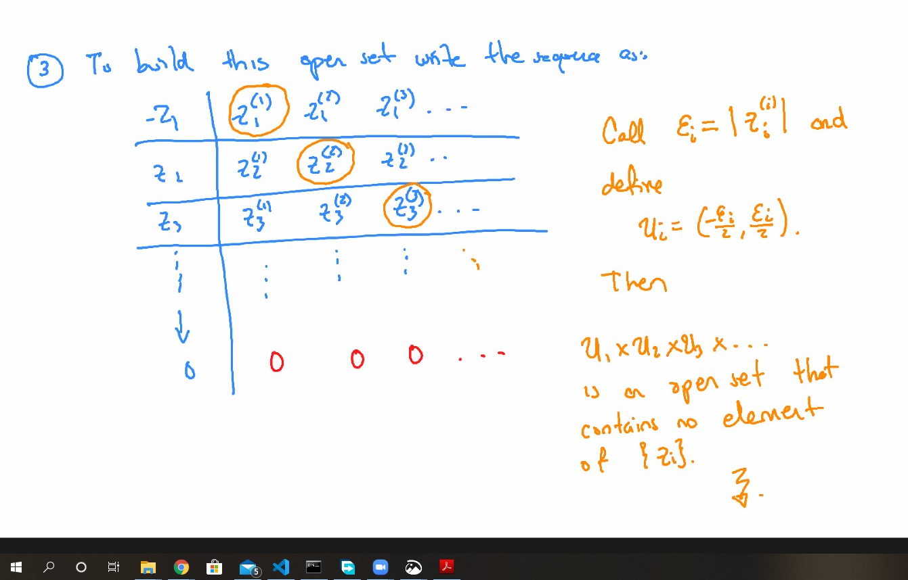

# UofT MAT327-Lec12

### Definition
Let $X$ be a topological space. We say $X$ is **paracompact**, if every open cover of $X$ admits an open refinement that is locally finite.

### Theorem
Every second countable, locally compact, Hausdorff topologoical space, is paracompact.

***

We care about Paracompactness, because it allows us to create partitions of unity.

### Theorem 

Let $X$ be a paracompact Hausdorff space. If $U$ is a cover of $X$ then there exists a partition of unity subordinated to $U$.

***

### Remark:
The definition of compacctness can change (equivalently) to the refinement. 

***

## Another perspective to take on paracompactness

It allows us to separate.

1. Hausdorff: We can separate  different points by disjoint open sets

The more you can separate, the "better".

### Definition:
Let $X$ be a topological space, We say $X$ is **regular** if we can separate ,with disjoint open sets, a point and a closed $C \subseteq X, p \not \in C$.  (open set contains $C$)

Basically because being regular doesn't have to be hausdorff. Sometimes, those are called quasi-regular.

#### Remark: 
Our book (of Lee) asks Hausdorff in the definition.

### Definition:
Let $X$ be a topological space. It is called **normal** if you can separate closed disjoint sets.

#### Example:

### Theorem
Let $X$ be a Hausdorff paracomapct space, then it is normal.

### The Main Theorem: Uryshon's Lemma:

Suppose $X$ is a normal topological space, let $A, B \subseteq X$ be disjoint closed subsets, then there exists a function that is continuous function $f: X \rightarrow [0,1]$

s.t. $f|_A = 0, f|_B = 1$

 

***

### Unchecked Theorem(?):
Existence of parition of unity subordinating is equivalent to normal

### Problem 3-9

