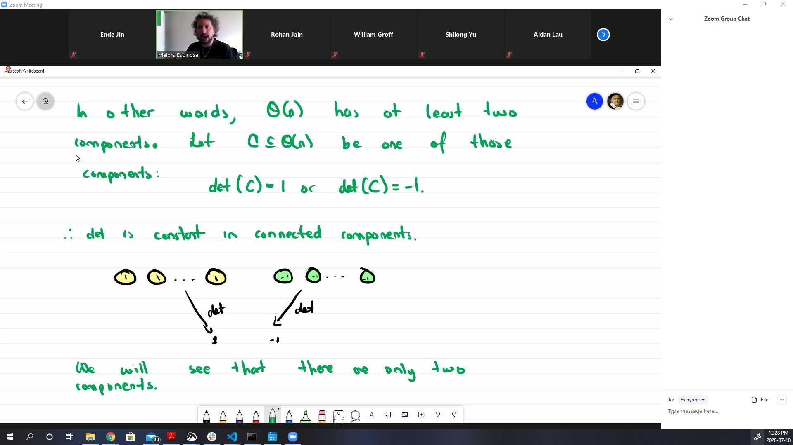

# missing ...

Inside $O(n)$ we have $SO(n) \subseteq O(n)$. We want to see that $SO(n)$ is actually path-conneccted. 

*  The idea of how to connect with a path two matrices has to match linear algebra constructions.

*  we want to join everything with identity

$SO(n)$ are orthogonal matrices, and because of that it is composition of an even number of reflections. A rotation path.

You will put a 1, -1 at the end square.

For example,

.

Doing this I can join every matrix of $SO(n)$ with $1$,, then we can see $SO(n)$ is path connected => connected.

The set of  $B*SO(n)$ is  again path connected. We can just think of $B$ as a homeomorphism between $SO(n)$ and $O(n)\backslash SO(n)$.

$O(n)$ has two components. $SO(n)$ is one of them.

We are claiming the set of matrices of det -1 is path connected.

So sometimes important objects are disconnected.

Herin-Borel tells you it is compact. Taking euclidean norm that $A* A^T = I$ can tell you bounded. Closedness is from ... ?

https://math.stackexchange.com/questions/1337671/prove-that-every-element-s-in-son-is-a-product-of-even-numbers-of-reflection

Every rotation is a composition of even number of reflection.