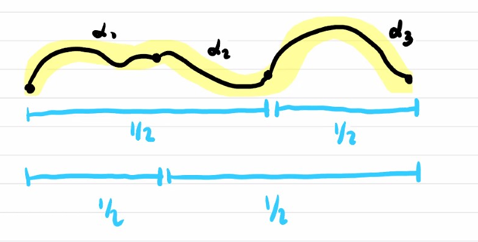

Motivation: to see really why two space are different

# Intro to algebraic topology

The main problem is to distinguish between topological spaces.

That is

* Given $(X, T_X), (Y, T_Y)$ how do we know they are not homeomorphic?

The main idea is to find something that a invariant under homeomorphism.

#### Example: 
* $\reals^n$ and $S^m$ are never homeomorphic. Because $S^m$ is compact but $\reals^n$ is not.
* $\reals^2$ and $\reals$ are not homeomorphic. $\reals^2$ minus a point is connected but $\reals$ minus a point is not.

### two directions for invariants:
* homotopy group
* homology

### Definition: Homotopy
* Let $X, Y$ be topological spaces, $f, g : X \rightarrow Y$ continuous maps. We  say $f$ is homotopic to $g$  if there exists a continuous map $H : X \times [0, 1] \rightarrow Y$
* with $H(x, 0) = f(x), H(x,1) = g(x), \forall x \in X$
* we denote the map $x \mapsto H(x, t)$ by $H_t(x)$

* denoted as $f \sim g$

#### There are several properties of homotopy that we care about. 
Some important are the following:
*  Being homotopic is equivalent relations on the set of maps $f : X\rightarrow Y$
  
$\text{Proof.}$

1. $f \sim f$ definte $H(x, t) = f(x)$
2. if $f \sim g$ then $g \sim f$ : $\exists H: X \times [0,1] \rightarrow Y$ with $H_0 = f$, $H_1 = g$.  Now define $H'(x, t) = H(x, 1-t)$
3. $f \sim g, g\sim k$ then there exists $H, G: X \times [0,1] \rightarrow Y$, $H_0 = f, H_1 = g$; $G_0 = g, G_1 = k$
   1. let us glue
   2. $F : X \times [0,1] \rightarrow Y$
   3. $F(x,t) = H(x,2t)$ when $0 \le t \le \frac{1}{2}$
   4. $F(x,t) = G(x, 2t-1)$ when $\frac{1}{2} \le t \le 1$
   5. continuous because of gluing lemma:
      1. range of $H, G$ are closed, we can use gluing map due to the well-defined-ness
* **Convention** The equivalence classes of homotopy classes of maps $f : X \rightarrow Y$ is **denoted** by $[X, Y]$
#### Example
$X = Y = S^1$ 

Fact: $[S^1, S^1] \simeq {\mathbb Z}$(currently only bijective on set)  since all continuous maps are homotopic to some $(\cos \theta, \sin \theta) \mapsto (\cos n \theta, \sin n \theta)$ for some $n$

#### Properties: Homotopies satisfies the following properties
1. preserves under composition:
   1. suppose $f_1 \sim f_0$ and $g_1 \sim g_0$ then $g_0 \circ f_0 \sim g_1 \circ f_1$
   2. 
   3. Prove it yourself!!
2. Sometimes we need some subspace of $X$ to remain fixed through the whole homotopy

#### Defintions: Path Homotopy 
* Let $X, Y$ be spaces, and $A \subseteq X$ a subspace, and $f, g: X \rightarrow Y$ continuous maps with $f |_A = g |_ A$
* we say $f, g$ are homotopic relative to $A$
* if $f \sim g$ and the homotopy $H$ can be taken to satisfy $H_t |_A = f|_A = g|_A$ for all $t$

The example means you cannot have a "continuous transformation" because otherwise you will go over the hole.

This above is called **path homotopy**

In general, we will consider paths $\alpha: [0,1] \rightarrow X$ and ask about the properties of these paths under homotopy.

When we are working with paths there is a natual operation we can do with them: we can compose them.

More specifically, $\alpha . \beta : [0,1] \rightarrow X$ given by $\{\alpha(2t), \beta(2t-1) \}$, still using gluing lemma.

A particular important type of paths are the loops:
*  that is when $\alpha(0) = \alpha(1)$

Given a loop, we can do operations with it:
1. $\bar{\alpha} : [0,1] \rightarrow X := t \mapsto \alpha(1-t)$
2. there is a canonical loop called constant loop : $\alpha \mapsto p$ for a fixed $p$

#### Properties of loop/paths : The key point is how to parameterize time
1. Let $\alpha_0, \alpha_1$ be homotopic paths (relative to $\{0, 1\}$) and $\beta_0, \beta_1$ be homotopic paths with $\alpha_0(1) = \beta_0(0), \alpha_1(1) = \beta_1(0)$ then 
   1. $\alpha_0 . \beta_0 \sim \alpha_1 . \beta_1$
   2. 
2. Let $\alpha$ be a path and $\alpha(0) = p, \alpha(1) = q$ then $C_p . \alpha \sim \alpha \sim \alpha . C_q$
3. $\alpha . \bar{\alpha} \sim C_p$
4. we have $(\alpha_0 . \alpha_1). \alpha_2 \sim \alpha_0 . (\alpha_1 . \alpha_2)$ if defined
   1. 
   2. parametrization on different amount of time

#### Definitions: path-homotopy class

* Let $X$ be a topological space and $p \in X$ any point. If $\alpha : [0,1] \rightarrow X$ is a loop based at $p \in X$ any point. its path-homotopy class is denoted by $[\alpha]$.
* If there is no possible confusion, we will write just $\alpha$

#### Definition: Fundamental Group.

**Remarks**:
1. the "path-connected" hypothesis can be dropped but then the "group" $\Pi_1(X, p)$ might change as $p$ varies
2. The "1" refers to the first homotopy group. The homotopy groups are a sequence of groups:
   1. $\Pi_0, \Pi_1 ....$
   2. $\Pi_0$ deal with path connectedness
   3. $\Pi_1$ deals with holes of dimension $1$
   4. others are higher homotopy group
   5. topological dimension is a way to assoicated topological with open sets and somehow dimension appears

#### Definitions: 
* There is an operation in $\Pi_1(X_1, p)$ that given two classes of paths, produce a third one:
  * $[\alpha_1]. [\alpha_2] := [\alpha_1 .\alpha_2]$ (path composition inside)
  * it satisfies
    * $[a]. [C_p] = [C_p] .[a] = [a]$
    * $[a] . [\bar{a}] = [\bar{a}] . [a] = [C_p]$
    * $([a] . [b]) . [c] = [a] . ([b] . [c])$

#### Example:

