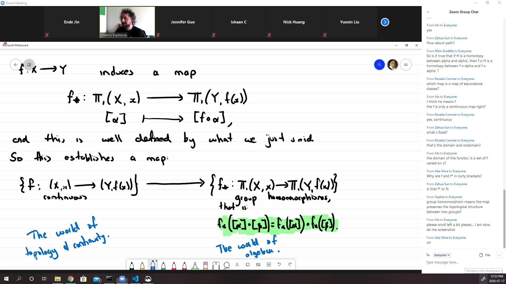

Motivation: to see really why two space are different

## Homotopies and induced maps

#### Defintion: Homotopy
* Let $X, Y$ be topological spaces, and $f, g : X \rightarrow Y$ two continuous maps
* We say $f \sim g$ if $\exists H: X \times [0,1] \rightarrow Y$ s.t. $H(x,0) = f(x)$ and $H(x,1) = g(x)$

Using the definition, we can define a new notion of equivalence in topological spaces.
#### Definition: homotopy equivalence
* Le $X, Y$ be topological spaces, We say $X, Y$ are homotopy equivalence if there exists $f: X \rightarrow Y$ and $g : X \rightarrow Y$, continous maps, such that
* $g \circ f \sim 1_X$ and $f \circ g \sim 1_Y$

#### Fact:
* Homeomorphic spaces are homotopic.

$\text{Proof.}$ $X \simeq Y$ and let $h$ be the homeomorphism. Then $h \circ h^{-1} = 1_Y \sim 1_Y$

#### Example:
* Mobius band is homotopic to the circle.
* $\reals^2 \backslash \{0\} \sim S^1$
  *  big H is to show that $g \circ f \sim id$

#### Main results: homotopy equivalence preserves fundamental group

#### Example: 
* $\Pi_1(M, x) \simeq \Pi_1(S^1, x) \simeq \Pi_1(\reals^2 \backslash \{0\}, x)$
  * in fact it preserves all homotopy group.
  * $\simeq$ is isomorphism of group

* The idea of all this approach is the existencce of a functoriality that relates topological spaces and groups

* The main construction is the following:
* we begin with $f: X \rightarrow Y$ a continuous map between topological spaces, $x \in X$

#### Example:
Consider the quotient map:

