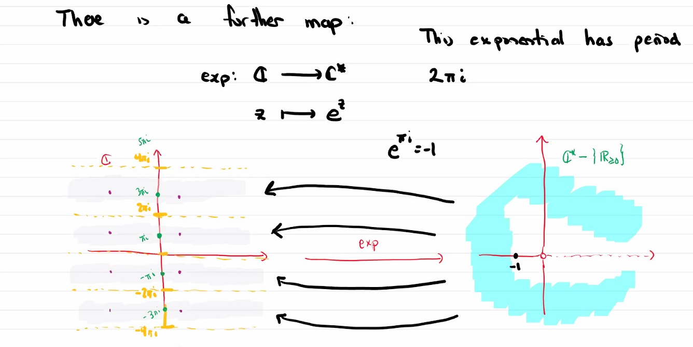
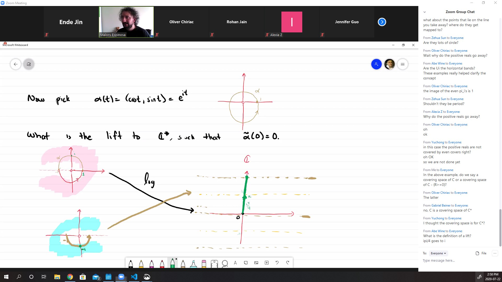

# The lifting problem and covering spaces

#### Example
Consider the complex plane $\mathbb{ C}$ and define an equivalence relation $z \sim w$ iff

$z - w \in \{a + bi : a, b \in \mathbb{Z}\}$

They are homotopic (with same ends) because they are around same hole.

Intersection in the codomain of the quotient map will not necessary be intersection in the domain (pull-back), maybe just two points in the domain that glues together by quotient,

#### Definition (Covering map)
* Let $q : E \rightarrow X$ be a continuous surjective map between topological spaces, with $X$  path-connected. $q$ is a **covering map** and $E$ is called a covering space of $X$ if for every pint $x \in X$ there exists an open set $U \subseteq X$ containing $x$, and a (countable) (can be finite) number of open sets $U_1,U_2,U_3, ...$ s.t.
* there exists local inverses (disjoint connected) $\pi_i : U \rightarrow U_i$
* for $q|_{U_i} : U_i \rightarrow U$ injective

* those in the codomain, that can be homeomorphism-ed in $E$ are called evenly covered.

It is a quotient automatically.

##### What is role of the local inverses?

#### Theorem 
* Let $q: E \rightarrow X$ be a covering map and $x \in X$ any point and $\alpha : [0,1] \rightarrow X$, $\alpha(0) = x$ any curve.
* Let $e \in E$ be s.t. $q(e) = x$. Then there exists a unique curve $\tilde{\alpha} : [0,1] \rightarrow E$ s.t. $q\circ \tilde{\alpha} = \alpha$ and $\tilde{\alpha}(0) = e$
* There is one such red arrow foe each initial point $e$ with $q(e) = x$

##### Example:

Klein bottles can be covered by the complex plane (?)
But the projective plane is really not working because the orientation is not compatiable.

#### Example

Consider $\mathbb{C} - \{0\}$, and define $\rho_n : \mathbb{C} \rightarrow \mathbb{C}^* := z \mapsto z^n$.

For these maps, $z \mapsto z^n$, you can define inverses $x \mapsto z^{\frac{1}{n}}$, but you need to fix where does a number go (a particular one).

There is a further map: $exp : \mathbb{C} \rightarrow \mathbb{C}^* := z \mapsto e^z$.

#### Example

The lift is $\tilde{(\alpha)}(t) = 2\pi t i$, notice that $\tilde{\alpha}(1) = 2\pi i$

The lifts are the lifted curves.

You can prove that the $S^2$ is a covering space of $RP^2$.