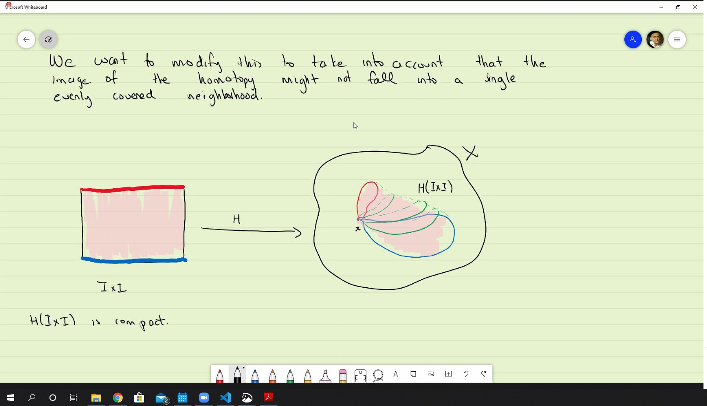
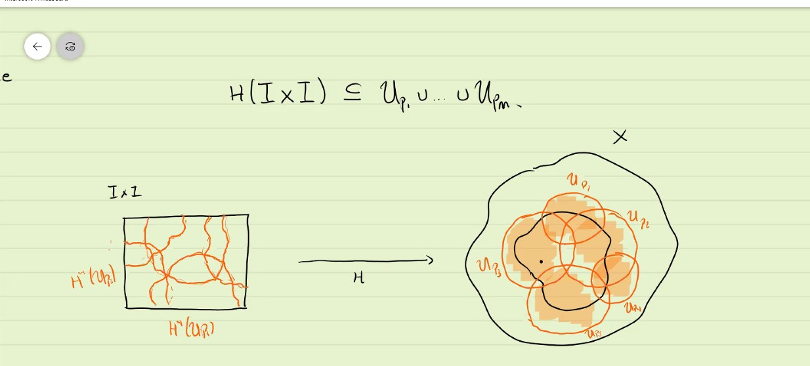
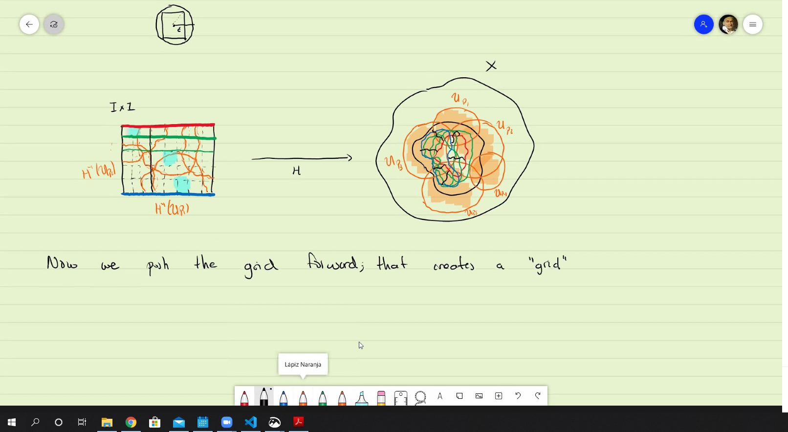
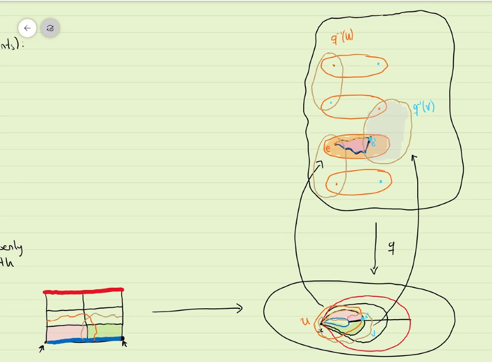
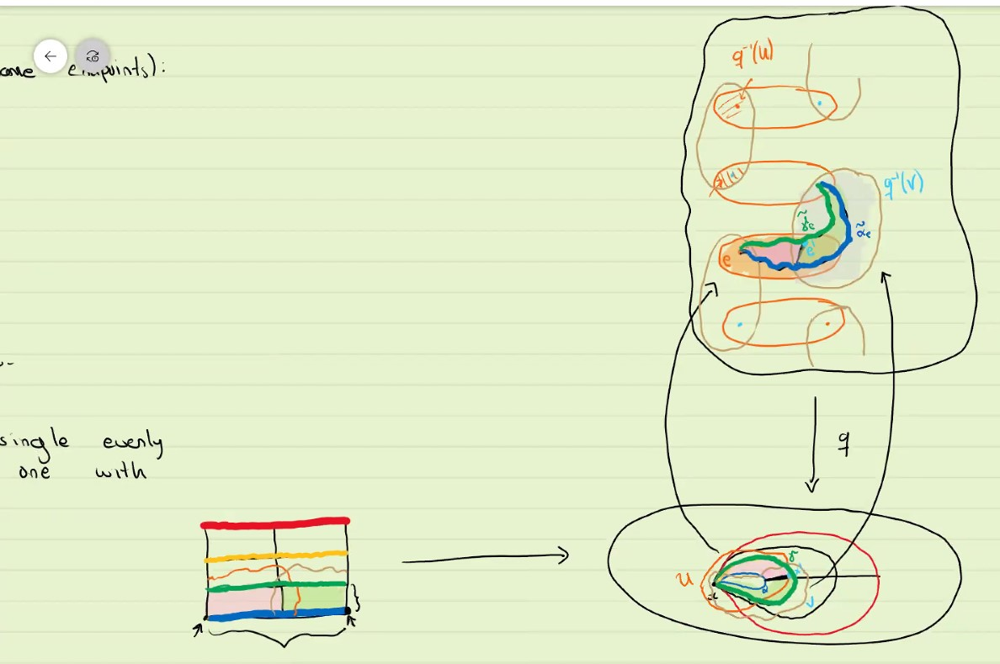
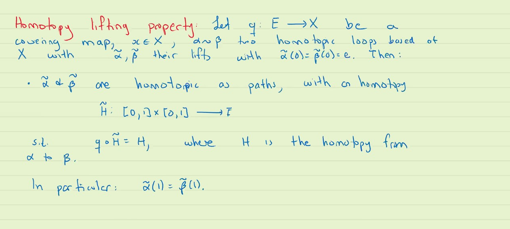
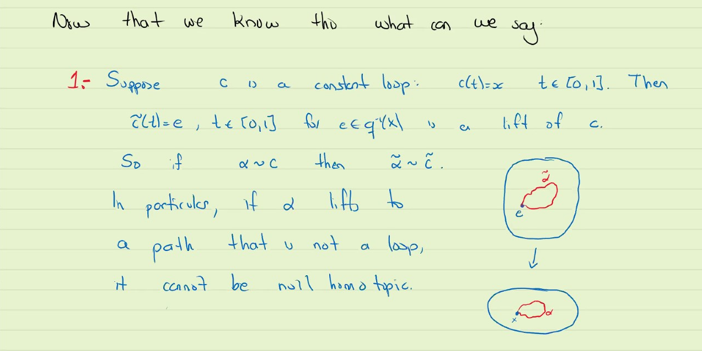
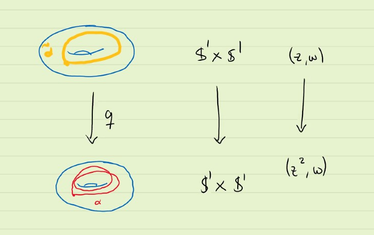

# Covering space
* Let $q: E \rightarrow X$ a covering space. We can lift curves: $\alpha : [0,1] \rightarrow X$ and $\alpha(0) = x$. Then for every point $e \in q^{-1}(x)$

this notation works only when $\alpha$ is a loop.

What would happen if $\beta \sim \alpha$?

$\beta \cdot e = \alpha \cdot e$!

***
You could have shown its an isometry by showing that the norm ||q(alb,c,d)|| = ||(a,b,c,d)||
Which shows its normal, ie solves the commuting of the transpose

***
#### 

This is true because we make sure everything in $H$ happens inside one neighbourhood.

We want to modify this to take into account that the image of the homotopy might not fall into a single evenly covered neighbourhood.

Since it is compact, for everyone of the points in $H(I \times I)$ pick an evenly cover neighbourhood $U_p$. By compactness, those neighbourhoods $p_1,..,p_m$ s.t. $H(I \times I) \subseteq U_{p_1} \cup  ...  \cup U{p_m}$

And we pull-back them into square:

Now we need a lemma.

#### Lebesgue Number Lemma
* Let $Y$ be a compact metric space, and $\{U_\alpha\}$ a cover of $Y$, then there exists $\epsilon > 0$ s.t. 
* for all $p \in Y$, $B\epsilon(p) \subseteq U_{\alpha}$ for some $\alpha$
  * the epsilon is only dependent on the cover instead of the points

Using this lemma, we can turn $I\times I$ into a grid such that every square of the grid is inside of an element of the cover.

***
Now we push the grid forward; that creates a "grid" in the image
$H(I \times I)$ in such a way that eqach "sqaure" is inside an evenly covered neighbourhood.

***
#### Example: how does those square possibly look like

The above is general homotopy, thus no same endpoints

***
Now that every one is contained in a single evenly covered neighbourhood, we pull it back one by one with the covering 

now we pull back pink to the $E, X$.

We pull-back one by one, and we can see how loop-ness is destroied into paths.

#### Homotopy lifting property:
* Let $q: E \rightarrow X$ be a covering map $x \in X$, $\alpha \sim \beta$ two homotopic loops based at $X$ with $\tilde{a}, \tilde{b}$  their lifts with $$

***

Now that we know this what can we say:
1.  Suppose $c$ is a constant loop, $c(t)$

Warning: If $\alpha$ lifts to a loop, doesn't mean it is null homotopic. The following as counter-example.

2. To answer the question of what happened with those that lifted to loops is that we introduce the idea of monodromy action.

