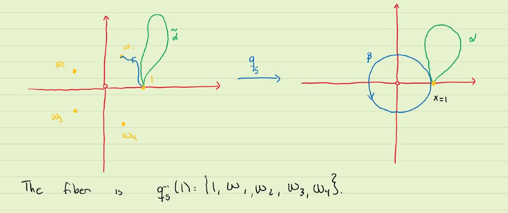

# Monodromy Action

We have done the following: given a covering space $q : E \rightarrow X$. 
1. We have proved that all fibres have the same number of elements
2. We have proved that all loops(actually including paths) based at $x \in X$ can be lifted to a unique path once we fixed the beginning point
3. If the loops were homotopic, then they lift to homotopic loops w.r.t the endpoints. In particular the lifts have the same endpoints (as long as they have the same initial points)
   1. $\tilde{a}(0) = \tilde{b}(0)$ then $a \sim b \iff \tilde{a} \sim \tilde{b}$
4.  Lift to a loop doesn't mean null-homotopic

All the 

#### Example: 
Define $q_n : \mathbb{C} \backslash \{0\} \rightarrow \mathbb{C} \backslash \{0\} := z \mapsto z^n$

This is $n$-sheeted cover.

Because the $\alpha$ is null homotopic, then $\tilde{\alpha}$

For $q_n$ what happens is the following:
1. If the loop groes around $0$ a multiple of $n$ times then it lifts to a loop
2. If the number of times it goes around is not a multiple of $n$ then it doesn't lift to a loop

These liftings define the monodromy action
1. We pick a point $x \in X$ and look at the fibre
2. We pick a particular point on the fibre $e$
3. We pick an equivalence class in the fundamental group $\Pi_1(X, x)$

The end point only depends on
1. The point $x$
2. The initial point $e \in q^{-1}(x)$
3. the equivalence $[\alpha] \in \Pi(X, x)$

#### Example
$q_n : \mathbb{C} \backslash \{0\} \rightarrow \mathbb{C} \backslash \{0\} := x \mapsto x^4$

The monodromy is the action of permuting inside a fibre.