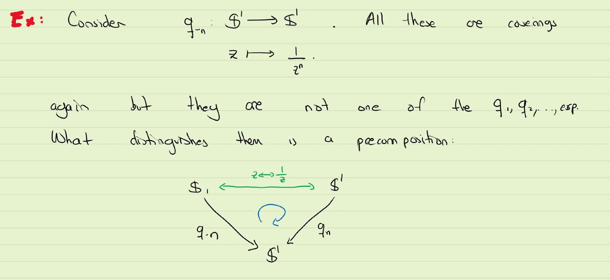

# Monodromy Action, II

Monodromy refers to the way in which an element of fundamental group $\pi_1(X,x)$ permutes the fibre $q^{-1}(x)$ where $q : E\rightarrow X$ is a covering map.

How is this permutation constructed? 
1. we begin with a point $x \in X$, a class $[\alpha] \in \pi_1(X, x)$
2. Now we consider the fibre $q^{-1}(x)$
3. $\alpha \in [\alpha]$ can be lifted to a unique path $\tilde{\alpha}_e$ for each $e \in q^{-1}(x)$. The ending point is again in the fibre. $\tilde{\alpha}_e(1) \in q^{-1}(x)$
4. we define the permutation in this way:
   1. $[\alpha] \cdot e = \tilde{\alpha}_e(1)$
   2. the monodromy is the $\cdot$ inside, that varies on those $[\alpha]$

#### Example: 
Let $X = \mathbb{S}^1$, we have the following covering, for each

$q_n : \mathbb{S}^1 \rightarrow \mathbb{S}^1 :=  z \mapsto z^n$

and also

$exp: \reals \rightarrow \mathbb{S}^1 := t \mapsto e^{it}$

Each one of these maps is a covering. Let's pick our loops at $x = 1$

$q_n$ This is an $n$-sheeted cover and the preimage of $1$ are the roots of unity, which form a regular $n$-gon with a vertex at 1.

A loop in the circle is $\alpha(t) = e^{2\pi ti}$.

The lift of this is $\tilde{\alpha}$

Let us rotate by multiplying by $e^{\frac{\pi}{3}i}$

$\beta(t) = e^{\frac{\pi}{3}i} \times \tilde{\alpha}$

We claim all the loops are homotopic to one of the indexed alpha. But we need to prove this claim. Using covering map.

So the fundamental group is described by 

.

Now to begin at $e^{\frac{k \pi i}{3}}$ we just multiply and we get $\tilde{\alpha}$

***

We can see now to detect path-homotopic, we can use the concept of covering space. But is there always existing the best covering space?

# Universal Covering Space

#### Philosophy of covering spaces:

Covering space are unfoldings of a particular space, where by unfolding we literally mean a "fold" in the sapce of folding we creats holes and paths become loops. Holes and loops can make things complicated and many times they codify information that we care about.

Covering register the folds in a very precise way via monodromy and the fundamental group.

you are actually gluing the three colours together. SO it is gluing different lifts of a loop.

Moral of this proposition: A covering map cannot disappear holes. Because two different elements in fundamental group will be map to different elements in the base space, which makes the underlying base space not simply connected anymore.

Using this we can think of the fundamental group $\pi_1(X, x)$ as registering inside the images of $q_*(\pi_1(E,e))$

and I get the multiple of 6.

Concretely, $q_* (\pi_1(E_n, 1)) =$ {the multiples of $n \in \ints$} = $[\alpha_n] \cdot ... \cdot [\alpha_n]$ (finite # of times)

Analogously, $q_*(\pi_1(E_\infty, 0)) = [c_1] = \{1\}$

This gives 

Of course two covering map sending to same subgroup might not be the same.

#### Example
Consider $q_{-n} := z \mapsto z^{-n}$. All these are civerings again but they are not one of $q_1, .. exp$, What distinguish them is a procomposition:

#### Definition

We now have the following situation:

This gives an ordering in the integers inherited to the coverings -- the ordering of divisibility.

SO the bottom one is the universal covering.

$t \mapsto e^{it}$ is at the bottom. (the real line one)