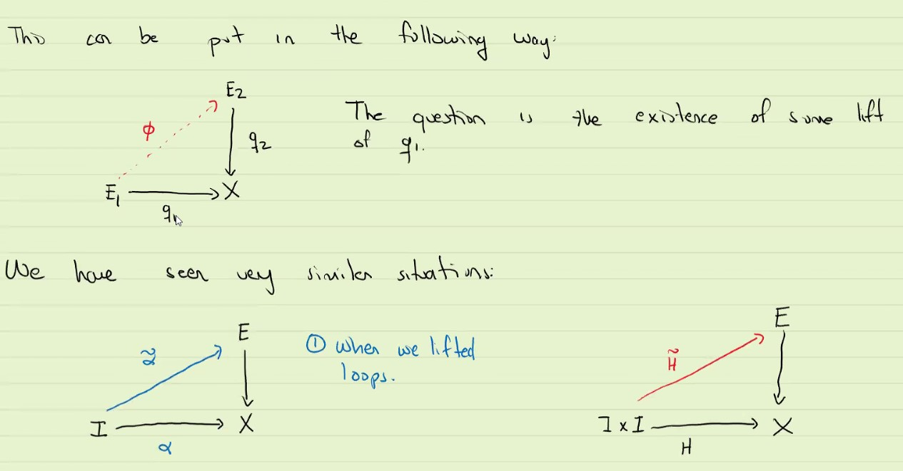
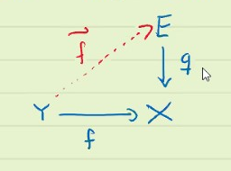
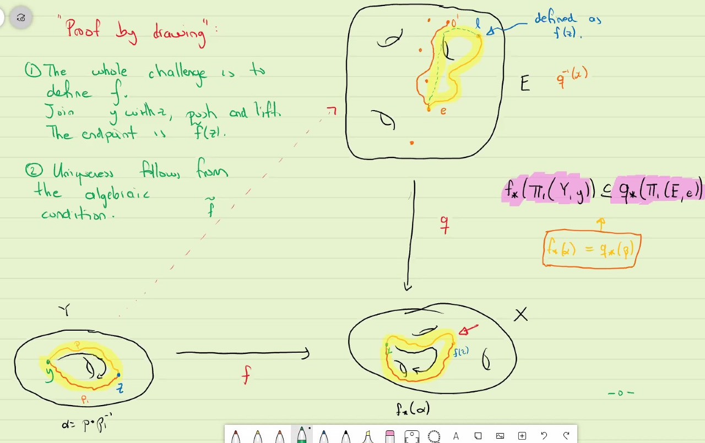
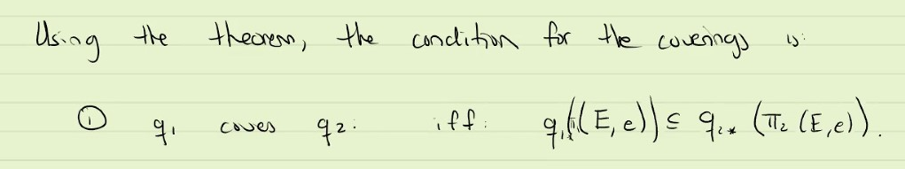
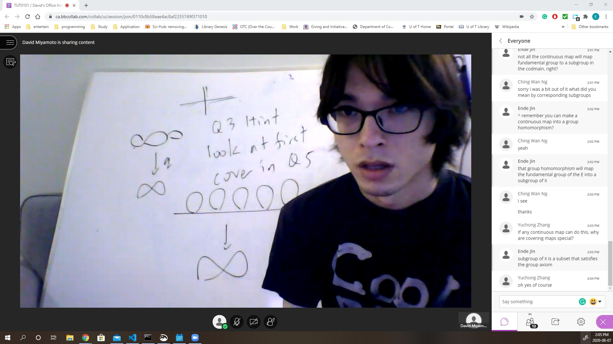

# Covering maps and Universal Covering spaces

### Definition : Covering map
* Let $q_1: E_1 \rightarrow X$ and $q_2 : E_2 \rightarrow X$ be covering maps. A continuous function $\phi : E_1 \rightarrow E_2$ is called a covering homomorphism if $q_2 \circ \phi = q_1$

* Remark: $\phi$ is not necessarily a homeomorphism

### Definition
* If $\phi$ is an homeomorphism and $E_1=E_2$, then we call $\phi$ a deck transformation.

Note: we have to have the above diagram (commute) that we can call it deck transformation.

### Example

If such an equivalent $\phi$ exists, $q_1, q_2$ are call equivalent, which is an equivalence relationship of covering maps. More generally, we can define the same notion with covering homomorphism by homeomorphism. But we require set equality to realize a permutation happens, and homeomorphism means equality in the language of topology. So we don't usually call them deck transformation if $E_1 \neq E_2$.

### Example

### Question
How do we tell if two coverings are equivalent? (are related by homeomorphism)?

***

This can be put in the following way.

2. lifting homotopies.

# General Lifting question:
* Let $q : E \rightarrow X$ be a covering map, $f : Y \rightarrow X$ any continuous function with $Y$ connected and locally path connected. We can ask if there exists a lift:

### Theorem : Lifting criterion
In the previous context, pick $y \in Y$, $x = f(y)$, $e \in q^{-1}(x)$. Then there exists a lift $\tilde{f} : Y \rightarrow E$ with $\tilde{f}(y) = e$ iff 
* $f_*(\pi_1(Y,y)) \subseteq q_*(\pi_1(E, e)) \subseteq \pi_1(X, x)$
* in this case, the lift it unique 

Using the theorem, the contradiction for the covering is 

it is a seems cover (at least continuous surjective) of Hawaiian ring.