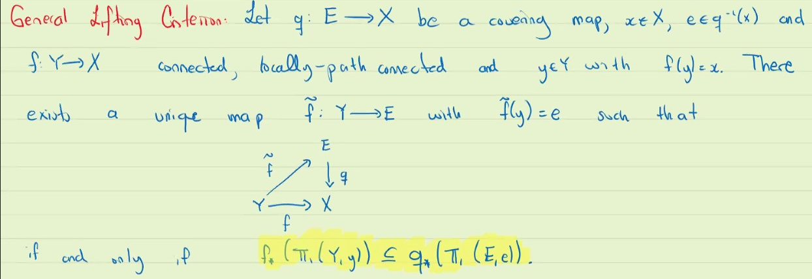

# Universal Covering space and monodromy

#### General Lifting Criterion:
* Let $q:E \rightarrow X$ be a covering map, $x \in X$, $e \in q^{-1}(x)$ and $f: Y \rightarrow X$ connected, locally path connected and $y \in Y$ with $f(y) = x$.
* There exists a unique map $\tilde{f} : Y \rightarrow E$

#### Note:
on a same path connected space, changing base point of the fundamental group won't change group up to isomorphism. (i.e. $\pi(X, x) \cong \pi(X, x')$) but they are different since the loops contain different points.

#### Remark:
* If $\Pi(Y, y) = \{1\}$ (null-homotopic), then the condition of the theorem is satisfied automatically.
  * This means that if $\Pi_1(Y,y) = 1$, we always have liftings
* Suppose $q_1 : E_1 \rightarrow X, q_2 : E_2 \rightarrow X$ are covering, $x \in X, e_2 \in E_2,$ and $e_1 \in E_1$ with $\Pi_1(E_1, e_1) = \{1\}$

#### Definition:
* Let $X$ be connected + locally path connected, if $\Pi_1(X, x) = \{1\}$, we say $X$ is simply connected.
* if $q: E \rightarrow X$ is a covering with $E$ simply connected we say it is a universal covering map
* universal is for two reasons:
  * a universal cover covers any other cover
  * all universal cover are isomorphic:
    * 

#### Example:
1.  $exp : \reals \rightarrow \mathbb{S}^1 := t \mapsto e^t$
    1.  This is a cover, infinite countable number of sheets
    2.  $\reals$ is simply connected
    3.  Hence this is universal cover
2.  $\pi : \mathbb{S}^2 \rightarrow \mathbb{RP}^2$ for $n>2$
    1.  this is a cover
    2.  $\mathbb{S}^n$ is simply connected
    3.  hence a universal cover
3.  $T = \mathbb{S}^1 \times \mathbb{S}^1$
    1.  The cover is $\phi := (s,t) \mapsto (e^{is}, e^{it})$
4.  In a HW you proved $\epsilon : T \rightarrow K$ (torus - klein 2-sheeted map)
    1.  then you have $\reals \times \reals \rightarrow^{\epsilon \circ \phi} K$, this is also a cover.
    2.  hence the universal cover of Klein is $\reals^2$
    3.  Note: usually composition of covering is not a covering; here it is by proving in another way

#### Now all spaces admit a universal cover! 
For example, Hawaiian Earing

#### Exxample
Basically the reverse image of the spider will have its body null-homotopy (due to simply connected-ness), but down there they are not.

#### Semi-Locally simply connected iff has a universal covering

#### Now that we have universal covering

1. Change the point in the fibre.

Now because $E$ is path connected, we can join $e_1, e_2$ by a path in $E$, say it is $\beta$.

When I push down the fundamental groups, what happens to $\beta$? 

It will become a loop (that though a hole, even possible the same hole as red's hole)

#### A non-example: Torus

It is releasing the mid-fixed-point $x$.. 

but I still kind of confused.

$\gamma = \beta \alpha \beta^{-1} = \alpha^{-1}$. $\alpha$ conjugate to its inverses. We prove it by seeing the picture where we release the green point.

#### Final Theorem:
* Let $X$ be a connected, locally path connected covering space $q : E \rightarrow$.
* Then the equivalence classes of covering  correspond to conjugacy classes of subgroups of $\pi_1(X,x)$

