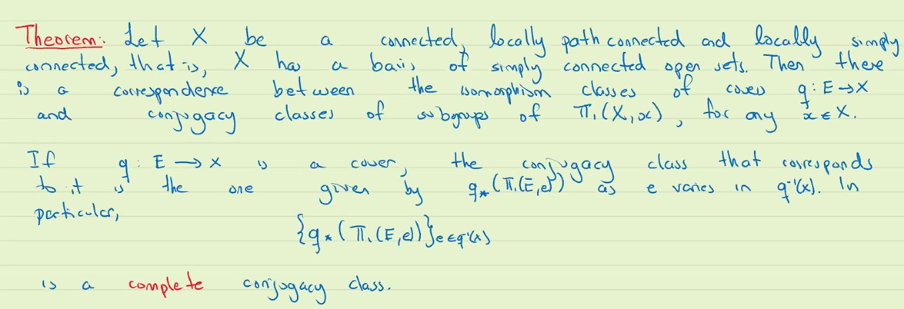
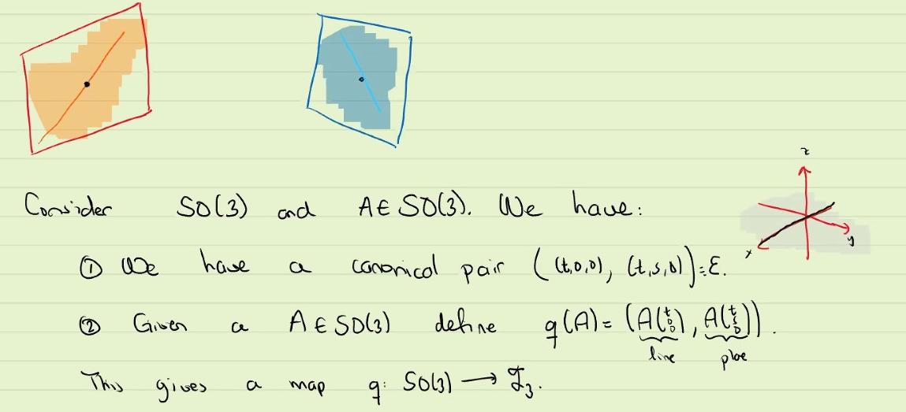
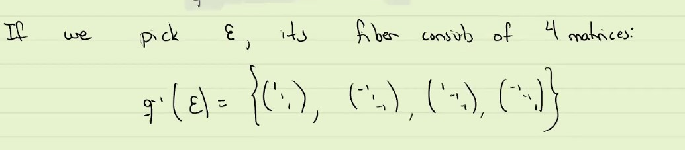
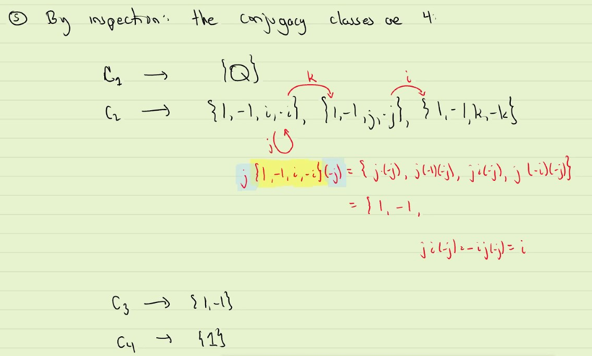
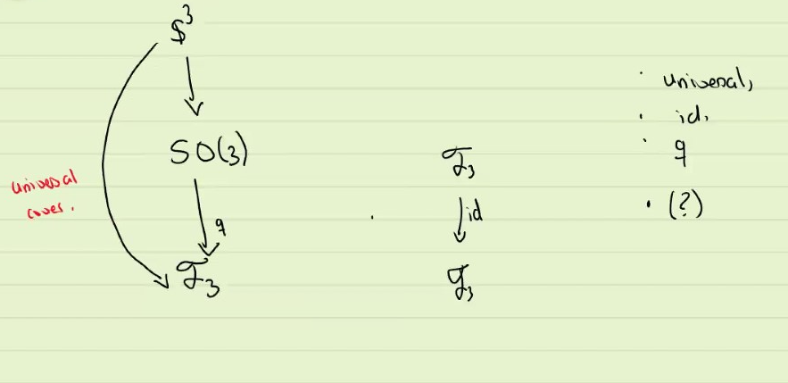

# Correspondence betweem cover map and subspace

### Theorem: the correspondence
* Let $X$ be a connected, locally path connected, and locally semi-simply connected,
  * that is $X$ has a basis of open sets that are simply connected
* then there is a correspondence between the isomorphism classes of covers $q: E \rightarrow X$ and conju

#### Remark:
* The hypothesis of locally simply connected is added to so that we can construct a universal cover

* complete just mean that all the conjugate items are in that set

* In one direction, $\{q: E \rightarrow X\} \mapsto \{q_*(\Pi_1(E, e))\}$, it is trivial and always exists (for any cover); but the other direction,
* if we are given a conjugacy class of subgroup, in order to build the quotient $q : E \rightarrow X$, we need to use the existence of the universal cover

#### Example/Prop: 
* Let $q : E\rightarrow X$ be a **universal** cover of $k$-sheet,
* then $|\pi_1(X, x)| = k$
  * note, $k$ can be a cardinality
* proof.
* Pick $x \in X, e \in q^{-1}(x)$
  * we define $\pi(X, x) \rightarrow q^{-1}(x) := [a] \mapsto [a] \cdot e$. we claim it is bijection
    * Surjection: by the transitivity of monodromy, we know there is one $[a]$ s.t. $[a] \cdot e = f$
    * Injection: $[a] \cdot e = [b] \cdot e \implies [a b^{-1}] e = e$
    *  
#### Example:
* Consider the following set:
  * $F_3 = \{V_1 \subseteq V_2 \subseteq \reals^3 : V_1$ is a subspace of 1 dimension , $V_2$ is a subspace of 2 dimension  $\}$
  * 
  * We put quotient topology into $F_3$ by this function
  * turns out $q : SO(3) \rightarrow F_3$ is a covering map 
  * 
  * We could compute the fundamental group and get the following
  * $\pi_1(F_3, E) = <i,j,k : i^2 = j ^2 = k^2  = ijk = -1> = \{1,-1,i,-i, j,-j, k,-k\} = Q$
  * By inspection: the conjugacy classes are 4
    * $C_1 = Q$
    * 
  * 