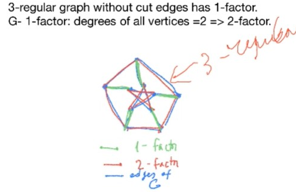

# Lec 10

### Definition:
* 1-factor: spanning 1-regular subgraph
* almost the same as perfect matching
* multiple edges don't do different -- simple graph
* necessary and sufficient condition:
  * necessary but not sufficient: at least it needs to have even number of vertices

### Theorem: Tutte
* let $S \subseteq V(G)$
  * denote $G-S$ as the induced graph on $V(G) - S$
  * denote $o(G-S)$ as the number of components in $G-S$ with odd number of vertices
* A graph $G$ has a 1 factor iff 
  * every $S \subseteq V(G)$, $o(G-S) \le |S|$
* it is easy to see that it is a necessary condition as 
  * every odd component has to connect to a vertex out of $G-S$

### Application : Tutte
* 1-factor in 3-regular graph
* 
* this graph cannot have 1-factor / perfect matching
* pf by contradiction:
  * since the middle vertex must be saturated, let's say red is in 1-factor
  * then the remaining green one in the middle cannot in 1-factor 
    * note that the green edge is cut-edge
    * thus the "house" must contain a subgraph of 1-factor, and thus still perfect matching within the component
    * but we know there are 5 vertices, it cannot be the case 
### Theorem: Peterson
* every 3-regular graph without cut edge is 1-factor
***
* when tutte's condition is violated (no 1-factor)
* How many vertices of $G$ will be /must be unsaturated?
* Let $d(S) = o(G-S) - |S|$ (is positive for some $S$ as tutte's condition is violated.)
  * and take $d =\max_{S}d(S)$

### Theorem: Berge - Tutte Formula
* The largest number of vertices of $G$ saturated by a matching (1-factor) is $|V| - d$
  * i.e. the smallest number of vertices unsaturated by a matching is $d$
  
### Definitions: 2-factors
* spanning graphs that are 2-regular
  * thus each component is a cycle
  
### Theorem: Peterson
* Each 2k-regular graph  has a 2-factor
  * Note: it is not iff!
  * 
  * note that remove 1-factor from the above peterson graph will directly give you two cycles
  * it is natural to see that 3-regular graph without cut-edges -- has 1-factor, and remove 1-factor, 2-regular graph! 