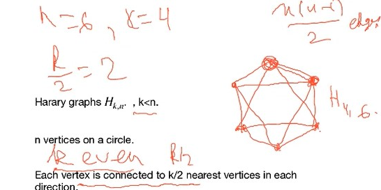

# Lec 11

## Connectivity: Chp 3 -> 4.21

How connected is the graph? The minimal number of edges/vertices to remove that the graph will keep connected

Section 4.3
### Definition:
* Separating set/ vectex cut:
  * a set of verties s.t. $G - S$ has more than 1 compoenent
  * example: 
    * the red part is the separating set/vertex cut as removing them resulting two blue vertices
* connectivity of $G$, denoted as $k(G)$
  * defined as the minimal size of $S$ s.t. $G-S$ disconnected or $G-S$ has only 1 vertex
  * example: $k(K_n)$ is of course $n-1$
    * if a graph is not complete, then we can always throw away all of the vertices excepted two not connected node
      * thus $k(G) \le n - 2$
* a $k$-connected graph $G$ is when $k(G) \ge k$
  * 1-connected : connected + a cut vertex or it is actually $K_2$
  * thus 3-connected graph is also 2-connected
  * 0 -conneced graph is also disconnected
* $k(K_{m,n}) = \min \{m,n\}$

### Definition : Harary Graph $H_{k,n}$ where $k < n$ P150, 151
* $H_{k,n}$ with n vertices and connectivity $k$ with the minimal possible edges
  * $n$ vertices on a circle, 
    * when k even
      * each vertex is connected to $\frac{k}{2}$ nearest vertices in each direction (on the cycle)
      * 
      * apparently $kn/2$ edges, minimal degree is $k$ (??? why not $k$ regular?)
      * remove all vertices adjacent to one vertex will make the vertex isolated, thus $k(G) \le \delta(G) = k$
      * and $k(G) = k$ because for two fixed point $A,B$ we can move from $A$ to $B$ along two directions (clockwise and counter-clockwise) all the time, as long as on any direction you remove less than $k/2$ vertices **not rigorous**
        * **formalize it**
        * this story is true even if $A$ is close to $B$
        * 
    * when $k$ odd, ...

### Definition: Edge-connectivity
* A disconnecting set of edges $E$ : 
  * $G-E$ has more than 1 compoenents
* edge-connectivity, $k'(G)$ the minimal number of edges in a disconnecting set (of edges)
* k-edge connected graph $k'(G) \ge k$
* We use $[S, T]$ to denote the set of edges with one end in $S$ and the other in $T$, where $S, T$ are all sets of vertices
* $\bar{S}$ to denote the complement of $S$, i.e. all vertices not in $S$
* An edge cut is always $[S, \bar{S}]$
  * always a disconnecting set, but not vice versa
  * 
  * because disconnecting set can include more edges from edge-cut

### Theorem: 
* minimal disconnecting set is walys edge cut
  * minimal disconnecting set : no proper subset is disconnecting set
* **A bond** is a non-empty minimal disconnecting set
  * all bonds are edge cut
  * but not all edge cuts are bond
    * because there are cases you can have removing edge cut but give you more than two connected component
  * for a disconnected graph, minimal disconnecting set is empty
* If $G$ is connected, An edge cut $F$ is a bond iff $G-F$ has exactly two compoennts
  * is it true that for a connected graph, an edge cut is alwalys a bond?
    * No, for graph $C \rightarrow A \leftarrow B$, the cut $[\{C,B\}, \{A\}]$ doesn't have exactly two component, and of course it is not minimal disconnecting set
  * is it true that if all edge cuts are bond, then the graph is connected?
    * that means every edge cut is a minimal, non-empty disconnecting set, that means for every edge cut $[S, \bar{S}]$, originally S is connected to $\bar{S}$ (otherwise, the minimal disconnecting set is empty)
  * is it true that if one edge cut is a bond, then the graph is connected?
    *  yes, similar reasoning: for the edge cut, any subset will cause the graph connected, so the graph is originally connected.
* $k'(G) \le \delta(G)$, as we can remove all the edges incident to that vertex with minimal degree

### Theorem: (Whitney)
* $k(G) \le k'(G) \le \delta(G)$
  * is the following idea wrong? For each disconnecting set, we can just choose a vertex incident to each edge, then the chosen vertices must become a separating set
  * the idea is wrong because we need to be careful not to delete the only vertex of a component of $G - F$
  * 
* there are example that $k(G) < k'(G) < \delta(G)$

### Theorem: P153
* If $G$ is a 3-regular graph, then $k(G) = k'(G)$
* 