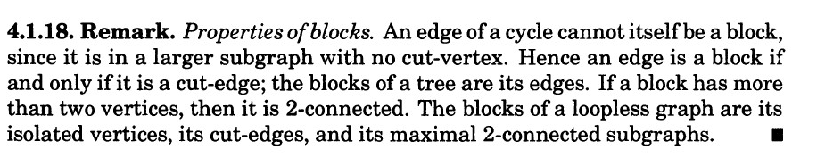
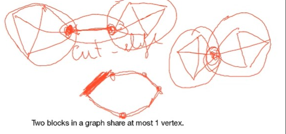
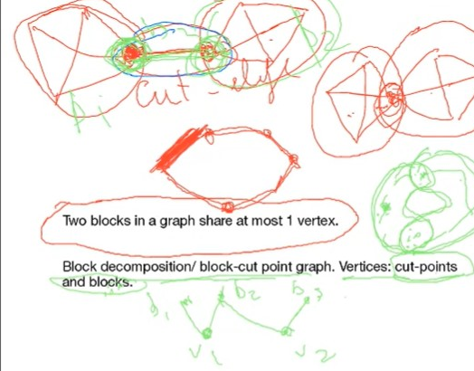
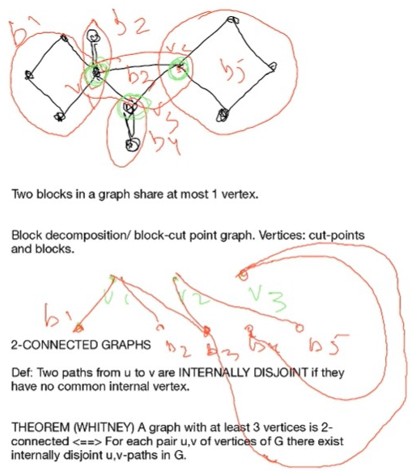
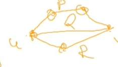

# Lec 12

### Theorem: P153
* If $G$ is a 3-regular graph, then $k(G) = k'(G)$

### Definition: Blocks
* maximal connected subgrph with no cut vertex
  * can be $K_1, K_2$ or a 2-connected graph
  * if a graph $G$ is 2-connected, then $G$ is the only block
* inspection
  * two blocks in a graph share at most 1 vertex (prop 4.1.19)
    * otherwise that is one block
  * **an edge is a block iff it is a cut edge of the original graph**
    * how to prove it?
    * if an edge is a cut edge (of the original graph), then it is a cut edge for any non-tivial connected subgraph, then for any graph containing this edge, since it is connected, then one of the vertex of the cut edge has degree more than 1, remove that vertex, the adjacent vertices are disconnected
    * if an edge is a block, i.e. the maximal connected subgraph with no cut vertex, then any subgraph containing this edge has a cut vertex ... (then what?)
  * an edge is a cut edge iff it is not part of any cycle
  * look at Remark 4.1.18
  * 
  * a vertex is a block iff it is a cut vertex or isolated point
    * 
    * block clearly can intersect
### Definition: Block Decomposition (4.1.20) (**won't be on test**)
* block decomposition/cut-point graph
  * is a tree/forest
  * vertices of this graph are two kinds: cut-points and blocks
  * also bipatite graph
  * only connect cut-points to blocks
  * 
  * 
  * these bipartite graphs are all trees! (without cycle)

### 2-connect graphs
### Definition:
* two paths from u to v are **internally disjoint**
  * if they have no common internal vertex
  * 

### Theorem: (whitney)
* a graph with at least 3 vertices 
  * it is 2-connected
  * iff for each pair $u,v$ of vertices of $G$ there exisrs internally disjoint $u,v$-path in $G$
  * proof.
    * from right to left: after we remove arbitrary vertex, any two vertices is still connected, so it is 2-connected
    * from left to right: by induction

### Theorem: Expansion Lemma
* $G$ is $k$-connected graph
  * and if $H$ is obtained from $G$ by adding a new vertex $y$ of degree $k$, then $H$ is $k$-connected as well.
  * Proof. by proving removing $k-1$, $G$ is still connected

### Theorem: 
* For a graph with at least 3 vertices, the following conditions are equivalent to each other and to 2-connectedness:
  1. $G$ is connected and has no cut-vertex
  2. for all pairs of vertices x,y there are internally disjoint x,y paths
  3. for all pairs of vertices x,y, there is a cycle through x and y
  4. the minimal degree $\delta(G) \ge 1$, and every pair of edges in $G$ lies in a common cycle
  * proof
  * 1 iff 2
  * 2 iff 3
  * 1,2,3 => 4 because we can consider the subdivision of edges, or in other words, add two new vertices only connected to the vertices of the edges, and since it preserves 2-connectedness (by expansion lemma);
    * minimal degree is greater than 1 since there is no isolated vertex?
  * 4 => 3 trivial 