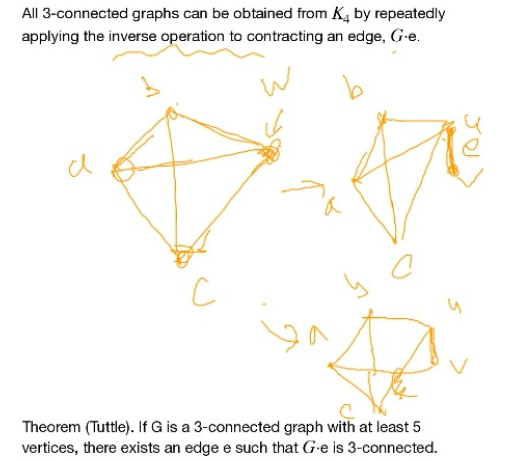
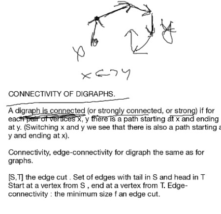
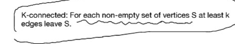

# Lec 13

### Definition:
* a **subdivision** of an edge $u,v$ is the operation of replacing $uv$ with $uwv$ through a new vertex $w$
* recall that 
  * 2-connected iff any two edges share a common cycle (proved by expansion lemma!)
  * that means if $G$ is 2-connected, then any subdivision of $G$ is also 2-connected (using Theorem 4.2.4D)
    * we can check every two vertices share a common cycle
      * the new vertex is sharing common cycle with any old vertex
      * the any two old vertices sharing cycle, and if the subdivided edge is on the cycle, we replace it by two new edges from subdivision 
* an **ear** of a graph $G$ is the maximal path that internal vertices are all degree 2
* an **ear decomposition** of $G$ is a decomposition $P_0,..P_k$ s.t. $P_0$ is a cycle, and $P_i$s is an ear  of $P_0 \cup P_1 ... P_i$  subgraph
  * ear decomposition is not unique

### Theorem: Whitney
* A graph is 2-connected iff it has an ear decomposition
  * Furthermore, every cycle in a 2-connected graph is an initial cycle in some ear decomposition
### Theorem
* every 2-connected graph is 2-edge connected
  * because every adjacent vertex is on a cycle, removing that edge won't disrupt connectivity
  * converse is not true
  * consider a bowtie
### Definition:
* a **closed ear** in a graph $G$ is a cycle $C$ s.t. all vertices except one have degree 2 in $G$
* a **closed ear decomposition** of $G$ is a decomposition $P_0,..P_k$ s.t. $P_0$ is a cycle, and $P_i$s is either an ear or a closed ear of $P_0 \cup P_1 ... P_i$  subgraph

***
Basically when doing ear-decomposition, we allow ear to have same endpoints (cycle)

### Theorem: Whitney
* A graph is 2-edge-connected iff it has a closed ear decomposition
  * Furthermore, every cycle in a 2-edge-connected graph is an initial cycle in some closed ear decomposition
  * 
  * proof is similar to the above

### Theorem: 3-connecteed graphs
* $K_4$ is the only three connected graph with 4 vertices
  * trivial
* all 3-connected graph can be obtained by inverse operation to contracting an edge $G\cdot e$ 
  * the operation that may make multigraph!
  * 

### Theorem : Tuttle
* If $G$ is a 3-connected graph with at least 5 vertices, there exists an edge $e$ s.t. $G \cdot e$ is still 3-connected
  * proof by contradiction and extremality.. where to find it on the book?
  * It is Lemma 6.2.9 (at chapter 6, section 2)

### Definition : connectivity of Digraph

There are some differences between lecture and book
* on the book $k$-edge connected can be restated as:
  * for every non-empty proper vertex subset $S$, there are at least k edges leeaving $S$
  * but in the lecture
  * 
* adding directed (in one direction) open/closed ear doesn't affect connectedness