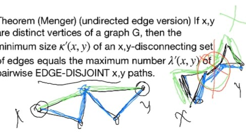

# Lec 14

### Definition: connectedness of digraph
<!-- * (open) ear: path in $G$, all inner vertices have degree 2 in $G$, end points degree > 2 -->
* Proper orientation of an ear:
  *  an undirected ear s.t. there is a path
  * from one end to the other (no other direction)
* closed ear:
  * so that cycle is (strongly) connected

### Theorem: 4.2.13
* Adding a directed ear preserve the strong connectedness of digraph
* proof :
  * trivial as we can always travel along the ear and travel against ear by using the original strong-connectivity to the start of the ear 
***
* a strong orientation of an undirected graph is an assignment of a direction to each edge (an orientation) that makes it into a strongly connected graph.

### THeorem: Robbins 4.2.14
* A graph has a strong orientation
  * iff it is 2-edge connected

### Definition: Line Graph
* given graph $G$, Line graph $L(G)$ has the original edges as vertices ($V(L(G)) = E(G)$)
  * two vertices $e,f \in L(G)$ is adjacent if $e,f$ incident to same vertex in $G$ 
* for directed version:
  * $e \rightarrow f \in L(G)$ if the head of $e$ is the tail of $f$ 

***
Following started from 31:10 of 10-22, recording 7

### Theorem: Menger's Theorem
* we allow $X,Y$-path to have one vertices if $X \cap Y \neq \emptyset$
* directed/un-directed version
* easy to start with one and prove others
* for vertices $x,y$, $x,y$-cut/separator is a set $S\subseteq V(G)$ s.t. $G-S$ doesn't have $x,y$-path
  * $\kappa(x,y)$ denotes the minimum size of $x,y$-cut 
  * $\lambda(x,y)$ denotes the maximum size of a set of pair-wise internally disjoint $x,y$-path
* one of duality theorem, not an accident, they can deduce each other
* (undirected version):
  * if x,y are vertices of a graph $G$ that are not  connected by an edge, then $\kappa(x,y) = \lambda(x,y)$
* (directed verssion):
  * same for digraph
#### directed vertex implies undirected vertex:
*  easily replace each undirect edge by two directed edge of different orientation
*  direct + vertex implies undirect + vertex
   *  path correspondence is also trivial (almost the same)
      * a path on a digraph still not allowing repeated vertices
   *  thus separting set correspondence is trivial, and size preserving
   *  correspondence between set of vertex disjoint paths is trivial, and again size-preserving (same number of paths)
*  direct + edges doesn't seem implies undirected + edges

#### (directed/undirected) vertex version implies (directed/undirected) edge version  
* use line graph
* this includes both directed and undirected
* The above 2 ideas are similar to Remark 4.3.15
* then we can prove
  * any set of disjoint vertex path 1-1 corresponds to a set of disjoint edge path, with same size (number of paths)
  * any disconnecting set 1-1 corresponds to a separating set, with same size
  * thus we can prove the duality
* directed 
  * basically because we can prove a $s,t$ path corresponds to a $sx-ty$ path, no matter directed/undirected
*** 
* (undirected edge verion) Theorem 4.2.19
  * if x,y are distinct vertices of a graph $G$, then the minimum size $\kappa'(x,y)$ of an **$x,y$-disconnecting set of edges** equal the minimum number $\lambda'(x,y)$ of pairwise **edge-disjoint** x,y path
  * we are not assuming any more that x,y are not adjacent 
  * 
* (directed edge verion)
  * same for digraph

### Theorem: 4.2.21
* The connectivity of $G$ equal the maximum $k$ such that $\lambda(x,y) \ge k$ for all $,y \in V(G)$
* The edge-connectivity of $G$ equal the maximum $k$ s.t. $\lambda'(x,y) \ge k$ for all $x,y \in V(G)$
* hold for both directed and undirected