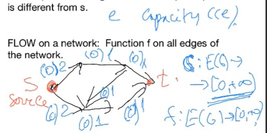
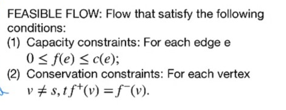

# Lec 15

### Theoeem : Menger, continue
* we prove 
#### directed edge verion implies directed vertex version
  * it eem like book doen't contain this content
  * at 10-27 3:00 pm
  * Still at Remakr 4.3.15
  * basically replace each vertex with two vertex $v_{out}$ and $v_{in}$, that only has out/in edge of $v$, and there is only one edge from $v_{in}$ to out
    * and for the new graph, each of its disjoint edge set corresponds a disjoint vertex set
    * we always have a minimal disconnecting set with $v_{out}$ as each end of the edges
    * this disconnecting set corresponds to a seperating set of the original graph
    * and each seperating set corresponds to a disconnecting set (with each end as $v_{out}$)
    * this can prove minimal disconnecting set size-equal to the minimal seprating set
***
* Another version of menger
* A, B two sets of vertices
  * disjoint (non-repeat vertices) A,B-path: start at A, end at B, do not visit A or B in between
  * If $v$ is in both A, B: v (and no other edges) is regarded as A,B-path
  * A,B-cut:
    * A set of vertices $S$ that $G-S$ doesn't have any A,B path
    * now we can use the vertices from A or B in the cut
  
### Theorem: Menger another
* The maximum number of disjoint A,B-path i equal to the minimim size of A, B -cut

### Theorem: Global Menger Theoerm 4.2.21
* The connectivity of $G$ equal the maximum $k$ such that $\lambda(x,y) \ge k$ for all $,y \in V(G)$
* The edge-connectivity of $G$ equal the maximum $k$ s.t. $\lambda'(x,y) \ge k$ for all $xx,y \in V(G)$
* hold for both directed and undirected

### Theorem: removal of edge reduce connectivity by at most 1
* Lemma 4.2.20

## Connection with Koenig's Theorem about bipartite graphs

### Theorem: Menger implies Koenig
* first add two vertices $s,t$ at each parition and connect each of them to each parition
* then we can prove every $s,t$-vertex-cut is a vertex cover
* and each matching is a set of disjoint path

### Theorem: Koenig also implies vertex, directed Menger, (don't cover, maybe won't be tested)

***
We will deduce (directed, ege version of) Menger's Theorem later using

## Network Flow problems
* Network: a digraph with an non-negative capacity $c(e)$ on each edge $e$
  * a distinguished vertex $s$ ("source"), and a distinguished vertex ("sink") that is different from $s$
* Flow on a network:
  * function $f$ on all edges of the network
  * 
    * for each vertexx
      * $f^{+}(v)$ is the um of $f(e)$ over all edges $e$ starting at $v$
      * $f^{-}(v)$ is the um of $f(e)$ over all edges $e$ entering $v$
      * value of flow $val(f) = f^{-}(t) - f^+(t)$
        * $t$ is the sink
* feasible flow
  * capacity constraint
  * conservation constraint
  * 
  * everything that comes to $v$ get redistriibuted respecting the capactity
  * only $s,t$ can create/reduce thing
  * example of feasible flow: 
    * zero flow, $f(e) = 0$ every where

Recording 14: 20:00
***
How to construct other feasible flow?
### Definition:
* $f$-augmenting path:
  * An $s,t$-path $P$ in the undering graph of the network s.t. 
    * each edge along the path (from $s$ to $t$) $f(e) < c(e)$
    * each edge against the path (from $t$ to $s$) $f(e) > 0$
* **tolerance of $P$**  Definition 4.3.4
  * for each edge $e$ in $P$,
    * $h(e) = c(e) - f(e)$ if $e$ is forward (directed to $t$)
    * $h(e) = f(e)$ if $e$ is backward (directed to $s$)
    * The tolerance $c(P) := \min_{e \in P}h(e)$
    * If $P$ is $f$ augmenting, its tolerance is positive

### Theorem: Lemma 4.3.5
* if the tolerance of $P$ is equal to $z$, and $f$ is a feasible flow
  * then the new flow $g$ defined as $f$ for eadges not in $P$, $f+z$ for all forward egdges in $P$
    * $f-z$ for all backward edges $e$ in $P$ is feasible
    * also $val(g) = val(f) + z$
***
How to find a maximal feasible flow?
* start from zero flow and use the above lemma by finding an augmenting path
  * repeat if possible

***
What is the maximal value of a feasible flow?
### Definition ssource/sink cut 4.3.6
* a parition $S, T$ of $V$ nodes
* the capacity of the cut $[S, T]$
  * $cap(S,T)$ is the total capacities on the edges of $[S, T]$ 
    * note: edges start in $T$ and end in $S$ are just ignored
* given a $U$ set of vertices, 
  * $f^+(U)$ is the sum of $f(e)$ over all $e$ leaving $U$ to its complement $\bar{U}$,  
  * $f^-(U)$ is the sum on edge entering $U$
  * **net flow out of $U$** is $f^+(U) - f^-(U)$

### Theorem: Lemma 4.3.7
* $f^+(U) - f^-(U) = \sum_{v \in U}f^+(v) - f^-(v)$

