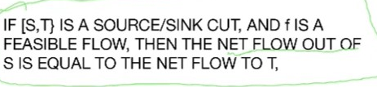
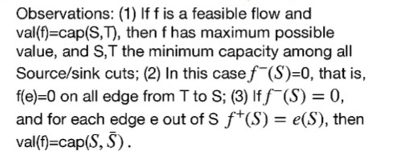
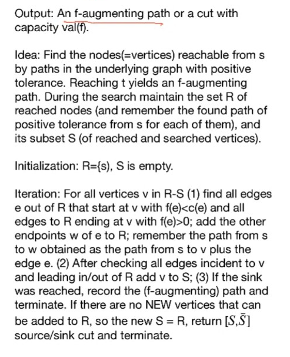
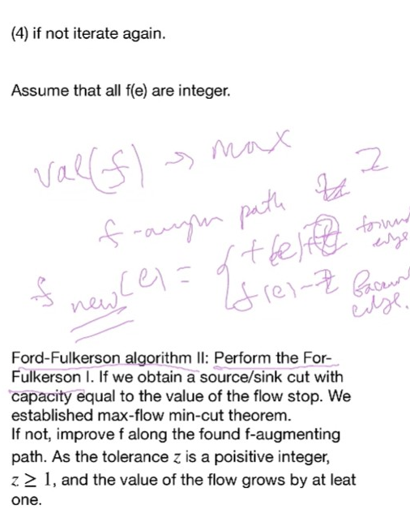
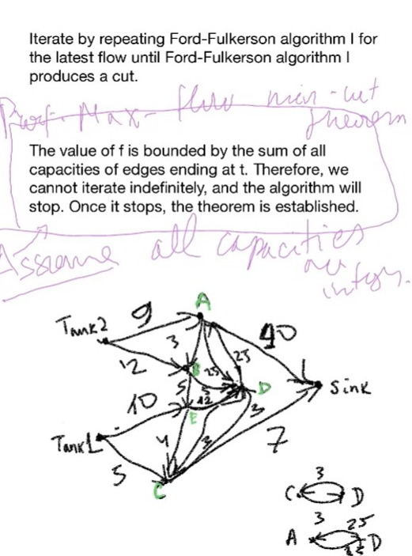

# Lec 16
### Theorem: Lemma 4.3.7
* $f^+(U) - f^-(U) = \sum_{v \in U}f^+(v) - f^-(v)$

### Theorem: Corollary 4.3.8 (Weak duality)

Maximum value of a feasible flow doesn't exceed the minimum capacity of a source/sink cut

### Theorem: Ford Fulkerson (Theorem 4.3.11)
* In every network, the maximum value of a feasible flow is equal to the minimum capacity of a source/sink cut

#### Algorithm: Ford-Fulkerson Algorithm I (10-29 recording 8, 28:51)

#### Algorithm: Ford-Fulkerson Algorithm II (10-29 recording 8, 41:22)

