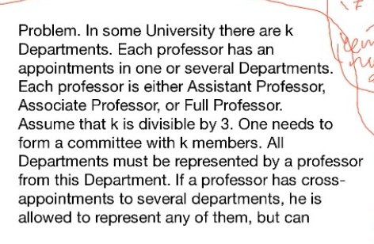
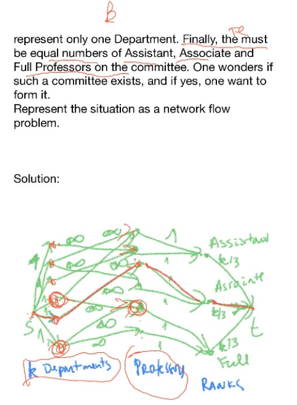
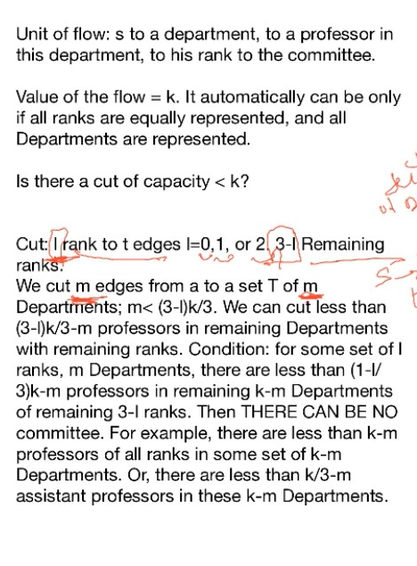
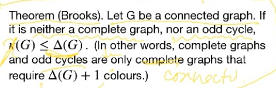
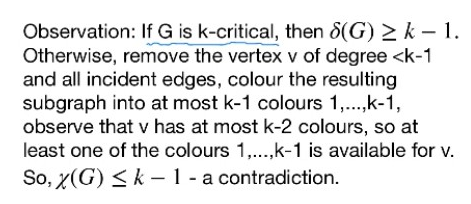
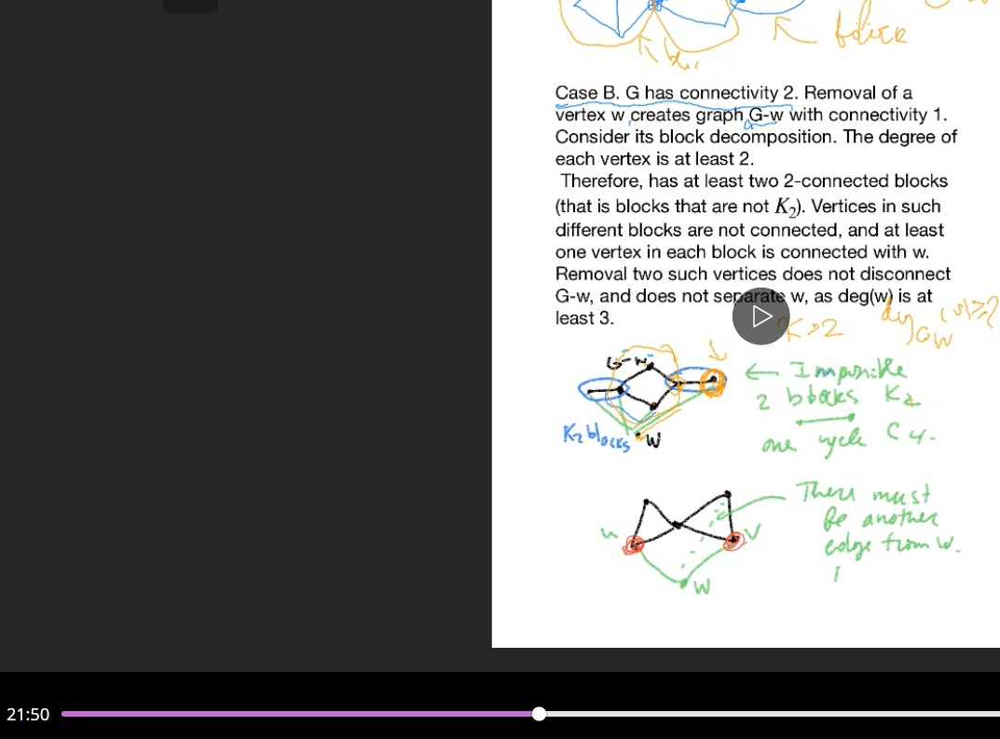

# Lec 17
### Theorem: (directed-edge) Menger From Min-cut/Max-flow 
* Remark 4.3.13

### Example: 4.3.15 -- Baseball elimination

***
The following example: totally don't understand
2020-11-03, 3:03pm -- 40:00 min

***
# Colouring of the graph

### Definition: colouring

### Theorem : Proposition 5.1.7, Prop 5.1.13
* lower bound for $\chi(G) \ge \omega(G) , \chi(G) \ge \frac{n}{|\alpha(G)|}$
* $\chi(G) \le \Delta(G) + 1$

### Example 5.1.5

### Theorem : Brooks

***
* 3-critical graph is odd cycle because
  * 1. it must have odd cycle otherwise it is biparitite and thus 2-chromatic
  * 2. and removing any edge will cause removing that odd cycle, thus any edge is on that odd cycle. 

### Theorem: Lemma 5.1.18

### Theorem: 5.1.19
* $\chi(G) \le 1 +\max_{H \subseteq G} \delta(H)$
### Theorem :5.1.21 (Vitaver)
* $\chi(G) = \min\{l(D) : D \text{ is an orientation of} G\} + 1$
  * $l(D)$ is the longest path on the $D$

### Theorem: 5.1.22 (Brook)

* this key part fills in th details
* basically w is over 3-degree, $G-w$ after block composition, must have non-trivial blocks on the edge-side (at least 2 sides), at least two blocks exists because 1-connected
  * and thus w cannot all connect to the joint of blocks, because that will create cut-vertex
  * must at least connect to two on each edge-side, otherwise they will become 
  * and it cannot connect to the joint of blocks, otherwise the joint of blocks is exactly

