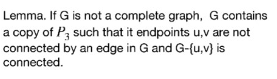
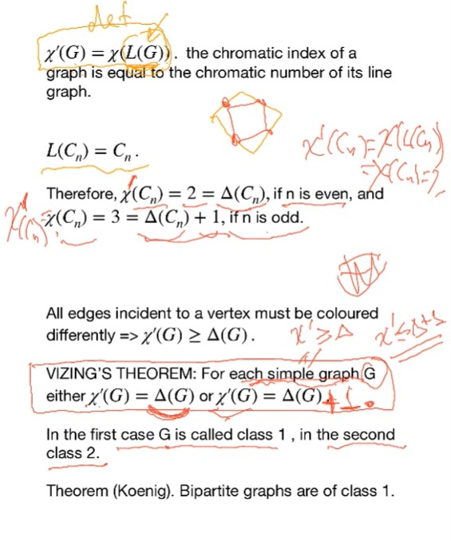
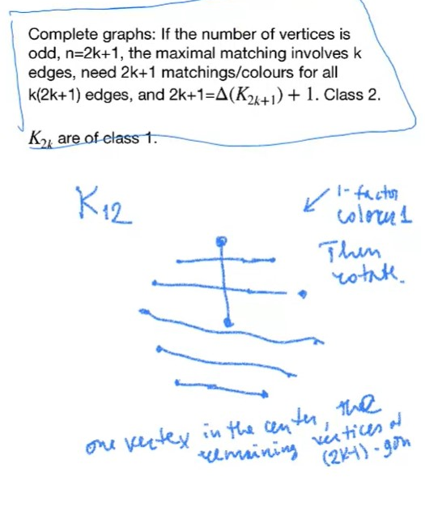
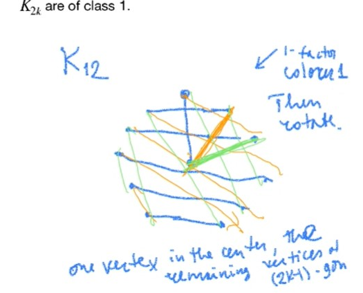
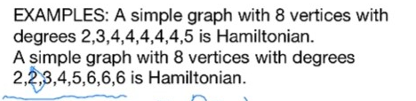
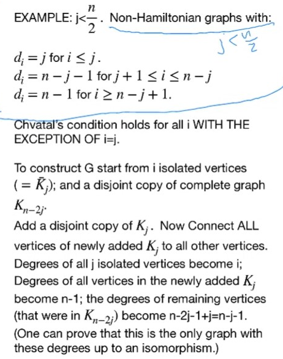

# Lec 18

### THeorem: Brook

### Lemma:

***
# Section 7.1

### Definition 7.1.3: Chromatic Index/k-edge coloring
* colour differently when colouring edges to the same vertex
***

* $\chi'(G) \ge \Delta(G)$

* egdes in one colour = 1-factor (but not full spanning)

### THeorm: Vizing THeorem
* For each simple graph $G$, either $\chi'(G) = \Delta(G)$ or $\chi'(G) = \Delta(G) + 1$

### Theorem 7.1.7: Konig
***

Continue to 11-05 - 4:10p.m. 40min

### Example 7.1.9
* if it is 3-colourable,then there will be a 1-factor consist of edges of one colour
* then the remaining is exactly 2-factor
* basically Girth(P) $\ge 5$, and thus the 2-factors are either $2C_5$ or just one $C_10$
  * if it is $2C_5$, then we will have to use 4 colours
  * we only need to prove it is impossible to have one $C_10$
    * basically looking at the cross edges between the inner star and outer pentagon
    * For a $C_10$, there must be even number of cross-edges used in $C_10$, 
      * if 2 of them are used, then remaining 3 cross edges must be in the earlier 1-factor, and its joint edges must be in 2-factors, we can derive contradiction from it
      * similarly when 4 of them are used.

***
### Theorem: Vizing  for multi-graph
* $\chi'(G) \le \delta(G) + \mu$
  * where $\mu$ is the maximal multiplicity between any two edges

### Theorem: Shannon (THM 7.1.13)

***
# Hamltonian Graphs
* A graph is hamiltonian if
  * it is with spanning cycle also called Hamiltonian Cycle.
  * spanning cycle: spanning subgraph : contains all vertices of graphs
  * travelling sales man -- hamiltonian cycle with least weight
  * given a simple graph
* spanning path
  * hamiltonian path -- through all vertices each exactly once
***
* peterson graph is with hamltonian path
  * but without hamiltonian cycle
### Theorem: $K_n$ is hamltonian
### Theorem: $K_{m,n}$ is hamiltonian iff $m = n$
* just look at the hamltonian cycle, we look at any of the vertex, then its neighbours must be in different partition, and .. so on; we can count
***
* Hamiltonian graph is connected

### Theorem: (Necessary COndition for Hamiltonian)
* If $G$ is hamiltonian, then for each non-empty set $S$ of vertices
  * the number $c(G - S)$ of components of $G - S$ doesn't exceed $|S|$
  * (WHY??? this condition guarantee $G$ is 2-connected?)

### Theorem: (Dirac) Sufficient COndition for Hamiltonian
* If $G$ is a simple graph with
  * at least three vertices
  * and $\delta(G) \ge |V| / 2$
* then $G$ is hamiltonian

***
### Examples: Graph Almost satisfying Dirac
* $K_{m,m+1}$, $\delta = (|V|-1)/2$ (odd vertices)
* join $K_m$ and $K_{m+1}$ at exactly one point (even vertices )

***
Nov. 17 : 2nd part 40min

### THeorem (Ore):
* we can replace precondition of Dirac with
  * $d(u) + d(v) \ge n$ for each pair of non-adjacanet vertices $u, v$

### Lemma (Ore):
* if $d(u) + d(v) \ge n$ for some pair of non-adjacanet vertices $u, v$
* then
  * $G$ is hamiltonian iff $G+uv$ is hamiltonian

### Definition: Hamiltonian Closure $C(G)$ of Simple Graph $G$, 

### THeorem:Bondy - Chvatal
* $G$ is Hamiltonian iff
* $C(G)$ is Hamiltonian
* proof:
  * by easily induction using above Lemma
### Theorem: 
* $C(G)$ doesn't depend on the order of adding edges 

### Theorem: Chvatal 7.2.13

***
### Example: Nov.19, 10:00

### THeorem： Chvatal's THeorem for Hamiltonian Path (7.2.17)
* proof by reduction to Chvatal's THeorem.
* Nov.19, 29:26

# Exercises:

### 7.2.7
* impossible. as that means there is a Hamiltonian Path from corner to center
  * we add an edge between corner and center, then we get a Hamiltonian cycle
  * Assume this is Hamiltonian, we remove first level 4 blocks
    * second level 5 blocks
    * third level 4 blocks.
    * then we will have remaining 27-13 = 14 vertices/components > 13 vertices
    * a contradiction to the necessary condition
  * you can also check the standard answer