# Lec 19

# Planar Graph

### Definition: Planar graph
* Graph can be drawn on a plane without crossing.
* Path:
  * a continuous map from $[0,1]$ to the plane
* closed curve
* simple closed curve
* polygonal path/
  * polygonal (simple) closed curve
    * finitely many line segments
### Definition
* A (planar) drawing of a graph 
  * is $f: V \cup E \rightarrow \reals^2$
  * s.t.
    * distinct vertices maps to distinct points
    * the image of each edge is a polygonal path (???)
      * Actually, don't quite understand (???)
      * we should look at an arbtrary map and point out how is it a planar graph
* a crossing : 
  * intersection of images $f(e),f(e')$ that is not the image of common endpoint of $e, e'$
* planar graph
  * $G$ is planar if there exists a planar drawing without crossing
* Crossing number $v(G)$ is the minimal number of crossing in a drawing
* 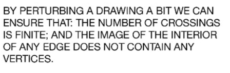 
  * basically the intersection is all finite

### DEfinition: faces (Nov. 19. 44:22)

### Theorem: Jordan Curve Theorem (6.1.6)
* THe proof on the book is very non-rigorous

***
### Definition:
* A plane (??? is it just planar?) drawing of a planar graph is called a plane graph
* plane graph divides the plane into polygonal faces (not necessarily convex)
  * once face is unbounded (Why???)
  * **outer** face is that unbounded face

### Definition: 6.1.11 (Nov.24, 3:00, 24:25)
* the length of a face (why it is well-defined?)
  * the length of the closed walk bounding the face

### Example 6.1.12 (Nov.24, 3:00, 25:18)
* An edge appears twice iff it is a cut edge (???)
  * = we see the same face on both sides
* it appears once if the edge seperates the face from the other faces

### Theorem: Prop 6.1.13
* sum of lengths of all faces is equal to 2$|E|$
  * use a different proof than in the book
### Definition: Dual Graph $G^*$ 6.1.7 (28:14)

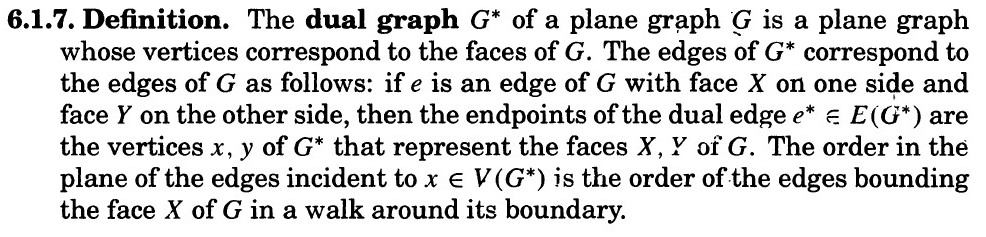
very vague and abstract -- a plane graph is defined to be a function from the underlying graph to $\reals^2$.

* a dual graph $G$ has each face of $G^*$ as vertices
* and each $e \in G$ we have $e^* \in G^*$ connecting both sides of $f_1, f_2$ faces of $e$
  * (???) the $e^*$ has to cross $e \in G$
  * dual graph is defined on plane graph, plane graph is planar embedding (no crossing)
### Remark: 6.1.9:
* dual graph is still planar
* dual of dual is iso to the original if connected

### Remark: 6.1.10:
* dual of plane graph of the same graph might not be isomorphic

### lemma: trivially (32:40)
* $|E(G*)| = |E(G)|$
* length of a face in $G$ = degree of the corresponding vertex of $G^*$
* $\sum_f l(f) = 2e$
* sum of lengths of faces of $G$ = sum of degrees of vertices of $G^*$

### Theorem: Euler's Formula 6.1.21
* proof by induction!

### Theorem: 6.1.23
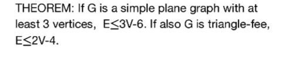
* $E \le 3V - 6$
*  because $2 e = \sum_f l(f) \ge 3f$ (each boundary/closed walk is at least 3)
   *  $n - e + f = 2$ => $f = e + 2 - n$
   *  $2e \ge 3e+ 6 - 3n$
* if $G$ is planar and bipartite, (46:06)
  * $E \le 2V -4$
    * similar as above, 

### Corollary : $K_5, K_{3,3}$ are not planar (Example 6.1.24)

***
recording 20 (Nov.24, 4:01pm)

### Observation 
* average degree of planar graph $\frac{2E}{V} \le \frac{6V - 12}{V} < 6$
* thus there exists a vertex of degree at most 5
* the sum of all degrees is at most 6V-12
  * assume $G$ is connected,
    * then each vertex has degree at least 1 (connectivity)
    * there must be at least 3 vertices of degree < 6
    * 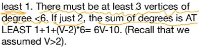

# Theorem: Kuratowski (6.2.2)
 Very LONG
### Lemma
* a graph is planar iff its subdivison is planar
* subgraph of planar graph is planar
* subgraph is not plaanar then original graph is nonplanar 
* 
### Lemma (10:41) 
  * $G$ is planar graph, $e \in G$ as an edge
    * then there exists a planar eb=mbedding of $G$ s.t.
      * $e$ is in the boundary of the outer face
    * (we can do that the bundary of any face will become bondary of the outer face ) (Lemma 6.2.4)
### Lemma (17:13) 6.2.5
* every minimal non-planar graph is 2-connected
* S-lobe is the induced subgraph of one componenet of $G-S$ and $S$
* 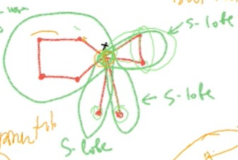
### Lemma (26:12) 6.2.6
* ??? what is the point adding xy-edge?
  * one of those lobe has to be nonplanar, without adding xy we still can derive this
* wrong! if you don't add xy-edge, it cannot be part of the face and locate at the outside
### Lemma (33:04) 6.2.7

### Definition: Convex Embedding (6.2.8) 38:40

### Theorem: Tutte  6.2.11
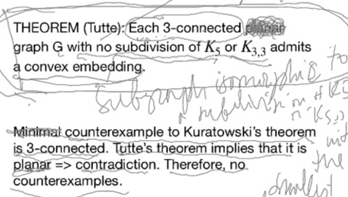

### Lemma 6.2.10 (46:42)
***
# recording-11, Nov. 26.

### Definition: Convex Embedding

### Theorem: Tutte  6.2.11
* **check the proof!!!**

### definition : plane graph
* Plane graph are actual picture of drawing on the plane

### definition: triangulation 6.1.25
* a simple plane graph s.t.
  * each face boundary is a 3-cycle (triangle)
    * doesn't have to be straightline on each edge
* 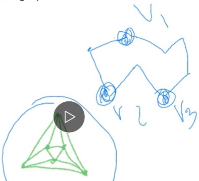

### Definition: Maximal Planar Graph 6.1.25 (27:11)
* A simple planar graph 
  * that is not a spanning graph of another planar graph
* in other words,
  * a simple planar graph
    * s.t. addition of any edge between non-ajacent vertices creates a non-planar graph

### Theorem: (6.1.26) (31:06)

### Lemma: (36:58)
* For triangluation: if there are at least 4 vertices
  * each vertex has degree at least 3
* 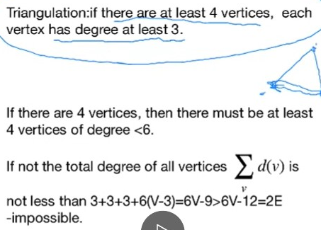

* if there are 4 vertices, there must be at least 4 vertices of degree < 6
### Theorem: Fary's Theorem (41:00) P247, Exercise 6.2.6
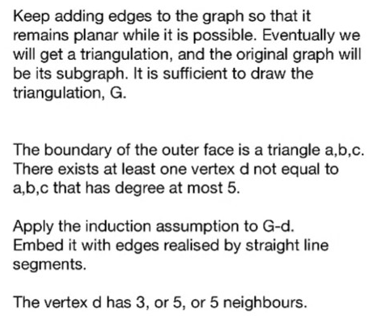
* the proof on the book is not correct
  * basically we only first prove about maximal planar graph (triangulation)
  * (which is enough since every planar graph is a subgraph of that)
  * by the above we know there are 4 points with degree < 5, since outer face has triangle as boundary
    * so there is a node inside that with degree < 5, removing that node, using induction, 
      * and then we try to add the node back
***
# recording 21, Dec 01

### Lemma: (04:00)
* For triangluation: if there are at least 4 vertices
  * each vertex has degree at least 3

### Theorem: Fary's Theorem (10:00) 
* the proof on the book is not correct
* we will proof by induction
### definition: Platonic solids (application of triangulations) 
### 6.1.28 (18:00) 
* Three dimension polyhedral
  * all faces are congruent regular polygons...
  * 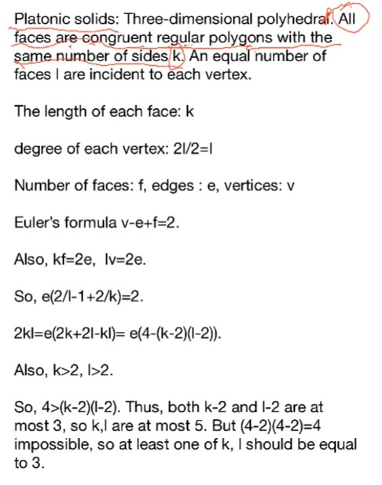

***
# Exercises
### 6.1.13 : (???)
* how do we find planar embedding. The result is all triangles, so the e = 3n-6
  * but how is that helpful?

### 6.1.18 : (???)
* it doesn't say intersect once. then we  can draw something with face without vertex
* for Q3, we have the following properties
  1. $x$, $y$ is located at both sides of $(xy)^*$, (by definition, recall how $e^*$ is actually defined on $e$)
    * that means $xy$ crosses $(xy)^*$
  2. for arbitrary $e \in E(G)$, there is one and exactly  one in $E(G*)$ $e' = e^*$ crossing it
    * by definition of dual graph
    * which also reveals a bijection by $(\cdot)^*$ between $E(G) \cong E(G*)$
  3. we define $x^{**}$ the face in $G^*$ that contains $x$ (by part b)
  4. now we claim $(xy)^{**} = x^{**}y^{**}$ to get graph isomorphism
    * by 1, we know $(xy)^{*}$ is crossed by $x = x^{**}$ and $y = y^{**}$ (i.e. $x^{**}y^{**}$)
    * but by 2, we know only $(xy)^{**}$ crosses $(xy)^{*}$
    * thus $(\cdot)^{**}$ is a graph isomorphism
  
### 6.1.25
* n - e + f = 2 => f = n => e = 2n-2
* if n = 4, then e = 6, f = 4
  * $K_4$ is exactly what you want, $K_4^* = K_4$
  * for all $n \ge 4$, consider $G$, it already has a 
    * basically $K_1 \lor (C_{n-1})$ 
    * the outer face becomes the one point joins everyone

### 6.1.30
* $2e = \sum_f l(f) \ge kf$
* $n-e+f = 2$ => $f = e+2-n$
  * $2e \ge k(e+2-n) = ke+2k-kn$
  * $\frac{kn-2k}{k-2} = (n-2)\frac{k}{k-2} \ge e$
  * Peterson-graph : girth 5, e = 15, n = 10
  * $40/3 < 15$

### 6.2.6 (Fary Theorem)

### 6.2.7
* $G$ is outer planar iff $G \lor K_1$ is planar
  * left to right is trivial,
  * right to left, we can make the planar graph having $K_1$ at the outer boundary (by the Lemma)
    * and then removing $K_1$ of course giving back planar graph $G$
    * it is easy to see that $G$ is outer-planar. Since the outer boundary, by Jordan Curve Theorem will cut the plane into two faces, if $G$ is not outer-planar, then we have a point v inside the inner face, connect to $K_1$ by definition, crossing the boundary.
* $G \lor K_1$ has subdivision of $K_5$ or $K_{3,3}$ iff $G$ has subdivision of $K_4$ or $K_{2,3}$

### 6.2.8
* essentially speaking -- once we hvae $K_5 = \{x,y,u,v,t\}$
  * we are very close to $K_{3,3}$
  * we just need to find another point connects to arbitrary 3 vertices of $K_5$
    * that point is found by an vertex $p$ on the path of $x,y$, which will either connect to a point $q$ on cycle $u-v-t-u$, or path $\{x,y\}-\{u,v,t\}$
    * then informally speaking $p$ connects to $x,y, q$ already, $q$ connects to three of $\{p,u,v,t\}$ already
      * of course there are some glitches but you know how to continue

### 6.2.11 (???)
* the standard answer is very weird
* but basically we are asked to prove when $\Delta(H) \le 3$
  * if $H'$ contractible to $H$,
    * then $H'$ has a subdivision of $H$
    * by induction and the fact that a subdivisoon of $H$ also has degree at most 3
    * then we consider $H'e$ is the contraction step, and $e$ contracts to $v$
    * if $v$ is not in the subdivision, then the subdivisoon is also in $H'$ already
    * otherwise if $e = ab$, and $d(v) \le 3$, we need to prove $H'$ is still a subdivision --
      * basically because one vertex in $a,b$ will have at most 1 edge that is at the end incident to $v$ inside the subdivision (degree at most 3)
      * so that part can be considered as a subdivison (enlonging of an edge)
### 6.2.12
1. Deletion and contraction preserves planarity
   * Now given a planar graph, assume it can be contract/delete to $K_5, K_{3,3}$, then one of them would be planar, a contradiction.
2. Don't use Q11. but it is trivial. Just prove contrapositive and we can use deletion and contraction on subdivision.
  
### 6.3.12
* 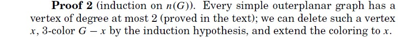
* Theorem 6.1.20

### 6.3.15 
*  (the book has totally different proof!)
* by induction, 
* if it has a cut vertex ..
  * we remove the cut vertex and on each component we have two sets
  * we take one set from each component and become a new set -- this must be a disjoint union of paths as there are no connection in between (as otherwise this is not cut vertex)
* if it doeesn't, then it is 2-connected and thus a cycle on boundary
  * then we find a chord, (if not we just split the cycle to left side and right side and we are done.)
  * we cut the graph according to the chord as left side and right side, each side by idnuction we can get two sets
  * the left side one set cannot connect to right side one set because of the chord (otherwise there are two chords )