### Definition: independent set
* a subgraph formed by a set of pair-wise non-adjacnet vertices
* $\alpha(G)$ the maximal cardinality of independent set of $G$
* $\omega(G)$ the maximal cadinality of complete subgraphs

### Definition: bipartite graph
* $V = V_1 \cup V_2$
* all edges run between $V_1, V_2$
* complete bipartite graphs are that all edges between $V_1, V_2$ should be presented
  * denoted as $K_{m,n}$, also called bi-clique
  * $K_{m,n} \cong K_{n,m}$

### Definition: connected, distance
* a graph where each pair of vertices are vertices of a path is called connected
* the length of path is exactly the number of edges in a path
* the minimal length of path containing $v_1, v_2$ is called distance between $v_1, v_2$
  * if there is no such path, then the distance is $\infin$
  * distance satisfies the definition of measure
* $diam(G)$ is the maximal of $distance(v_1, v_2)$
* The whole graph can be decomposed into connected components (as partition)
  * each connected component is a induced subgraph

### Definition: Girth 
* cycle $C_n = P_n \cup (v_n, v_1)$
* Girth, $g(G)$ minimal length of cycles in $G$
  * Paths/Cycles cannot have points repeat (i.e. vertices distinct) 
  * $g(G) = 1$ -> a loop!
  * $g(G) = 2$ -> multiple edges, no loops (multi-graph)
  * $g(G) > 2$ simple graph!
  * no cycles -- $g(G) = \infin$
    * such graph is called forest
    * if this is connected, then we call it tree
    * i.e. each connected component must be a tree
  * $g(C_m) = m$

### Definition: Decomposition of graph $G$
* a collection of subgraphs s.t. 
  * each edge of $G$ is in exactly one subgraph
  * 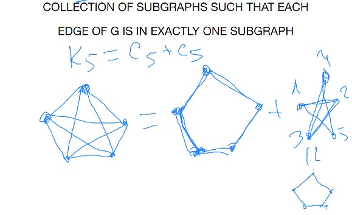
* you can decompose a graph into itself and independent set
  * just require each edge into exactly one subgraph 

### Definition: A complement
*  Given a simple graph $G$
   *  Define $\bar{G}$
      *  where $V(G) = V(\bar{G})$
         *  $v_1, v_2$ are connected in $G$
         *  iff $v_1, v_2$ are not connected in $G$
   *  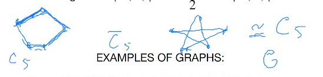
   *  $C_5$ is a self-complementary -- 
      *  it is isomorphic to its complement
   *  another example
      *  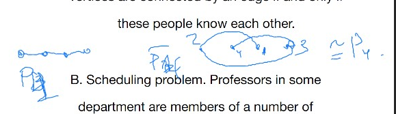
#### Example
* two people connected when they know each other
  * complement when connected when not know wach other
### Definition: chromatic colouring
* min # of colour required to colour $V(G)$ without conflicting (different colours on adjacent)
* 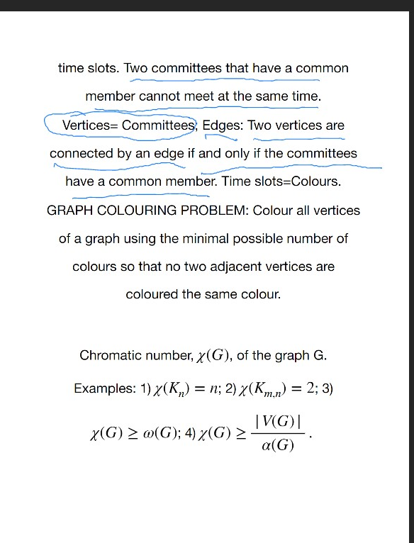
* All vertices coloured the same form an indepednent set
  * thus $X(G) \ge \frac{V(G)}{\alpha(G)}$
  * chromatic number of a graph is the minumum  amount of indep. sets needed to partition V(G) 
  * \# of each vertices $\ge \alpha(G)$ 
  * (see pg 5 of text book)
*  chromatic number of $K-$ partited graph is $\le$ $K$ (???)
*  this can also be used in geographic graphs
   *  but this graph is planar -- 
      *  it can be drawn on the plane so that graph can pairwise intersect only at their common endpoints
   *  Four Colour Theorem!
   *  But we will prove Five Colour Theorem!
   *  planar and sphereical graph are the same (???)
### Definition: Peterson Graph
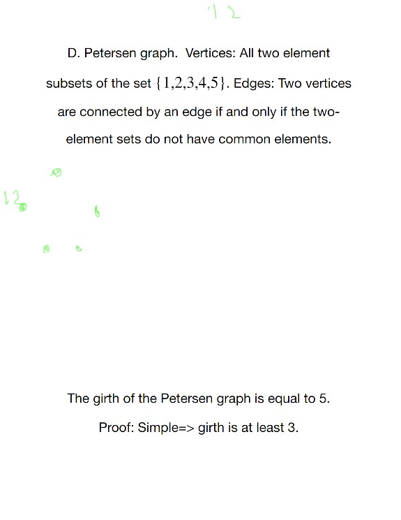
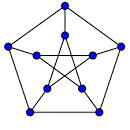
* it is a simple graph, so $g(G) \ge 3, g(G) \le 5$

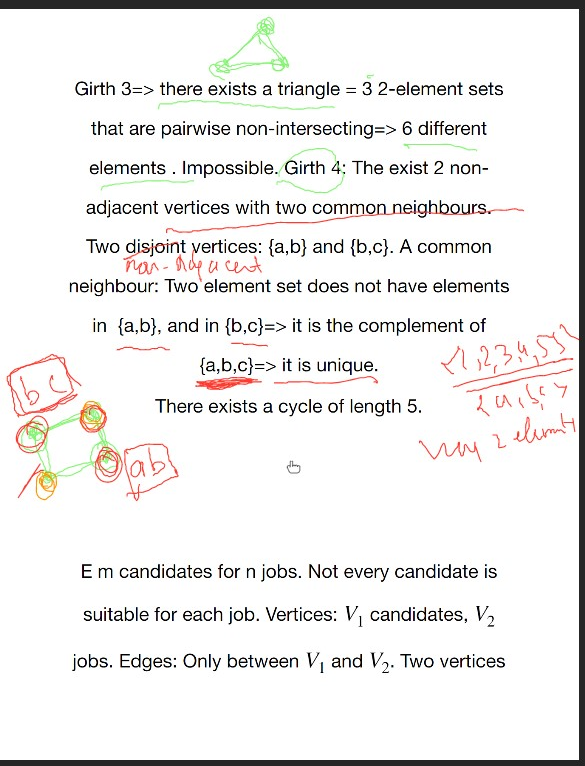

Of course handwaving enumeration on graph is ok

***
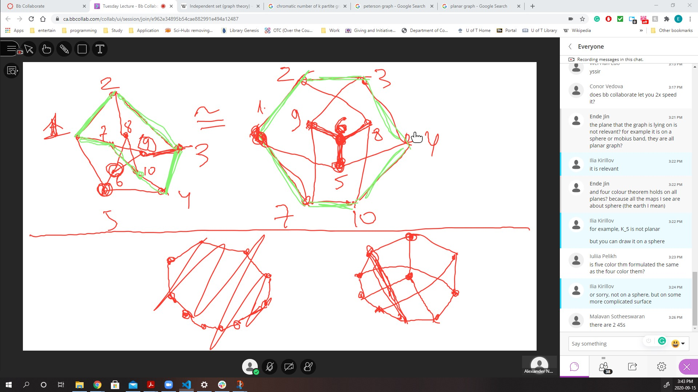
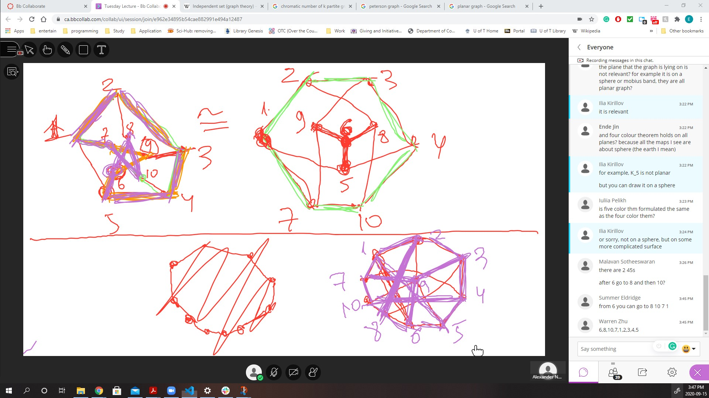

By decomposing into cycles, we can find isomorphism much easier

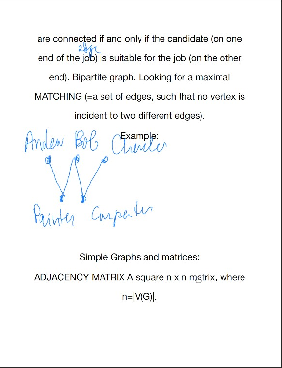

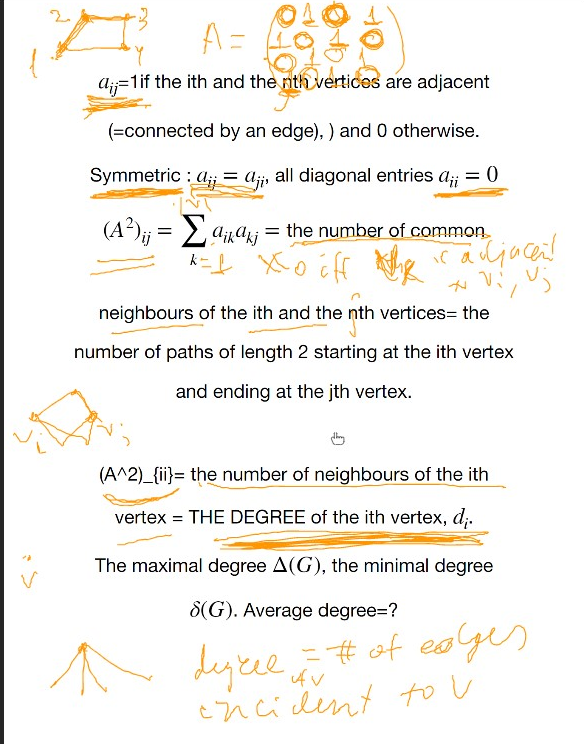

* the multigraph can be encoded as non-zero inside the entries (as the number of edges)

*  For simple graph, degree is exactly the number of neighbours; otherwise, it is larger

*  degree is exactly the number edges adjacent to it.

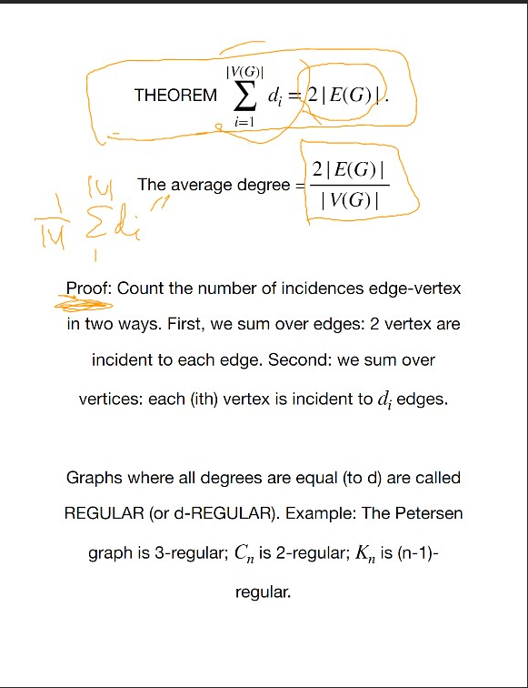