# Lec 20
# recording 21, Dec. 01, 20:00

### Definition: Platonic solids. (cannot find on textbook!)
* 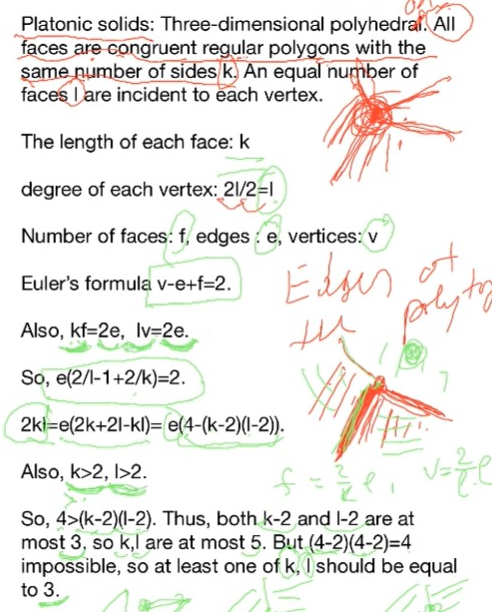
* 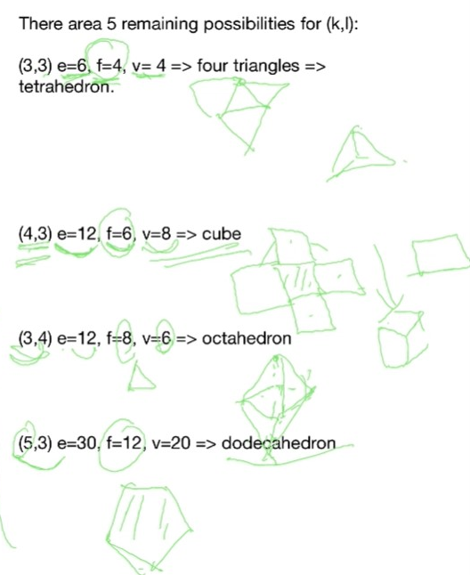

### Theorem: 5-colour theorem (6.3.1) (28:21)
* dual graph of a planar graph is also planar
  * actually only plane graph has dual
* key part: 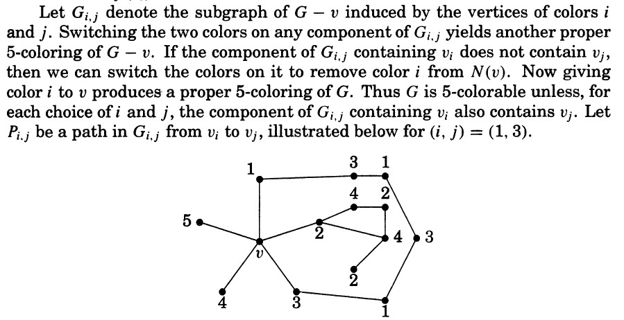
* basically because of planarity, path1/3 cannot cross path2/4, and thus component 2 is detached from compoennt 4, and we switch one colour (2 to 4) is safe
* the question is why if it is planar, it looks like this? it is totally proof by drawing.
# recording 22, Dec. 01, 

### Platonic solids

### Definition: outerplanar graphs (03:04) (6.1.17)
#### (where is it in the textbook)
* there exists a plane drawing with all vertices on the boundary of the outer face
* 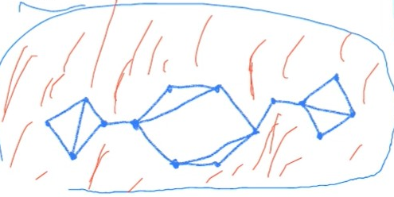
* don't have to be connected
* 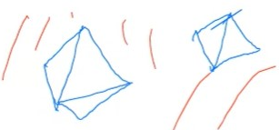
* 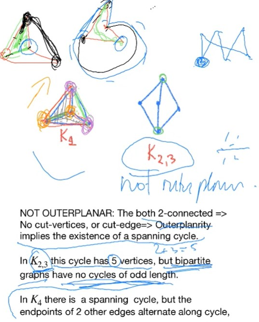
* 2-connected outer-planar graph has outer face as cycle as boundary
  * (???) because if not, then we have repeated edges on outer-walk, then we have both sides as outer face
### Theorem: Each outerplanar simple graph has a vertex of degree at most 2 (11:06) (6.1.20)
* cannot find on textbook

### Theorem: (18:18) 
* a graph is outer-planar iff it doesn't contain $K_4$ and $K_{2,3}$
  * one of the homework
  * the other direction: Prop 6.1.19
  
### Theorem: (20:01)
* a outer planar graph is 3-colourable
  * deducible from 4-colour theorem
    * not proven in the lecture

# Parameters of Non-planarity (20:32)

### Definition: (Thickness) 6.3.9
* minimal number of planar graphs in a decomposition

### Theorem: (6.3.10) (22:00)

### Definition: (Crossing number) $v(G)$

### Theorem: 6.3.13 (24:00)
* basically $G-H$ has crossing with H, 
  * and $G-H$ might still have crossing, whose sub planar graph has edge size at most $H$
  * thus $G - H - H$
### Example: 6.3.12 (30:00, 40:00)
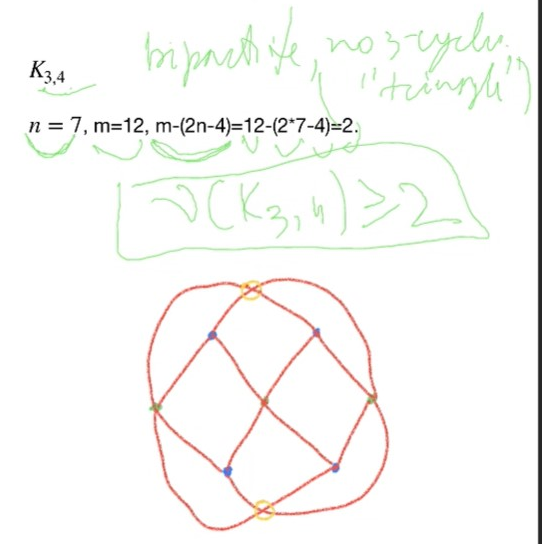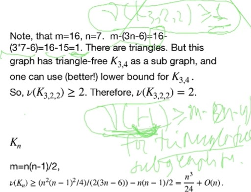
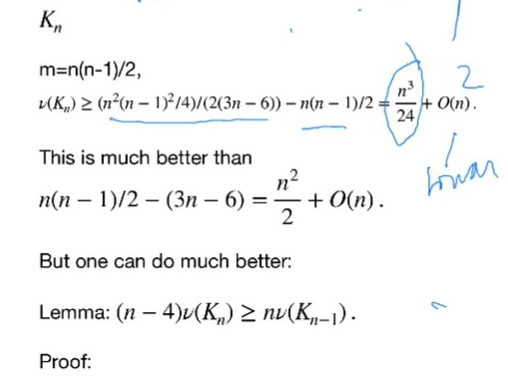

### Lemma (47:00) 6.3.14
* $(n-4)v(K_n) \ge n v(K_{n-1})$
* (???) each intersection point in $K_n$ is an intersection point in n-4 of $K_{n-1}$
  * each crossing corresponds 4 points

### Theorem: $v(K_n) \le C_4^n$

### About $v(K_{m,n})$, (50:00) Example 6.3.15

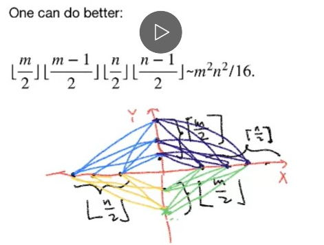

***
recording - 12, Dec. 3th, 
# Ramsey Theorey

### Pigeonhole Principle (P378)

### Generalizee Pigoenhole (03:21) (Theorem 8.3.5) 
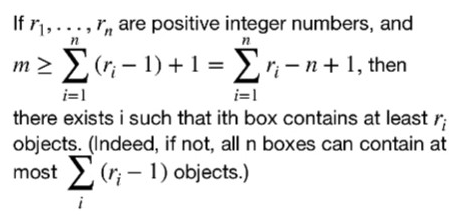

### Theorem: 8.3.3 (Erdos-Szekeres)

### Theorem: 8.3.1 (13:19)
* equivalently: each graph with 6b vertices contain either $K_3$ or $\overline{K_3}$
* 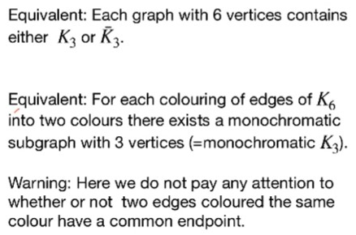

### Theorem: (23:22)
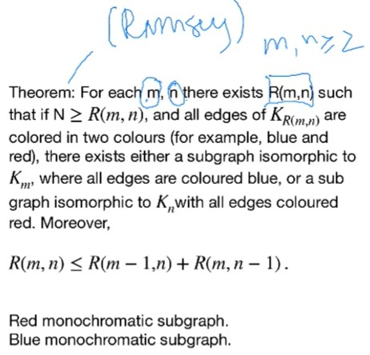
* THeorem 8.3.11
* Example 8.3.9, Example 8.3.10
* basically a graph with sub-clique of size $m$ and independent set of size $n$ and

### Corollary: $R(m,n) \le C_{m-1}^{m+n-2}$ (34:40)
* by induction

### Lower bounds for $R(n) = R(n,n)$ (43:00)
### Theorem 8.3.12
(Not done, please continue the video from 23:00)

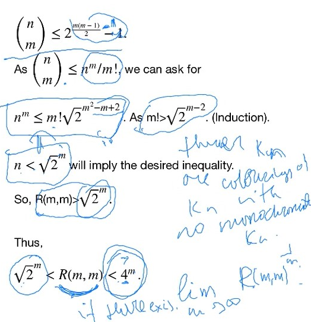

***

# Dec. 08th, 2:00, 3:00

### Ramsey Theorem -- Random Graph/Probability method (10:00)

### (17:30) Restricted version of Theorem 8.3.14

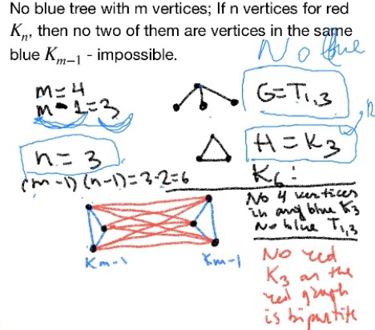
* the proof on book is also simple:
  * on lower bound part, there is no Kn because
    * otherwise one partite would have two elements which is impossible

### (33:30) Theorem 8.3.15

### Bowtie Lemma (45:30)

### Ramsey theorem for more
* $R(n_1,n_2,...,n_l)$
* 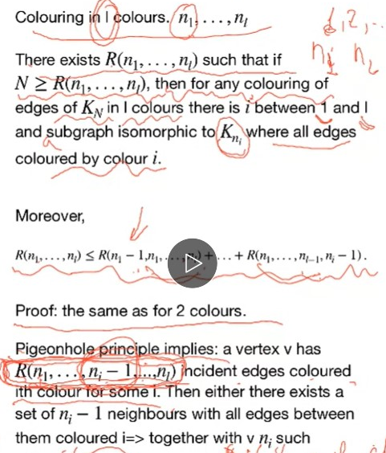

### Example : $R(3,3,3) = 17$
* 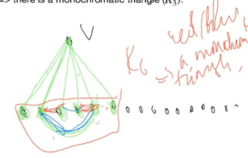

### Ramsey theorem for more again (8.3.7) (23:00)
* 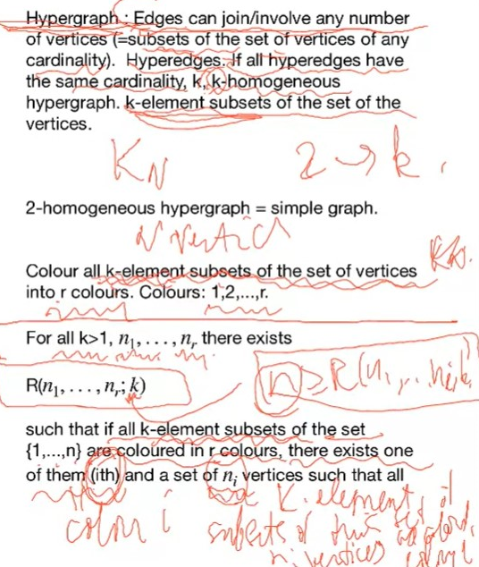
* such that all its k-element subset (of these $n_i$ elements) are coloured in the same (monochromatic)
* TOtally don't get it
### Theorem 8.3.8 (30:24)
* Lemma (35:29)
* 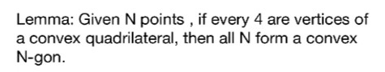

***
Start reading from 30:00

# Exercise:
### 8.3.17
* by generalized pigeon hole principle, a fixed $x$, with its neighbours, there exists colour $i$ s.t. $R(q_i)$ neighbours with $x$ coloured $i$
  * this can give us the $R(p)$
* 
