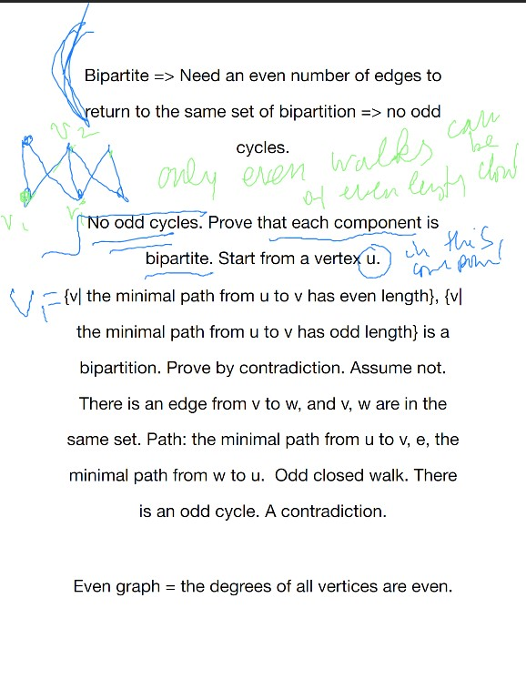
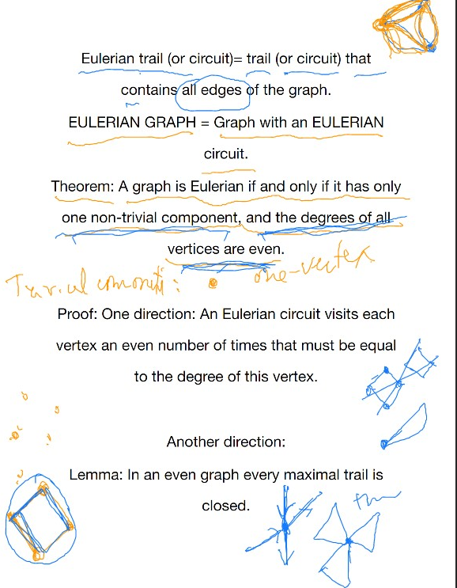

# Lec 3

### Theorem:  
* $\sum_{i=1}^{|V(G)|} d_i = 2 |E(G)|$
  * 
  * $d_i$ stands for degree
  * applies to both multi and simple graph
  * corrolary : number of all degress of vertices must be even
  * Proof: count the number of incidents (edge-vertex) in two ways
    * first, each edge has 2 vertex
    * second, each vertex has $d_i$ degree
#### Example:
* peterson is 3-regular
* $K_n$ is n-1 regular
* For d-regular graph, $d|V| = 2|E|$
* Bipartite k-regular graph has same number on each paritite vetices
  * edge number equal to the indicience beween an edge and a vertex in $V_1$, which is $k|V_1|$
### Definition: Incidence Matrix: Consider incidence are mathematical objects
* The incidence matrix $I(G)$, $I_{ij} = 1$ if $i$-th vertex is incident to $j$-th edge
### Definirion: WALK
* A walk is a sequence of vertices and edges s.t.
  * $v_iev_{i+1}$ where e is the edge between $v_i v_{i+1}$
    * in simple graph, no need to specify edges
  * the length of walk is the number of edges
  * walk allow repeated vertices
* closed walks == start and end points are the same
* no repeated edges = TRAIL
* no repeated vertices = PATH
* WALK values the order and repetition of edges/vertices
* CLOSED TRAIL = circuit
  * in textbook, two circuit are the same as long as they form a same trail
* $uv$-walk, $uv$-path , $uv$ standing for end points
### Theorem:
* $uv$-walk contains a $uv$-path
* every closed odd walk contains an odd cycle (length is odd)
  * proof by well-ordered principle (not induction, you don;t know what is being inducted on)
* A graph is bipartite iff it has an odd cycle
  * 

### Definition: Even graph:
* An even graph is a graph where all its degree is even
* Eulerian trail (or circuit) = trail (or circuit) that contains all edges of the graph
* Eulerian Graph = graph with an eulerian circuit

### Theorem: 
* a graph is eurilerian iff one non-trivial component and all degrees are even
* 
* I totally don't get the proof. He is too fast

***
* $G$ is connected but not even, is it possible to have a an Eulerian trail?
  * iff there are exactly 2 vertices of odd degree

***
* The degree sequence