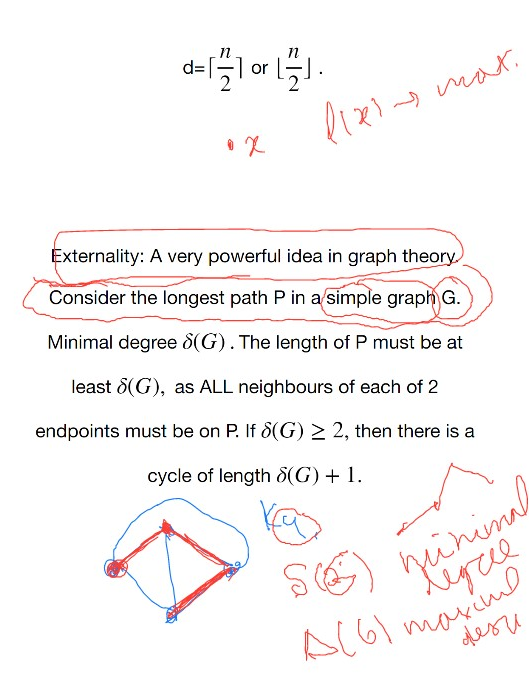

# Lec 4

### Definition
* the degree sequence of a graph
  * is the sequence of degrees of all vertices ordered in decreasing order
* any sequence [that number of vertices with odd degrees is even] can be a multi-graph degree sequnece
*  a graphic sequence 
   *  is a sequence of a simple graph

### Theorem: Algorithm to decide a graphic sequence 
* seeing (n, ...) => remove the first element, and remove 1 for the following n elements
  * rearrange it into decreasing degrees
  * repeat the above recursion
  * (0, .., 0) is graphic
*  not graphic if any of the above algorithm is stuck, or a nagative number appears
*  lemma: sequence $d$ is graphic iff sequence $d'$ is graphic
*  $d' = (n,...)$ is gotten by removing 1 for the following n elements
*  proof.
   *  
   *  
*  the above lemma is enough for the correctness of the algo (???) **totally didn't follow**

*** 
* Extremal Graph Theory:
  * what are the largest graphs with some property
### Theorem: Mantel
* The maximum number of edges in a triangle
* 
  * if n = 5, it will be $K_{2,3}$
  * 
  * in the above proof, 
  * **totally didn't follow**
    * we showed that that N(x) and G\N(x) give us a bipartition ,isomorphism comes from that
    * and it is complete because the number of edges is maximal possible  
  * 

#### Externality
* dentoe $P$ as the longest path in $G$
* $\delta(G)$ stands for the minimal degree, $\Delta(G)$ stands for the maximal degree
* then the length of $P$ must be at least $\delta(G)$ 
  * the neighbours of endpoints must be on $P$
  * otherwise it is not the longest path
* if $\delta(G) \ge 2$ then thre is a cycle of length $\delta(G) + 1$
  * thus each tree with at least 2 vertices has a leaf
    * (since otherwise it has a cycle)
  * Thus a tree with $n$ vertices has $n-1$ edges
    * because induction on vertices, and removing a leaf is okay, which won't destroy connectedness and won't create cycle
  * there is exactly one path otherwise we can construct a closed walk and thus a cycle
### Theorem: Tree can be defined otherwise
* no cycles
* connectedness
* (n-1) edges
* the above three, either 2 can derive the third  

### Definiton:
*  An edge is a cut
   *  if its deletion increases the number of components
*  a cut-vertex is 
   *  when remove it, we have an increase on the number of component
*  we can prove if an edge is not cut-edge, then it belongs to a cycle
*  we also have proved if an edge belongs to a cycle, then it is a not a cut edge (?) **totally didn't follow**

# Isomorphism of graphs
* simple graphs isomorphic
* if $f : G_1 \cong G_2$
  * then $|V(G_1)| = |V(G_2)|$
  * $|E(G_1)| = |E(G_2)|$
  * $d(v) = d(f(v))$
  * they must have the same degree sequence
* we now consider induced subgraph
  * the induced subgraphs from the vertex of a fixed degree must be isomorphic