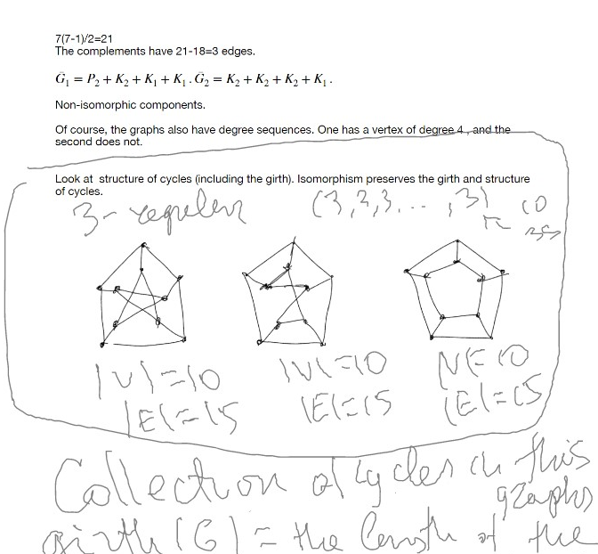
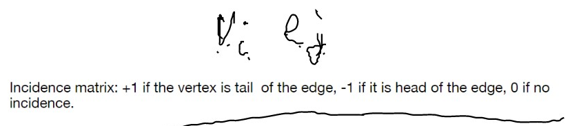
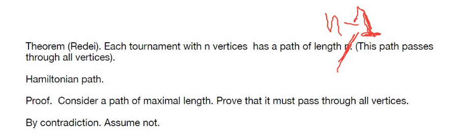

# Lec 5

### More about Isomorphism
*  Look at complement graph is also good idea
*  two graphs are isomorphic
   *  iff their complements are isomorphic

***

* Peterson Graph, $girth(G_1) = 5$
* while $G_2, G_3$ has a cycle of size 4
  * while $G_3$ , each vertex has on a 4-cycle 
  * this is not for $G_2$
    * the right above node is not on any cycle of length 4

### Definition: Directed Graph (Digraph)
* each edge is an ordered pair, 
  * the endpoints are head and tail
  * Notation as : Tail $\rightarrow$ Head
  * And, walk, trail, path has to composed by edges with same orientation (direction)
* It is strongly connected:
  * if each pair of vertices, there exists a path between
* Underlying graph -- the graph forgets about direction
  * a lot of times underlying graph of a strongly connected graph is a multi-graph
  * other times, for example, just a easy cycle, it is not
* isomorphism needs to respect direction as well
* adjacency matrix is not necessarily symmetric any more
* simple directed graph is without cycle and no two same directed edge between two vertices
* 
* Two types of degrees
  * indegree $d^-(v)$ the number of edges with head $v$
  * outdegree $d^+(v)$
  * $\sum_i d^-(v_i) = |E(G)| = \sum_i d^+(v_i)$
* orientation of a graph : orient each edge
* tournament: directed graph obtained by orienting a complete graph
  * direction means who lose to who in a match/game
***
### Theorem: Redei

### Theorem: Landau:
The king is the one with maximal $d^+(x)$

***
Nasir Hemed
3:45 PM

Would A^2 still represent the degree of the i'th vertex for the adjacency matrix ? 

Ilia Kirillov
3:50 PM

consider a graph with 2 vertices and 1 directed edge 

3:50 PM
 A^2 = 0 right?