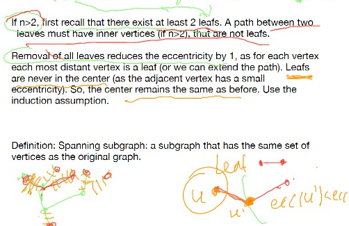
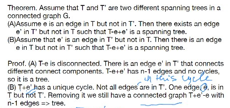
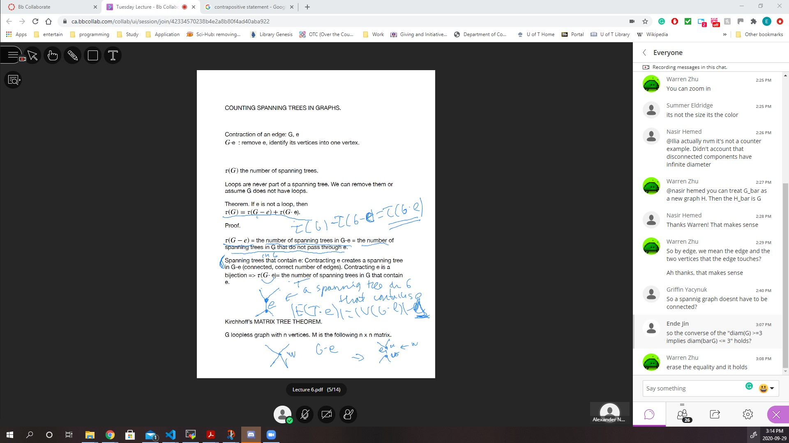
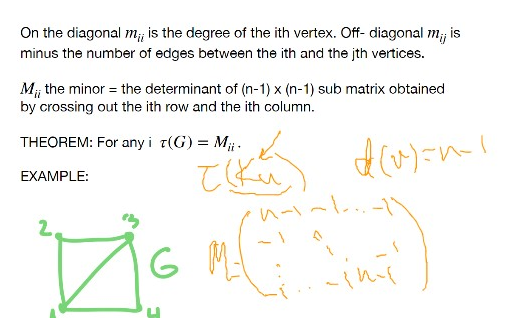

# Lec 6
### Terminology $G$
* dist(u,v) is the length of the shortest path
* diameter of a tree is $\max_{u,v}$ dist(u,v)
* eccentricity : $e(u) = \max_{v}$ dist(u,v)
* radius $rad(G) = \min_u e(u)$
* center of $G$ the subgraph induced by set of vertices $u$ with minimal eccentricity

### Theorem:
* if $diam(G) \ge 3$ then $\diam(\bar{G}) \le 3$
* What about the complement of the above prop?
  * a good counter-example might be a graph with 3 vertices?
    * incorrect 
    * unverfied source says "diam(G) < 3 implies diam(bar G) > 3"
* does it necessary mean that diam(G) is small implies $diam(\bar{G})$ is large

### Trees:
* Recall acyclic connected graph with $n-1$ edges
  * each of the above 2 implies the third property
* Every pair of vertices can be connected by exactly one path
  * this is yet another definition of tree

### Theorem:
* The center of a tree is $K_1$ or $K_2$
  * recall each tree has at least two leaves
  * 

### Definiton: spanning subgraph
* spanning subgraph: a subgraph that has the same set of vertices of the original graph
  * doesn't have to be connected
* spanning tree: spanning subgraph is a tree
* Every connected graph has a spanning tree
### How many spanning tree a graph has?
### Theorem: 
* for two different spanning tree $T, T'$
  * assume $e \in T \backslash T'$, then there exists $e' \in T' \backslash T$ s.t. $T -e + e'$ is a 
  * 

### Definition: Contracition
* $e \in E(G)$, $G \cdot e$ is removing $e$ and identify the two vertices of $e$
  * note that it will end up a multi-graph at the end
  * 

## Kirchhoff's Matrix  Tree theorem:
***
* $\tau(K_n) =$ all tree $T$ s.t. $V(T) = \{1,,..,n\}$
  * not isomorphic class
* $\tau(G) = M_{ii}$ for the 
* 
* Thus $\tau(K_n)$ is the determinit of matrix
***
* 