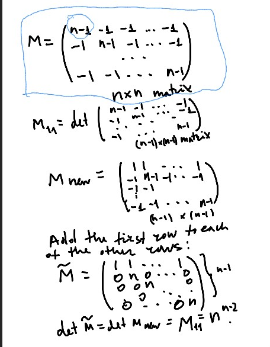
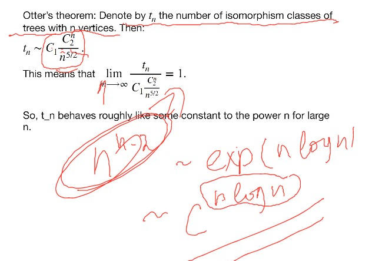
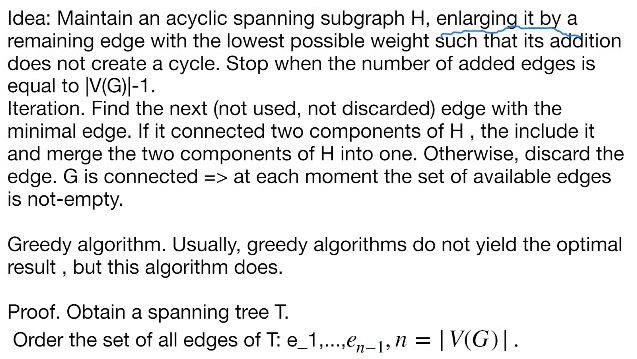

# Lec 7

### Kirkoff Theorem

***
### Theorem: Cayley's Formula
* the number of tree with n marked vertices is equal to $n^{n-2}$
* the number of tree with n marked vertices is just $\tau(K_n)$
  * recall that it is just diagonal $n-1 \times n-1$ matrix   with $n-1$ on diagonal and -1 on the other places, we need to calculate the determinate
    * we first sum all rows into the first row
      * then we have the first row all 1s
    * then we add the first row into all the remaining rows
    * then we would have
    * 
  * section 2.2. -- uses prufer codes
  * the kirkoff theorem is a bit different (aacorind to 10-01 recording around 44 minuts)
### 

### Theorem: Otter's THeorem : number of isomorphism tree

### Definition: Weighted Graphs
*  company with a function $f : E(G) \rightarrow \reals^{\ge 0}$
   *  in many application, weight are positive
   *  in others, weight are integers
   *  we only talk about non-negactive weight
### Theorem:
* Kruskal's Algorithm: find out the minimal spanning tree (the spanning tree with the minimal weight)
* 

