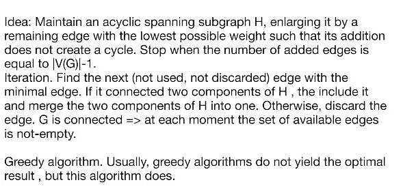
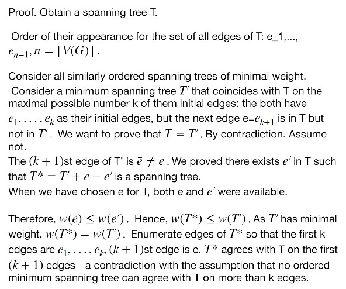
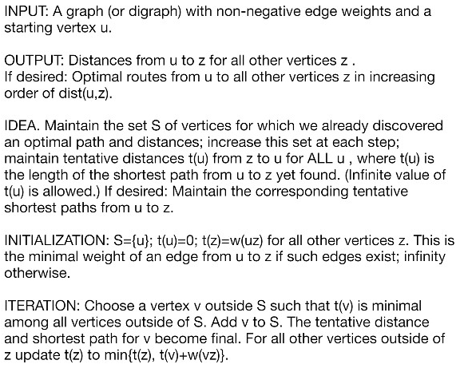
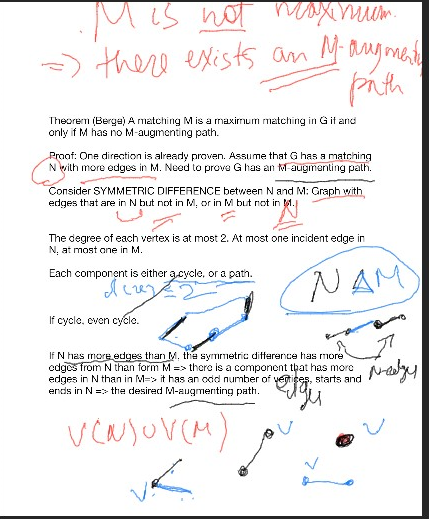
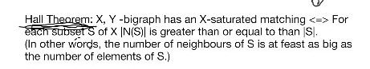
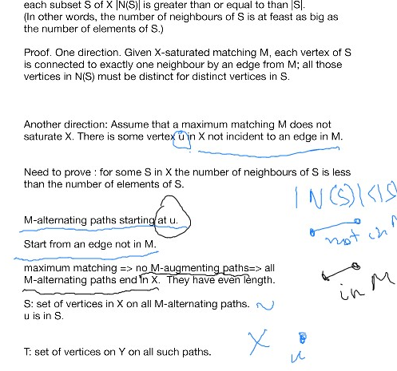
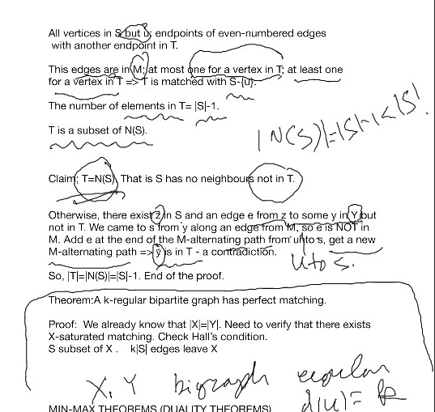

# Lec 8
* midterm coverage
  * Chapter 1, 2 
  * Section 3.1
#### Defnition: Weighted graph
#### Theorem: Kruskal's Algorithm
* Initialization: Set E(H) = $\emptyset$, V(H) = V(G)
  * each vertex of H is a component
* Step: 
  * maintain an acyclic 
  * 
  * 
* The proof idea is to find 
#### Theorem: Prim's Algorithm
* just directly searching the smallest edges that won't make into cycles

#### Theorem: Dijkstra's Algorithm
* 

#### Definition : Matching 
* Matching: a set of non-loop edges with no shared endpoints
* saturated vertices: vertices incident to the edges of a matching
  * not saturted: not incident
* Perfect matching: all vertices of the matching are saturated
* $K_{n,n}$ has $n!$ perfect matching
* $K_{2m+1}$ has no perfect matching
* maximal matching: cannot be enlarged by adding any edge
* maximum matching: the numebr of edges is maximal among all matching in the graph
  * maximum matching is maximal
* maximal/maximum matching doesn't have to saturate
  * in C_3 any maximum matchingg has only one edge
* M-alternating path: path that alternates between edges in $M$ and not in $M$
* M-augmenting path: M-alternating path that starts and ends in unsaturated vertices
#### Thheorem: Bergge
* A matchhing $M$ is a maximum matching in G
  * iff M has no M-aumenting path
* pf
  * if M has M-augmenting pathh, then we can easily find the "opposite" path as the bigger set
  *  
  *  

#### Theorem: Hall's Condition

* 

#### Teorem:
* A k-reular bipartite rap as perfect matcin
  * because we can prove (????) |X| = |Y|
  * and we check Hall's condition

#### Theorem: Min-Max (Duality)
* An answer of one might be the answer of the other
* a vertex cover : a set of vertex that contains at least 1 endpoint of every edge
* For all graphs, the minimal size of a vertex cover is never less than the maximal size of a matching
  * if G is bipartite
  * The maximal mum size of a matching in $G$ = the minimum size of a vertex cover