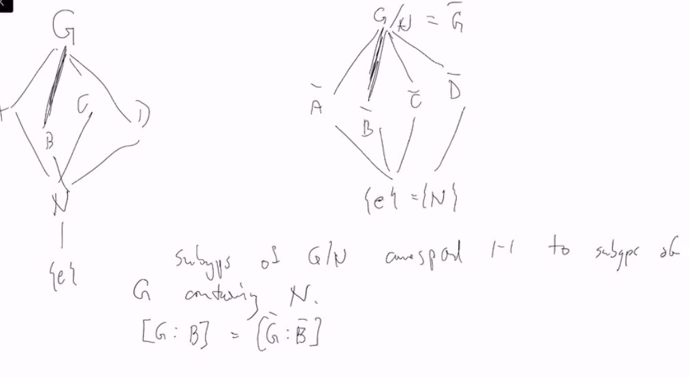
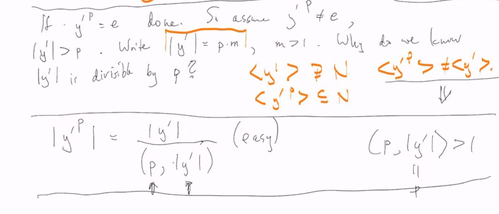

# Lec 10

### Quotient is subtle
### Recall things on tutorial : 4th Isomorphism Theorem: 
between lattices

* recall this $G$ has to be finite
* $[G : B] = [\bar{G} : \bar{B}]$
* $\bar{A \cap C} = \bar{A} \cap \bar{C}$
* $\bar{A} \triangleleft \bar{B}$ iff $A \trianglelefteq B$
* $<\bar{A},\bar{B}> = \bar{<A, B>}$
* this is an isomorphism between lattices of subgroups
* the lattice of subgroup of $G/N$ and of $G$ containing $N$ are "the same"

### Propositions:
* Suppose $G$ is abelian and $p | ord(G)$, some prime $p$
  * then $G$ contains an element of order $p$
  * 
* this theorem is not true in general
* to some extent this is the converse of lagrange theorem

* proof. (complete) induction  
  * Given a group G, assume the result holds for all groups $H$ with size less than $|G|$
  * we will use that to prove the result for $G$
    * Suppose $x \in G$, if $p | ord(x)$ then $|x| = pk$ i.e.
      * $x^{pk} = e$, so $x^k$ is the generator for a prime order group
    * Suppose $p \not | G$, let $N = <x> \trianglelefteq G$, (since $G$ is abeilean) 
      * and it is a proper subset since $p | ord(G)$
      * consider $G/N$, thus $p | ord(G/N)$ and p divides it and then we can apply induction hypothesis
        * thus there exists $y \in G/N$ s.t. $y^p = e$
        * we translate back $y$ into $G$, that $(y'N) ^ p = N$ by abelian, $y'^p \in N$ but $y'^k \not \in N$ for $1 \le k \le p$ 
        *  if $y'^p = e$. we are done.  
        *  otherwise $|y'| > p$. Write $|y'| = pm$
        *  