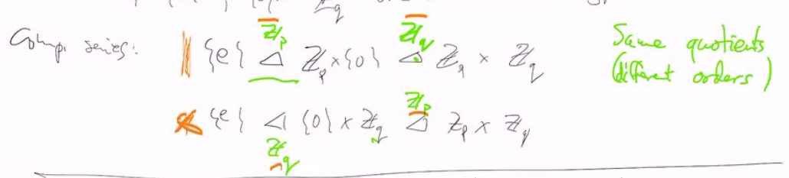
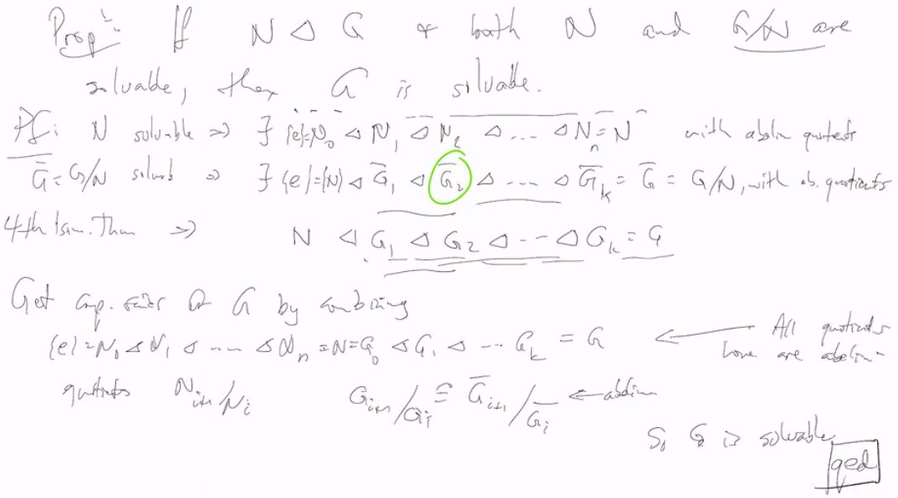

# Lec 11

### Propositions:
* Suppose $G$ is abelian and $p | ord(G)$, some prime $p$
  * then $G$ contains an element of order $p$
  * 

* Proof by complete induction. assume the result is known for all groups smaller than $G$.
  * (Base case: if $|G| = p$, then $G = Z /p Z$ (by Lagrange Theorem))
  * $|G| \ge p \implies \exists x \in G$ $x \neq e$, so $|x| > 1$
    * if $|x|$ is divisible by $p$, i.e. $|x| = pk$ some $k$ then $(x^{k})^p = x^{kp} = e$
    * so we assume $p \not | |x|$
      * let $N=<x>$, $p \not | |N|$
        * because $G$ abelian, thus $N \trianglelefteq G$ and $p | |G| = |N| * |G/N|$
        * thus $p | |G/N|$
        * the I.H. implies $G/N$ has an element of order $p$
          * $y \in G/N$ s.t. $y^p = e$
          * Let $y'$ be the repre s.t. $y = y' + N$. So we actually have $(y' + N)^p = e_{G/N} = N$ thus $y'^p \in N$. We can also see that $y' \not \in N$ (otherwise y is not order p)
            * so $<y'^p> \neq <y'>$ as $<y'^p> \le N$ but $<y'> \not \le N$
            * an easy exercise:
              * if $|a| = n$ then $|a^m| = \frac{n}{gcd(m,n)}$
            * thus $|y'^p| = \frac{|y'|}{(p, |y'|)} < |y'|$
              * since $|y'^p| < |y'|$ so $gcd(p, |y'|) > 1$ in fact $p | |y'|$, then we can use I.H. again
### Overall structure of finite group

### Definition: Simple Group
* A group $G \neq \{e\}$ is simple if the only normal subgroup
  * are $G$ and $\{e\}$ 
* they are not equivalent to group of prime order
  * an example is A5

#### Example: 
* Z/pZ

*** 
* $\{e\} = G_0 < G_1 < G_2 < ... < G_n = G$ (nested subgroup)
* suppose $G_i \trianglelefteq G_{i+1}$ for arbitrary $i$
  * Suppose $G_{i+1} / G_{i}$ is simple (this means there is no more normal subgroup in between)
  * such a collection of subgroup is called a "composition series" for $G$
    * or a Jorden Holder series for $G$
* Easy: every finite $G$ has a composition series
  * but they may not be unique
  * 
* In general, different composition series have the same quoteints up to isomorphism
  * though they might be in different order
* $G/N$ is simple then $N$ is the largest normal subrgoup
  * by 4th isomorphism theorem, and the lattice thing

### Holder Programme:
1. Classify all the simple groups (DONE!)
2. Figure out how to combine them incomposition series to make all groups
   1. infinite simple groups are more complicated
***
1. If $G$ is simple and $|G|$ is odd,
   1. then $G = Z/pZ$, p a prime
   2. Called Feit-Thompson Theorem
***
#### Example: Families of simple groups
1. If $F$ is a finite field, consider $SL_n(F) = \{M \in M_{n\times n}(F) : \det M = 1\}$
   1. center $Z$ = scalar matrices = $\{\lambda I : \lambda \in F\} \trianglelefteq SL_n(F)$
      1. Thus $SL_n(F) / Z$ is simple, except $SL_2(F_2), SL_2(F_3)/Z$
***
We get a family of simple groups (indexed by $n$ and $F$)
* In $S_n > A_n$ = even permutations $[S_n : A_n] = 2$
  * $A_n$ is simple for $n\ge 5$
***
* 1980 finished the simple groups classification completed:
  * 18 infinite families
  * 26 "sporadic groups"
    * biggest: the "monster"
  
### Definition: Solvable
* A (finite) group $G$ is called if all the **composition factors** "quoteints of adjacent elements of the composition series" are abelian

***
### Galois: 
* to any polynomial over a field, Galois associated a group
  * the group is solvable iff the polynomial can be solved with radicals
    * no general formula to solve quintic polynormials

### Proposition: 
* If $N \trianglelefteq G$ and both $N$ and $G/N$ are solvable, then $G$ is solvable 
* pf. 
  * $N$ solvable implies $\exists \{e\} \trianglelefteq N_1 \trianglelefteq N_2 ... N_n = N$
  * 

***
***
***
The tests cover up to this point
***
***