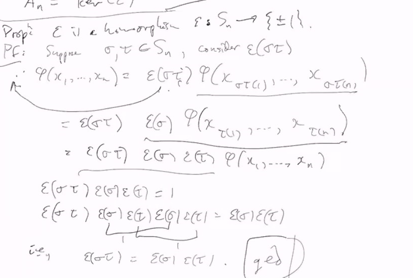
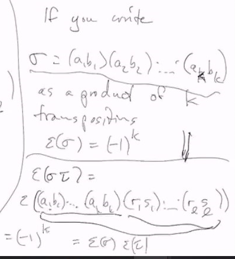
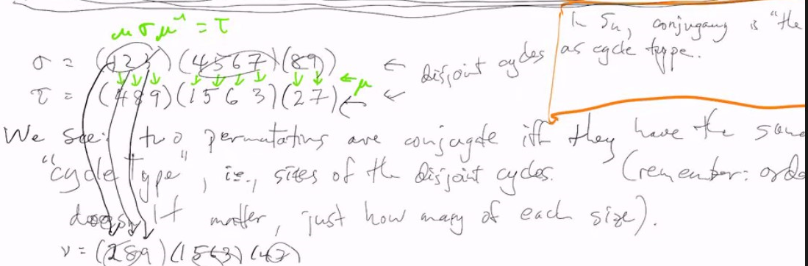

# Lec 12

### Definition Alternating Group $A_n$ simple for $n \ge 5$ (not proved yet)
* Recall : For fixed $n$, define a function
  * $\phi(x_1,...,x_n) := \Pi_{j > i} (x_j - x_i)$
  * (?important) if $\sigma \in S_n$, $\sigma \cdot \phi(x_1,...,x_n) = \phi(x_{\sigma(1)}, x_{\sigma(2)}, x_{\sigma(3)},.., x_{x_{\sigma(n)}}) = \epsilon(\sigma) \phi(x_1,..,x_n)$
  * $\epsilon(\sigma) = +-1$ (also called $sgn(\sigma)$)
  * $\sigma$ is even iff $\epsilon(\sigma) = 1$
  * $A_n = ker(\epsilon)$
### Prop : $\epsilon$ is homomorphism, $\epsilon : S_n \rightarrow \{1, -1\}$
* 

@Ende the definition of epsilon(sigma) is how sigma acts on the function phi. If sigma makes the polynomial negative for eg, then epsilon(sigma)=-1
It corresponds to how many transpositions sigma has though

***
* Basically $\epsilon$ is the parity of the permutation
* and thus $ker(\epsilon)$ is well-defined

***
* unfortuanately, $2$-cycle (12) - odd parity
* $3$-cycle (123) - even parity
* $k$-cycle is even if $k$ is odd and vise versa
* using this you can quickly decide "$\sigma =$(123)(315)(6248)" even, even, odd, thus $\epsilon(\sigma) = -1$ 
* $\epsilon$ <- sign of a cycle = $- (-1)^{\text{length}}$

***
* $\sigma = (123)(4567)(89)$
* $\tau = (489)(1563)(27)$

* relabeling is bijection mapping, not transposition of name