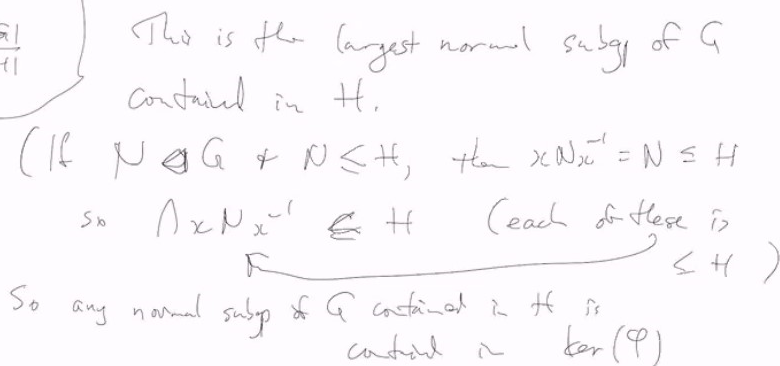

# Lec 13

### Recall: Group Action
* stabilier of a point = subgroup g that fix that point
* orbit of a point : $G \cdot x = \{g \cdot x \}$

***
1. if $H < G, G$ acts on $G/H$
   1. by left translation:
   2. $g \cdot xH = (gx) H$
2. In particular, if $H = \{e\}$ then $G/H = G$
   1. we say $G$ acts on itself by left translation:
      1. $g \cdot x = gx$
      2. what is stabilizer? $\{g \in G : gx = x\} = \{e\}$
3. If $H$ is not necessarily $\{e\}$, $G_H = \{g \in H | gH = H\}$
4. note: $xG_Hx^{-1}xH = xG_HH = xH$, 
   1. actually $G_{xH} = xG_{H}x^{-1}$

***
1. $G$ acting on $X$
2. if $X$ is finite, $G$ permutes elements of $X$
   1. Each element $g \in G$ amounts to a permutation of $X$
   2. i.e. there is a homomorphism $\phi : G \rightarrow S_X$
   3. prove it a homomorphism yourself
   4. of course $\phi$ doesn't have to be injective, 
      1. say $G$ is a trivial action
      2. or $Z$ acts on equilater triangle by rotation mutiple of $\frac{2 \pi}{3}$, ker = $3Z$
***
1. $|G|$ is finite, $G$ acting on $G/H$ by left transilation
   1. what is $ker(\phi)$? $|G/H| = \frac{|G|}{|H|}$
      1. we know $G_{xH}$ for any $x$
      2. $ker(\phi) = \{g \in G : g \cdot xH = xH, \forall x\} = \{g : g \in xHx^{-1}\}$
      3. ker($\phi$) = $\bigcap_{x \in G} xHx^{-1}$ of course a normal subgroup
         1. contained in H, and actually largest normal subgroup
         2. 
         3. basically any $N = xNx^{-1} \subseteq < xHx^{-1}$
         4. N = xNx^{-1} \subseteq xHx^{-1} for arbitrary x
         5. then taking intersection at both side
         6. even though it is the largest, it can be trivial or very large dependent on $H$
  
