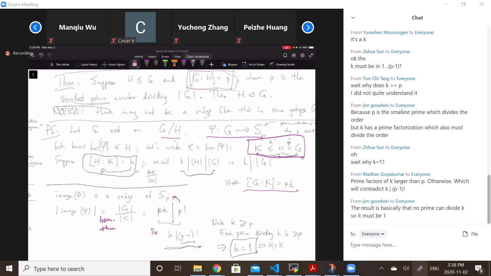
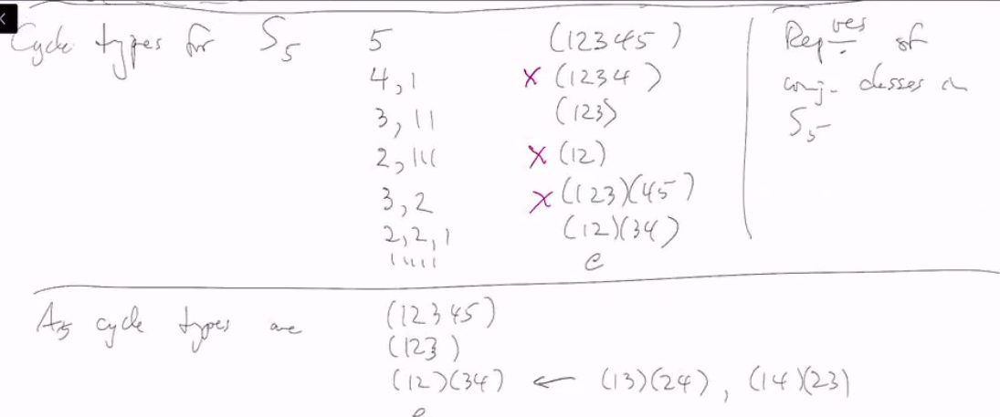
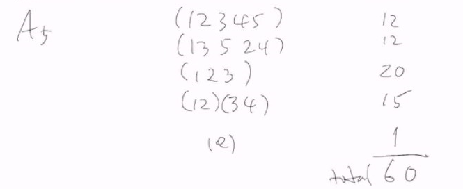
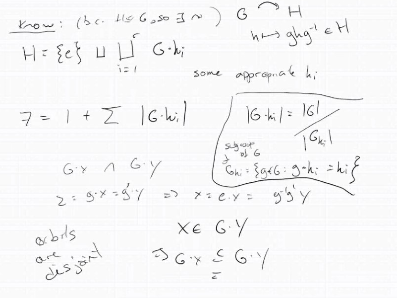
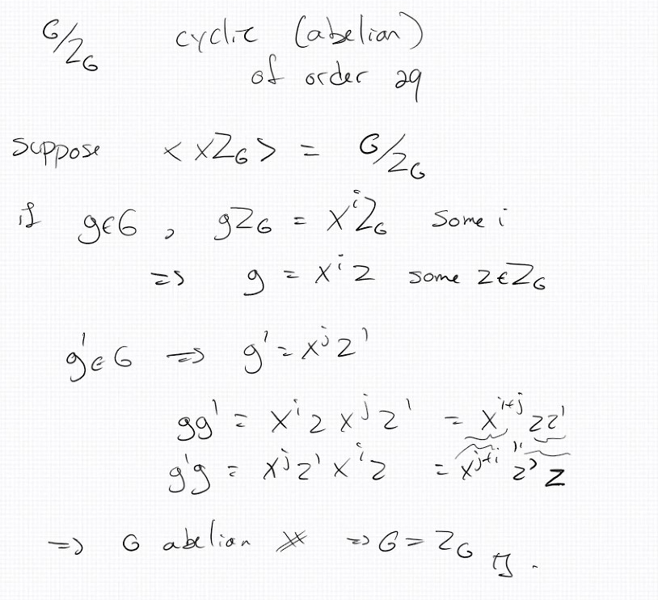

# Lec 14

* $G$ acting by left translation on $G/H$, for some $H \le G$
* get a map $\phi:G \rightarrow S_{G/H}$
* $ker(\phi)$ = $\bigcap_{x \in G} x H x^{-1}$

***
* Special case $H = \{e\}$, where $G/H \cong G$
  * i.e. $G$ acts on $G$ 
  * in this case, the kernel of $\phi$ is just $\{e\}$, thus $\phi$ is an injunction
  * $\phi:G \rightarrow S_G = S_n$, where $n = |G|$
  * $\phi$ s an isomorphism from $G$ to a subgroup of $S_n$

### Theorem: Cayley's Theorem
* Any finite group can be embedded as a subgroup of some $S_n$
* we map every element of $G$ to a permutation of $G$, basically $G \rightarrow [G \rightarrow G]$

### Example:
* Consider $A_5$; $|A_5| = \frac{1}{2}|S_5| = 60$
* The construction above embeds $A_5$ into $S_{60}$
  * but $|S_{60}| = 60!$ a very big number

### Theorem
* Suppose $H \le G$ and $[G : H] = p$,
  * where $p$ is the smallest prime number dividing $|G|$,
  * then $H \trianglelefteq G$
* proof.
  * Let $G$ acts on $G/H$, , $\phi : G \rightarrow S_p$
  * we know $K = ker(\phi) \le H$, let's write $K = ker(\phi)$
    * $K \le H \le G$
    * suppose $k = [H : K]$, thus $k | |H| | |G| $.
    * Thus $[G: K] = pk$
    * by first iso, $|image(\phi)| = pk$ divides the order of $S_p$, so $k | (p-1)!$
    * 
* an example, $A_3 \le S_3$, $[S_3 : A_3] = 2$ and $A_3 \trianglelefteq S_3$

## Grooup actins are a powerful tool
* $G$ acts on itself by conjugation $g \cdot x = gxg^{-1}$
  * for any $g$, $g \cdot e = e$
### Definition: 
* The orbit of $x \in G$ under conjugation is $\{gxg^{-1}: g \in G\}$
  * is called the conjugate class of $x$
* the stabilizer of $x$ is the centializer of $x$
* thesize of the conjugacy class of $x$ is $\frac{|G|}{|C_G(x)|}$

### Example:
* $p = (123) \in S_3$, $p, p^2$ commutes with $p$
  * so they are in $C_{S_3}(p)$
  * transpositions all map $p$ to $p^{-1}$
* So $C_{S_3}(p) = \{e, p, p^2\}$
  * the conjugacy class of $p$ has order $\frac{|G|}{|C_{S_3}(p)|} = 2$
* we have $f(g) = gxg^{-1}$, the homomorphism on the codomain is function composition
  * 
***
* $(12345) \in S_5$, whose conjugacy is all the 5--cycles
  * so number of 5-cucles permutations 4! = 24
  * but conjugacy class is of size $\frac{|G|}{C_{S5}(12345)} = 120/5$
    * thus $|C_{S5}(12345)| = 5$
    * works for any $n$
***
* $(123) \in S_5$, number of 3-cycles in $S5$ is 20
* thus centrilaizer is of size 6
  * we know the generator of $(123)$ s one of the subgroup
  * and $(45)$ is one of the centrualizer, there gives us 6
***
* A lirlle harded to find out centrualizer of things with multiple cycles
***
* if $z \in Z_G$, then $gzg^{-1} = z$
  * i.e. the orbit of $z \in Z$ is just $\{z\}$
* $G$ is disjoint union of conjugacy classes,
  * single element for each $x \in Z$
* if we take representative of the conjugacy classes
  * $g_0 = e, g_1...,g_k$
    * $|G| = \sum |\text{ conj classes}| = \sum_{i} \frac{|G|}{|C(g_i)|}$
    * let's reorder if necessary so that representatives are
      * $z_0 = e, z_1,...,z_m, g_{m+1},..,g_k$ where $z_i \in Z(G), g_i \not \in Z(G)$
        * when $C_G(z_i) = G$, so $\frac{|G|}{|C(z_i)|} = 1$
      * thus $|G| = |Z| + \sum_{i=m+1}^k\frac{|G|}{|C_G(g_i)|}$
### Theorem:
* Suppose $p$ is prime and $|G| = p^n$, some $n \ge 1$
  * then $G$ has a non-trivial center
* pf
  * obvious when $n=1$
  * Suppose not, class equation:
    * $|G| = 1 (= |Z|) + \sum \frac{|G|}{|C_G(g_i)|} (= p^k)$
    * left hand side is divisble by p, right hand side module p equals to 1, a contradiction

### Definition: 
* A group whose order is $p^n$, $p$ is prime, $n \ge 1$, is called a $p-group$
* if $S \subseteq G$, then the number of conjugate of $S$ is $\frac{|S|}{N_G(S)}$

### Theorem: $A_5$ is simple (no proper normal subgroup)
* pf.  
* we observe a normal subroup must be a union of conjugacy classes
* After all, if $x \in N \trianglelefteq G$,
  * then $gxg^{-1} \in gNg^{-1} = N$
* What are the conjugacy classes of $A5$?
  * .... of $S_5$?
  * cycle types for $S_5$
    * representatives:
    * 
  * The conjugacy class of $(12345)$ in $S_5$, which we found has 24 elements, split into two $A5$-conjugacy classe each with 12
  * 
  * any normal subgroup of $A5$ would contain $\{e\}$, and some other conjugacy classes
    * and the order has to divide 60
    * $A_5$ is simple

***

Tutorial Ps7, Q4:
**when is normality used?**

