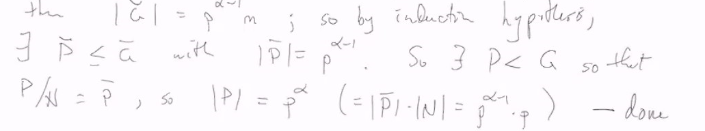
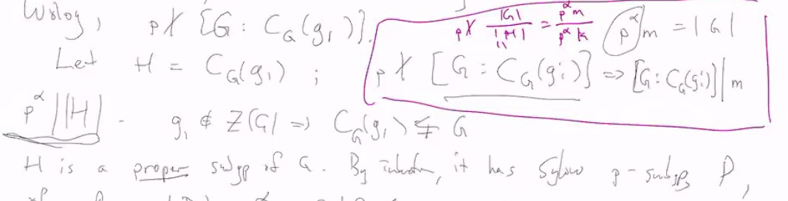
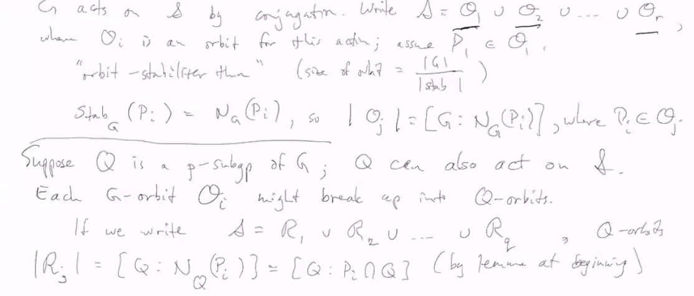
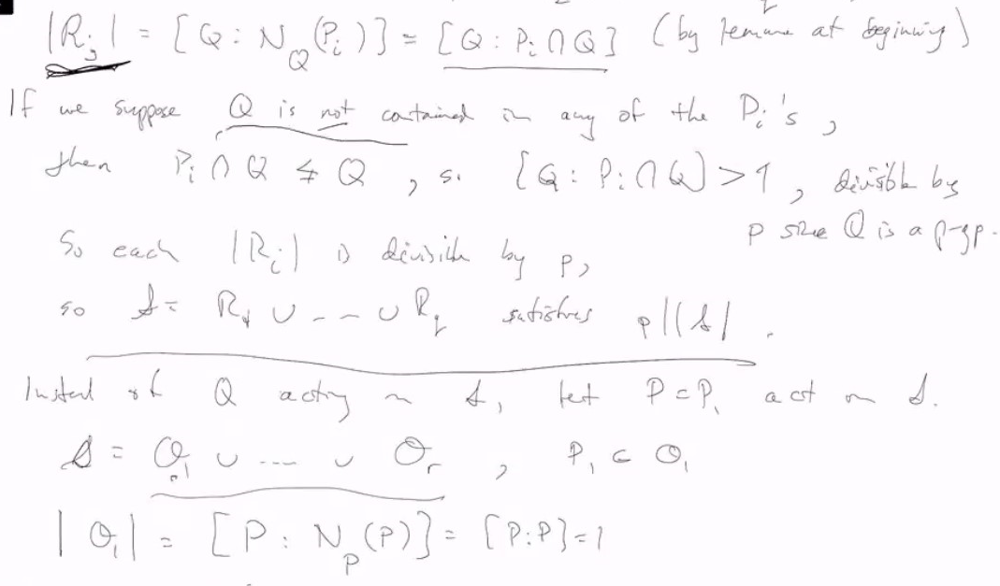
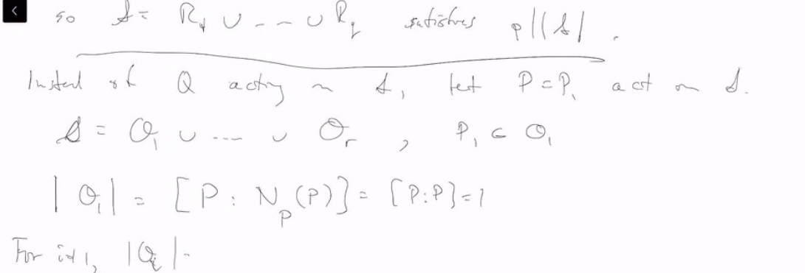
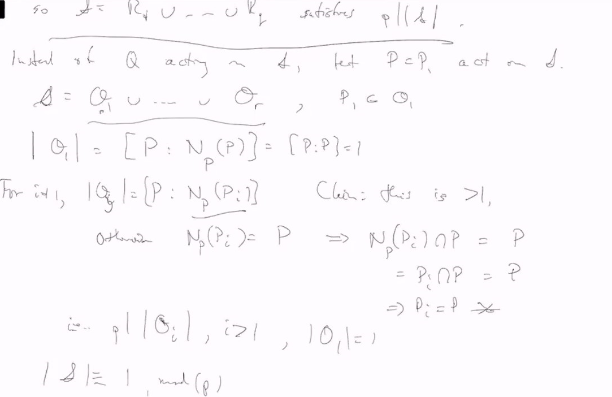
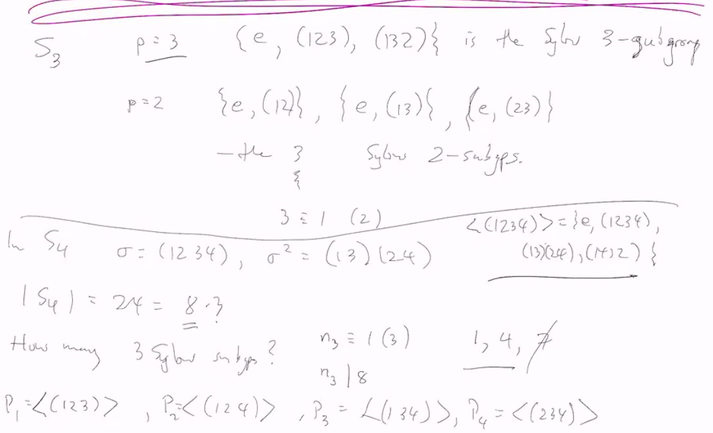
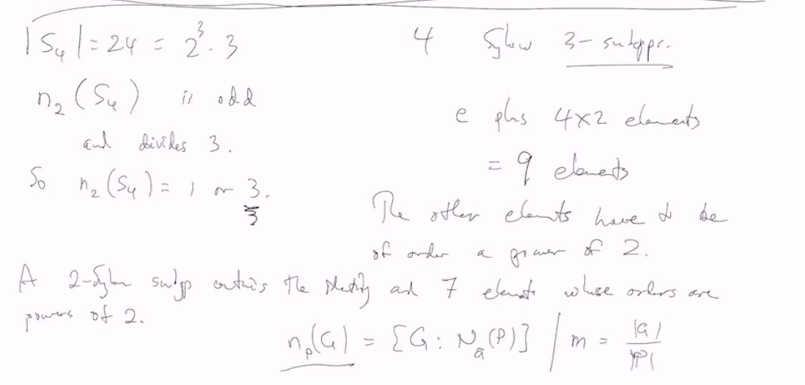
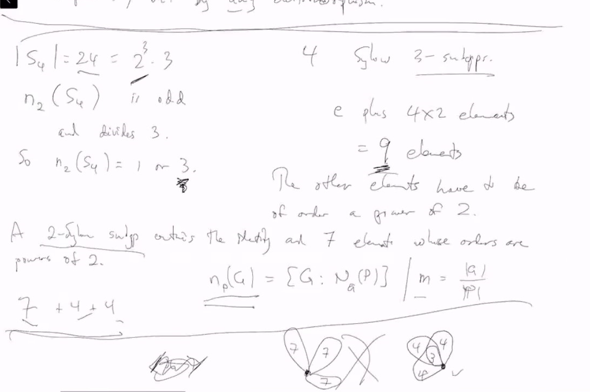

# Lec 16

### Theorem: Sylow's Theorem
With $|G| = p^am, p \not | m$
* exists a p-Sylow subgroup $p$
* for fixed $p$, the $p$-Sylow Subgroups are all conjugate
  * Any p-subgroup $Q \le  gPg^{-1}$ for some $g$ 
* For fixed $p$, the number of $p$-Sylow subgroups, $n_p = n_p(G)$
  * satisfies $n_p \equiv 1 \mod p$
  * Also, $n_p(P) | \frac{|G|}{|N_G(P)|} | m$ if $P$ is a p-Sylow subgroup

***
### Lemma: 
* Suppose $P$ is a sylow p-subgroup of $G$
  * $Q$ a p-subgroup then $Q \cap N_G(P) = Q \cap P$
* proof. $\supseteq$ is trivial
* the other direction
* Let $H = Q \cap N_G(P) \subseteq N_G(P)$
  * thus $HP$ is a subgroup, $|HP| = \frac{|P| |H|}{|P \cap H|}$, all of them are p-group
    * So $|HP|$ is a power of $p$
    * But $HP \supseteq P$ whehre $P$ is a maximal p-group
      * thus $HP = P$
      * thus $H \subseteq P$ but $H \subseteq Q$
      * and thus $H \subseteq Q \cap P$

### Theorem : Part 1 of Sylow (exists a p-Sylow subgroup)
* proof by induction.
* Assume 
* Base case: |G| = p*m
* Inductive :If $p | |Z(G)|$, then since $Z(G)$ is abelian
  * exists subgroup $N < Z(G)$ with $|N| = p$, and thus $N \trianglelefteq G$
  * Consider $G/N = \overline{G}$
    * if $|G| = p^\alpha m$, (m,p) = 1
      * then $|\overline{G}| = p^{\alpha - 1}m$ 
      * 
      * the final sentence is from lattice isomorphism theorem
  * If $p \not | |Z(G)|$
    * class equation: $|G| = |Z(G)| + \sum [G: C_G(g_i)]$
      * where $\{g_i\}$ representatives of non-centrual conjugates
      * so p cannot divides every one of $[G : C_G(g_i)]$
      * say $p \not | [G: C_G(g_i)]$
      * Let $H = C_G(g_i)$, thus
        * $p \not | [G: C_G(g_i)]$ means $[G: C_G(g_i)] | m$
        * and thus $p^\alpha | H$
          * since $g_i \not \in Z(G)$, which means $C_G(g) \neq G$
          * $H$ is a proper subgroup of $G$, and by Induction hypothesis, it has p-subgroup P of order $|P| = p^\alpha$, we are done.
          * 

### Theorem: Part 2 of Sylow
* Let $P$ be a sylow p-subgroup of $G$, $|G| = p^\alpha m$
* Let $S = \{P = P_1,P_2,...,P_S\}$ be all the $p$-Sylow subgroup of $G$ conjugate of $P$
  * $G$ acts on $S$ by conjugation, write $S = O_1 \cup ... O_r$
    * where $O_i$ is an orbit for this action
      * assume $P_1 \in O_1$
        * orbit stabilizer theorem (size of orbit = $\frac{|G|}{|stab|}$)
        * $stab_G(P_i) = N_G(P_i)$ so $|O_j| = [G: N_G(P_i)]$ where $P_i \in O_j$
  * Suppose $Q$ is a p-subgroup of $G$; $Q$ can also acts on $S$
    * each $G$-orbit $O_i$ might break up into $Q$-orbits
      * if we write $S = R_1 \cup R_2 ... \cup R_q$, Q-orbits
***
I don't understand why that set of sylow group is also  union of orbits?
From Patrice Moisan-Roy to Everyone:  04:14 PM
G acts on the set by conjugation
From Kunal Chawla to Everyone:  04:15 PM
If P is p-sylow then all it’s conjugates are as well, so you can decompose the set of p-sylows like this @Ende
From Jarod Palubiski to Everyone:  04:17 PM
Are each of those R_i Q-orbits?
From Taimur to Everyone:  04:17 PM
Yes
From Sacha Goldman to Everyone:  04:17 PM
ye
***

This also proves we cannot have a p-subgroup Q not contained in any $P_i$
i.e. any p-subgroup $Q \le G$ is contained in a sylow psubgroup, in particular, to a conjugate of $P$
in parituclar, eac Sylow p-subgroup is a conjugate of $P_1$

***
### Example:
* $S_3$, p=3, $\{e, (123), (132)\}$ is the sylow 3-subgroup
* $p=2$, $\{e,(12)\}, \{e,(13), \{e,(23)\}\}$

***

* If $n_p(G) = 1$ then the unique p-sylow subgroup is normal
* In fact, if $n_p(G) = 1$, the p-sylow subgroup is characteristic
  * meaning that it is fixed not only bu conjugation
    * but by **any automorphism**

***
* $|S_4| = 24 = 2^3 * 3$
* $n_2(S_4) \equiv 1 \mod 2$ and divides 3

