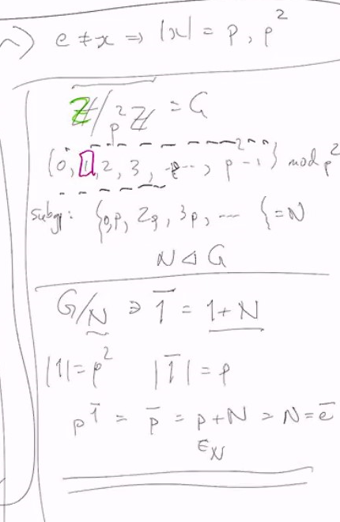

# Lec 17
* Problem set due on Nov. 28
* Monday test: 3:10 ~ 5:00 (5:30 for upload)
### Sylow group proof, please just read it on the book
### Example: Sylow!
* Suppose $|G| = 9 = 3^2 * 1$
* $G$ is a 3-group
* We showed that, a p-group always has a non-trivial center
  * why?
* If $Z(G) = G$, i.e. abelian
  * either $G = Z/qZ$ (cyclic)
    * or $G = Z/3Z \times Z/3Z$
  * Suppose $\{e\} \neq Z(G) \neq G$, so $|Z(G)| = 3$
  * Say $Z(G) = <x>$ where $x^3 = e$
    * $Z(G) \trianglelefteq G$ so consider $G/Z(G)$ has order of 3
    * So $G/Z(G) \cong Z/3Z$
    * so there is y $\in G$ so that
      * $y \mapsto \bar{y} \in G/Z(G)$
        * we either have $\bar{y}^3 = \bar{e}$m, which means $|y| = 9$, which makes $G$ cyclic and contradicting $Z(G) = G$
        * or else |y| = 3
        * take $x \in Z(G)$ then $xy = yx$
          * $G = <x> \times <y> \cong Z/3Z \times Z/3Z$ abelian
      * Actually this part means $Z(G) = G$, so actually a contradiction
      * basically $G/Z(G)$ 
### Example:
* What if $|G| = p^2$, p is prime?
  * same argument works, if $G$ is not abelian, $|Z(G)| = p$, $Z(G) = <x>$ some x, and then 
  * $|G/Z(G)| = p$, and thus $G/Z(G) = <\bar{y}>$
  * $\bar{y} = y Z(G)$. If $|y| = p^2$, then $G$ is cyclic
    * thus $|y| = p$, but $x \in Z(G)$, xy=yx, which makes $G$ again abelian, a contradiction
### Example:
* $\bar{y} = p$ might lead to $|y| = p^2$
* 

### Example:
* If $|G| = 15 = 3*5$
  * $n_5$ which is number of 5-Sylow subgroup
    * $n_5 \equiv 1 \mod 5$
    * $n_5  | |G|$, thus $n_5 = 1$
      * which is good, makes $n_5$ is normal
    * $\exists !$ 5-sylow group
  * $|G/P_5| = 3$ thus $G/P_5 \cong Z/3Z$
    * $\exists y$ s.t. $\bar{y} = 3$ and thus $|y| \in \{3,15\}$. If $|y| = 15$, then we know it is cyclic
  * if $G$ is abelian, then $G \cong Z/5Z \times Z/3Z$
    * or if $G$ is not abelian, since $G$ is not p-group, then $Z(G)$ can be trivial
      * and since $G$ is not abelian, $G \neq Z(G)$,
      * $Z(G)$ can be $\{e\}, P_5$ or $|Z(G)| = 3$
        * if $Z(G) = P_5$, then $G$ is abelian
        * If $|Z(G)| = 3$, say $Z(G) = <x>$, <>x> commutes with $P_5$, => product/abelian
        * If $|Z(G)| = 1$
            * because there exists a 3-sylow subgroup, that means a y of order 3, $P_5=<z>$ and $yz \neq zy$ thus $yzy^{-1} \neq z$
            * conjugation by y gives a nontrivial action of $P_3$ or $P_5$
              * there exists a $\varphi : P_3 \rightarrow Aut(P_5)$ where $Aut(P_5) = (Z/5Z)^\times$, $|Aut(P_5)| = 4$, but you cannot have a homomorphism from group of order 3 to group of order 4