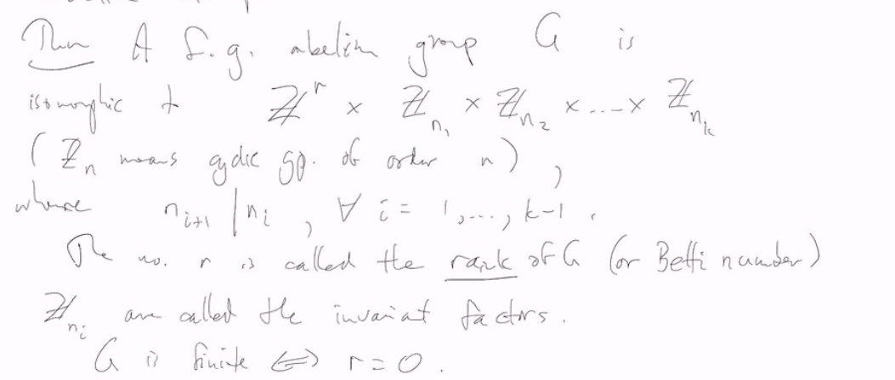
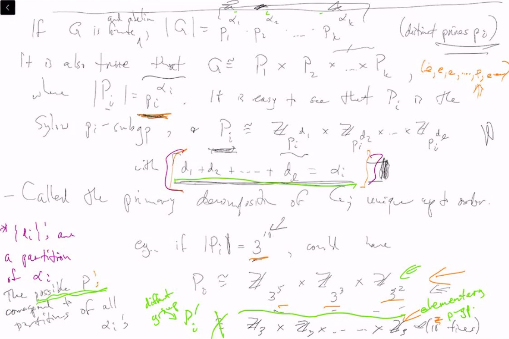
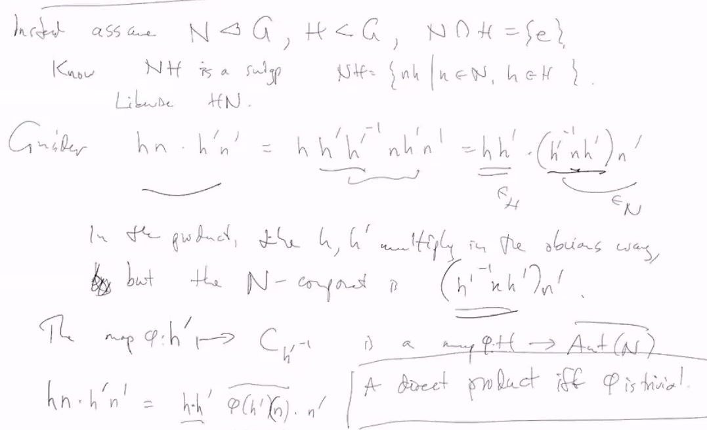
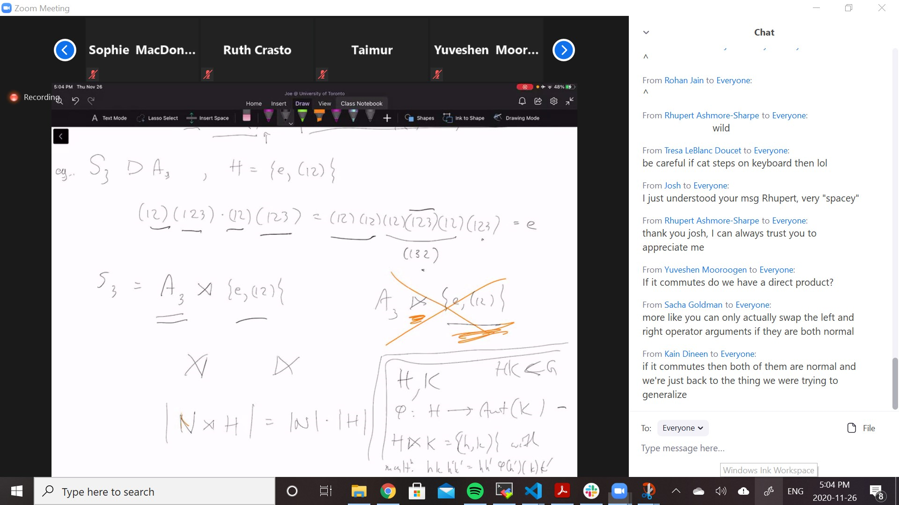

# Lec 18

### Theorem: $A_n$ is simple for $n \ge 5$
* It is proved in the book

### Theorem: Fundamention Theorem of finitely generated Abelian Groups

### Theorem: 
* A finitely generated abelian group $G$ is isomorphic to 
  * $\ints^r \times \ints_{n_1} \times \ints_{n_2} .. \ints_{n_k}$
* where $n_{i+1} | n_i$, forall $i = 1,..,k_1$

* They are finite of course iff $r = 1$
  * $r$ is called the rank of $G$
* and the $n_1,..,n_k$ are uniquely determined
* $r$ is called rank of $G$
* infinitely copy 

### Theorem: 
* If $G$ is finite and abelian, $|G| = p_1^{\alpha_1}  p_2^{\alpha_2} ... p_k^{\alpha_k}$ (distinct primes $p_i$)
* It is also true that $G \cong P_1 \times P_2...\times P_k$
  * where $|P_i| = p_i^{\alpha_i}$
  * it is easy to see that $P_i$ is the Sylow $p_i$ subgroup
  * and $P_i \cong \ints_{p_i^{d_1}} \times \ints_{p_i^{d_2}} .. \times \ints_{p_i^{d_l}}$
    * with $d_i + d_2 +... + d_l = \alpha_i$
* called the primary decomposition of
* 

### Figure out how to go from invariant factors to primary decompositions and vice versa

* I don't understand why it is not trivial? Just keep taking generators out of sylow-group, and we will have every element is the finite generated by the generators taken out, and because of abelian, we can just consider each generator corresponds to a coordinate

### Definition: Semi-direct product

#### Recall: Directp roduct:
* recall $N \trianglelefteq G, H \trianglelefteq G, N \cap H = \{e\}$
  * and $HN = G$
  * then $G \cong N \times H$ <- direct product 
  * why?  
***
* Assume $N \trianglelefteq G, H \le G, N \cap H = \{e\}$
* Know $NH$ is a subgroup, $NH = \{nh | n \in N, h \in H\}$
* 
  * trivial means $\phi(x) = e$
* in this situation, we call it semi-direct product

### Example:
* e.g. $S_3 \trianglerighteq A_3, H = \{e, (12)\}$
* $(12)(123)(12)(123) = (12)(12)"(12)(123)(12)"(123) = e$
* 
* basically we have two ways to construct semi-direct product
  * one way is to have a normal subgroup and a subgroup that intersect trivially, and we do have a phi always mapping to a conjugation
  * the other way is to have $\phi$ defined first, and $H, K$ still intersect trivially (in some way, what is the $\{e\}$?? because they don't have be anything related)
    * and you will define the group with that group operation, and you will find out the phi is still mapping to a conjugation 
