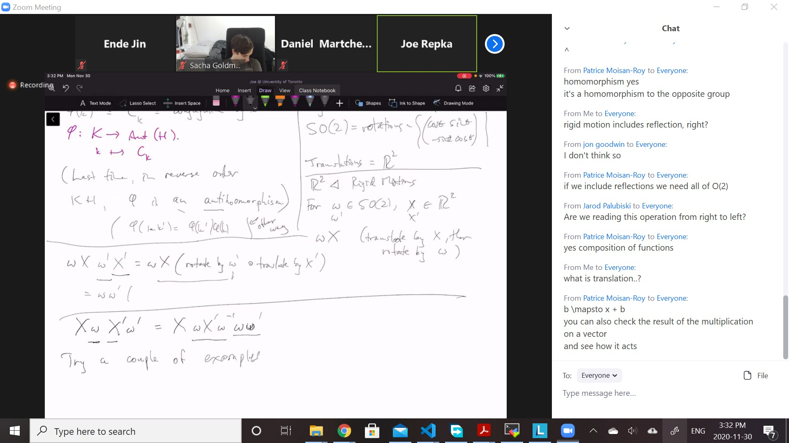
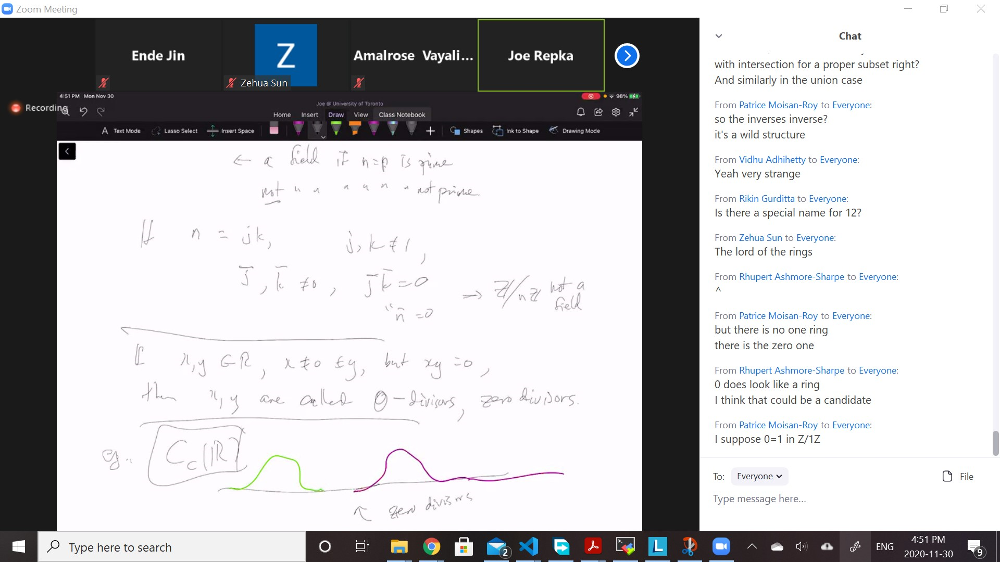
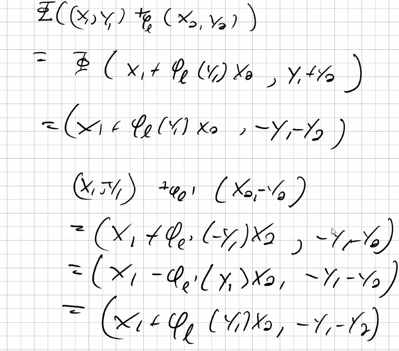

# Lec 19

### Definition: complement (group)
* $K$ is a complement to $H$ if
  * $H \cap K = \{e\}, G = HK$

### Definition : Semi-direct product group
* $H \triangleleft G, K \le G,$
* $H \cap G = \{1\}, G = HK$ (complement!)

* $H \triangleleft G$ thus $HK$ is a group
  * $hkh'k' = h \ kh'k^{-1} \ k k' = h \ \phi(k)(h') \ kk'$
    * where 
      * $\phi(k) = C_k =$ conjugation by $k$
      * $\phi: K \rightarrow Aut(H) := k \mapsto C_k$
      * (last time, we reverse the order $KH$ $\phi$ is actually antihomomorphism)
        * antihomomorphism is just
        * $\phi'(hk) = \phi'(k)\phi(h)$

### Example: Infinite Group
* Rigid motions in the plane $\reals^2$
* $SO(2)$ rotations $\{(\cos, \sin, -\sin, \cos)\}$
  * don't include reflection
  * Trnalations = $\reals^2$, Translation is just $b \mapsto x + b$
* For $\omega \in SO(2)$
  * 
  * try to make pictures!
  * What is special about $\omega X' \omega^{-1}$, by Joe?

### Convention:
* If $H, K < G$, then they are inner semi-direct product of $HK$, (maybe a proper) subgroup $G$
  * otherwise (starting from abstract non-related $H,K$ and give a $\phi$ ) outer semidirect product
    * note: (outer semi-direct product doesn't require normal for $H$)
    * i.e. $H \triangleleft$  ($H$ semi-direct-product $K$)

### Theorem: criteria for semi-direct product
* On book!
***
# RING

### Example:
* $(Z, +)$ is an abelian group
  * also have multiplication (not assuming existence of inverses)
  * but multi does have associativity, **may or may not** have commutativity
    * but we want distributivity
      * since commutativty is not there, we need two distributive law:
        * $a(b+c) = ab + ac$, $(b+c)a = ba + ca$
  * a ring **may or may not** have a multipliative unit (always both sides), 1
    * basically $1 * a = a * 1 = a \  \forall a$

***
* some authors require a ring to have an identity
  * some not
  * some require a commutative ring to have an identity

### Definition: Ring
* A ring $R$ has an additive structure: 
  * where $(R, +)$ is always abelian group
  * we write $0$ for the additive identity
* $R$ also has a multiplicative structure $a \cdot b = a\times b=ab$
  * **may or may not** be commutative
    * Note: we say commutative for commutativity about multiplication, abelian for commtative in addition
  * associative (2 laws)
  * distributive (2 laws)
  * It **may or may not** have a unit
    * when it has ,we denote it as $1$ where $1 a = a 1 =a \ \forall a$
      * in this case, we say $R$ is a ring  with unit/identity

### Example:
1. $Z$
2. field, e.g. $Q, R, C, F_p$ etc
   1. rings with units, every element other than $0$ is invertible
   2. commutative
3. Skew-field: like a field (every non-zero elements is invertible) BUT multiplicaiton is not commutative
   1. Quaternians (real quaternions)
      1. $w = a+bi+cj+dk,$ where $a,b,c,d \in \reals$
         1. $i^2=j^2=k^2=-1, ij=k=-ji$,...
            1. same as 
   2. identity is $1 + 0i + 0j + 0k = 1$
      1. not really clear if every non-zero element is invertible

### Exercise:
* $a+bi+cj+dk$ is invertible unless $a=b=c=d=0$

***
4. R = $C(\reals)$ i.e. all the continuous functions on $\reals$
   1. commutative ring with identity "$\_ \mapsto 1$"
   2. (or all functions, or all differetiable function, or all $k$-times differentiable function, or all infinite differentiable function)
5. $C_C(\reals)$ cts functions with compact support
   1. (point-wise multiplication, not composition) but doesn't have a unit $1$ doesn't have compact support
   2. a different mulitplication is convolution, another commutative ring, also doesn't have a unit
6. same for $(\reals^n)$ or any $C(X, \tau)$ with topological space $(X, \tau)$ or $C_C(X)$
7. If $|G| < \infty$, $G$ a group, $F$ a field
   1. $F[G]=$ group ring of $G$ $= \{\sum_i c_i g_i | c_i \in F\}$
      1. $(\sum_i c_i g_i)(\sum_i d_i g_i) = \sum_{i,j} ()c_i \cdot_F d_j) \  (g_i \cdot_Gg_j)$
      2. can deduce commutative, distributivity
         1. $F[G]$ is commutative iff $G$ is abelian
8. Polynomials: $F$ a field, $F[x] = \{a_0 + a_1x + ... a_k : k \in \natnums_0, a_i \in F\}$
   1. if $R$ is a ring, then $R[x] = \{.... : ..\}$ similarly
      1. $R[x]$ is commutative iff $R$ is commutative
      2. $F \subseteq F[x], R \subset R[x]$
      3. $F[x_1,..,x_n]$ polynormalis in n-variables
         1. two version: one doesn't have $x_i$'s commutes
         2. usually, we assume $x_i$'s comutates
            1. we call the non-commutative one  *non-commutating polynomials*
               1. i.e. $F[x,y]$ where $xy \neq yx$
9. $n \times n$ matrices over $F$ or $R$ (including non-invertible matrices)
   1.  rings with unit (identity matrix) (assuming $R$ with unit)
   2.  non-commutativeuless $n=1$
   3.  (note: invertible matrices are not closed under addition, so that doesn't work)
10. $(A, +)$ is any abelian group, multiplication always lead to zero
    1.  it is a commutative ring, without unit 
11. $Z[i] = \{a+bi : a,b \in Z \}$ -- Gaussian Integers, forcing $i^2 = -1$
    1.  $Z[i] \subseteq \Complex$ analogus to $Z \subseteq \reals$
12. $\{a+b\sqrt{2} | a, b \in Z \} \subseteq \reals$ ,here $\sqrt{2}$ can be any square roots of integers
    1.  $\{a+b\sqrt{2} | a, b \in Z \}\subseteq Q[\sqrt{2}]$ , the ring of integers of $Q[\sqrt{2}]$
        1.  analagous to $Z \subseteq Q$
        2.  algebraic number theory!

13. $Z/nZ$ commutative ring with identity
    1.  is a field iff $n$ is prime
        1.  because $n = jk$, then $j, k \neq 1$, then $\bar{j}, \bar{k} \neq 0$, but $\bar{j}\bar{k} = 0 = \bar{n}$, thus $\bar{j}$  doesn't have invrse
### Definition: Zero divisor
* If $x,y \in \Reals, x \neq 0 \neq y$, but $xy=0$
  * then $x,y$ are called $0$-divisors

### Example: $C_C(R)$

Everything here is a zero divisor

Very far from field.
***

Simple groups don't have non-trivial semi direct product?

quaternion are just an exmaple of ring
 would argue the quaternions is not the group ring of Q_8

