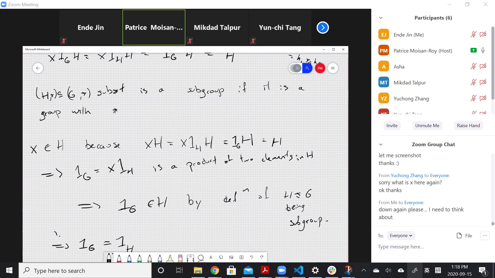

# MAT347: Algebra
* Joe Repka
* repka@math.utoronto.edu

# Symmetry
* You need examples
  * to know something work and something not
  * a toolkits of examples

### Definition: Group
* A group is a set $G$ with a binary operation
  * $g . h$ satisfies
    * associativity: $(g . h) . k = g . (h . k)$
    * there exists an identity element $e, I, id,0, 1$
      * $e .x = x = x . e$
    * $\forall x \in G, \exists x^{-1}$ s.t $x ^{-1}.x = e$
  * (yes, we need to prove right inverse is left inverse)

#### Example:
* $(Z, +)$ idenitity is $0$:
  * $0 + x = x  = x + 0$
  * $x^{-1} = -x$

***
Same for the elements of any field $F$ with addition as the binary operation. i.e. $(F, +)$. 
* Usually binary multiplication in $F$ doesn't have $0$'s inverse. 
* But we can have $F^x = F \backslash \{0\}$ with field multiplication. 
* This is called multiplicative group

####  Example:
* $n \times n$ matrices $M_n(F)$ not group
* $n \times n$ invertible matrices $GL(n, F)$ idenitity $I (I_n)$ as identity
  * $A^{-1}$ is matrix inverstion, binary as matrix mulitplication

***

#### Example:
* equilateral triangle is preserved under rotations by multiples of $\frac{2 \pi}{3}$, and under reflections in the mediums
  * and together with $e$ (that does nothing), 
  * these operations forms a group
  * let $\rho =$ rotation $\frac{2 \pi}{3}$
    * $r=$ reflection in vertical medium
    * thus $\rho . r = [A, B, C] \mapsto [B, A, C]$
    * $r . \rho = [A, B, C] \mapsto [C, B, A]$

***
#### Claim: 
* In this case, the group is 
  * {$e, \rho, \rho^2, r, r.\rho, r.\rho^2$}
* These 6 elements are the group of rotations and reflections of an equilaterial triangle
* $\rho . r \neq r . \rho$, these two elements do not commute
* thus the group is non-commutative
* in contrast, $Z, (F, +), (F^x, \times)$ are commutative, or **abeliean**

***
### Theorem: 
1. $e$ is unique
2. inverse is unique
3. $(x .y)^{-1} = y^{-1} . x^{-1}$
4. $x_1 . x_2 . x_3 .... .x_k$ is independent of where you put parenthesis
   1. $(x . y) . z = x . (y . z)$ is just associtivity law (when $k = 3$)
   2. it is generalized associativity law, proof by induction

### Definition:
1. if $H$ is a subset of a group $G$
   1. then $H$ is called a subgroup of $G$
      1. if it is a group using same operations as $G$
      2. we write $H \le G$ or $H < G$ ($<$ might not mean strict containment)
         1. (closure under the same operations)
  
#### Example:
*  $(Z,+) \le (Q, +) \le (R, +) \le (C ,+)$
*  for the operations on equilateral tri, $\{e, \rho, \rho^2\}$ is the rotation subgroup of the triangle subgroup
*  set of invertible upper triangles $n \times n$ matrices over $F$ is a subgroup of $GL(n, F)$
*  $Z \backslash n := \{0, 1, 2..., n-1\}$ with addition modulo $n$ is a group
   *  multiplication modulo is not good here, because of no inverses
***
### Definition: coset
* For $H \le G$, $x \in G$
  * $x.H = xH = \{x . h: h \in H\}$ is called a left coset (of $H$ in $G$)
  * $H.x$ ... is called a right coset

### Theorem:
* The different cosets of $H$ in $G$ disjoint, i.e. 
  * $xH \cap yH \neq \emptyset \rightarrow xH = yH$
* proof.
  * $\exists h, h' \in H$, $x = y h' h^{-1} \in yH$
    * for any $h'' \in H$, $xh'' \in $
* So the left coset of $H$ in $G$ partition $G$:
  * $G = \bigsqcup_i x_i H$ for suitable $x_i$'s
  * $G = \bigsqcup_i H y_i$ ....
  * These two decompositions are in general different

#### Example:
*  $2Z \subseteq Z$, a subgroup, but a trivial coset of its own
   *  $e . 2Z = 2Z$
   *  $1 + 2Z =$ odd integers, a coset of $2Z$
   *  $Z = 2Z \sqcup (1 + 2Z)$
* $H = \{e, \rho, \rho^2\}$, $rH = \{r, r\rho, r \rho^2\}$
  * $G = eH \sqcup rH$ is a union of rotations and reflections
* Can we generalize it? into arbitrary shapes?

***
@Ende the distinction between hexagon and pentagon was that there's two different ways to reflect in an even-sided regular polygon, while on an odd-sided regular polygon you'll just have one type of reflection. But the two different reflections make two separate groups as far as I gathered. Someone can step in and correct me if I understood wrong.

### Definition:
*  the order of a group is the number of elements of $G$, written $|G|$, which could be infinite
   *  $| triangle \  operations | = 6$
   *  $|Z| = \infin$

#### Example:
*  If $x \in G$, {$...x^{-3},..e , x, ...$} is a subgroup of $G$

### Definition:
*  The subgroup of $G$ generated by $x$ is $<x>$
   *  $\bigcap_{x \in H, H \text{ subgroup}}H$
*  You have to prove this is a group -- a lemma: any arbitrary intersection of subgroup is a subgroup
  
*** 
### Definition: 
* if $S \subseteq G$ is a subset of $G$, $<S> = \bigcap_{S \subseteq H, H \text{ subgroup}} H$
  * the subgroup generated by $S$

### Definition:
* if $x \in G$, then order of $x$ is $|x| = |<x>|$
  * i.e. $x, x^2 ... ,x^n = e$ for the first time $n$
  * intuitively, you will get a lot of combinations

***
#### Tutorial

I don't think above is correct. But by using the uniqueness of inverses, everything will be trivial.

