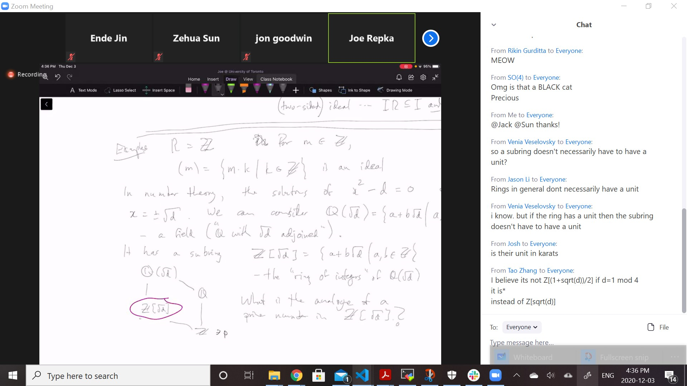
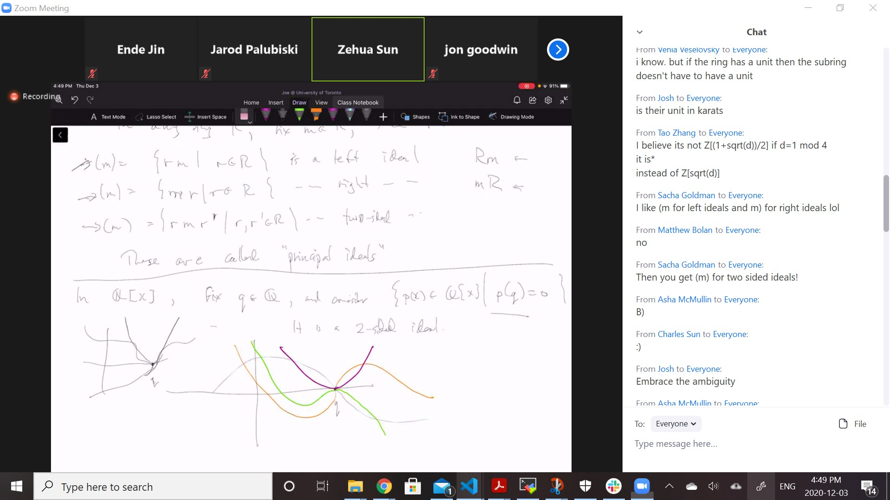

# Lec 20

### Recall: Ring
* underlying additive group (abelian)
* multiplicative : associative
  * above two distributive, from both left and right
* Additive unit is 0,
  * there **may or may not be** a multiplicative unit 1
  
### Lemma: $\forall r \in R, 0 \cdot r = 0 = r\cdot 0$
* proof: 
  * $0r = (0 + 0)r = 0r + 0r$
    * thus $0r = 0$, same proof for the other way

### definition: Homomorphism
* If $R, R'$ are rings, a homomorphism
  * $\phi : R \rightarrow R'$ s.t.
    * $\phi : (R, +) \rightarrow (R', +)$ is an homomoprhism
      * $\phi(a+b) = \phi(a) + \phi(b)$
      * $\phi(rs) = \phi(r)\phi(s)$
    * ?? is it just $\phi(ax + by) = \phi(a)\phi(x) + \phi(b)\phi(y)$
      * without multi identity, this might not be true

### Theorem: $\phi(0) = 0$; $\phi(R)$ is a subring of $R'$

***
* Note: there is no subring notation

### Definition: kernel
* if $\phi$ is a ring homomorphism, $\phi : R \rightarrow R'$,
  * we define $ker(\phi) = \{r \in R : \phi(r) = 0\}$

### Theorem: 
* Suppose $n \in ker(\phi), r \in R$
  * $\phi(rn) = \phi(r) \phi(n) = 0$, thus $rn \in ker(\phi)$

***
* not only $ker(\phi)$ a subring of $R$, but
  * $rn \in ker(\phi)$, 
    * $\forall n \in ker(\phi), \forall r \in R$
      *  $R\cdot ker(\phi) \subset ker(\phi)$ and $ker(\phi) R \subset ker(\phi)$
      *  might not equal since multi identity might not be there

### definition: 
* A subring $I \subseteq R$ is a left ideal
  * if $R \cdot I \subseteq I$
  * A right ideal if $IR \subseteq I$
  * twosided if $RI \subseteq I$ and $IR \subseteq I$

### Example:
* $R = Z$ For $m \in Z$,
  * $(m) = \{m \cdot k : k \in Z\}$ is an ideal
* In number theory,
  * the solutions of $x^2 - d = 0$ are $x = +-\sqrt{d}$
    * we can consider $Q(\sqrt{d})=\{a+b\sqrt{d}: a, b \in Q\}$
      * a field ("$Q$ with $\sqrt{d}$ adjoined")
        * it has a subring
          * $Z[\sqrt{d}] = \{a+b\sqrt{d} : a, b \in Z\}$
          * the "ring of integers" of $Q(\sqrt{d})$
  * 
  * the analogue is disaster, but prime ideal is okay
    * but prime ideal in different rings are not just a linear like $\{mk : k \in Z\}$
    * that is the name **ideal** coming from, as ideal number as a generalization of number/rational
### Definition: Principal Ideal
* In any ring $R$, fix $m \in R$ then 
  * the set $(m) =\{rm | m \in R\}$ is a left ideal
  * $(m) =\{mr : r \in R\}$ right ideal
  * two sided ideal is just an ideal that is both left and right ideal
    * the notation above are the same, but mostly used in commutative ring
      * in commutative context, $Rm = RmR$?
    * in non-commutative context, they will use $mR$ instead
***
* In polynomials $Q[x]$, fix $q \in R$, and  consider $\{p(x) \in Q[x] : p(q) = 0\}$
  * it is a 2-sided ideal
  * 
  * Actually for any field $F$, in $F[x]$, fix $q \in F$
    * $\{p(x) \in F[x] : p(q) = 0\}$ is an ideal 
### Factor Theorem in field:
* if $p(q) = 0$, then $p(x) = (x-q)r(x)$ for some $r(x) \in F[x]$
  * So $I = (x-q)F[x]$
  * Factor Theorem is proved by Division Theorem (long division, and thus the reaminder has degree less than 0 and thus must be zero)

***
* In $F[x]$, $\{p(x) \in F[x] : p(a) = p(b) = 0\} = (x-a)(x-b)F[x]$
  * is an ideal, for any $a, b \in F$
    * also principal

***
* Let's go to ring
  * In $Z[x]$, polynomials over $Z$
    * consider $\{p(x) : p(1) = 0 \text{ and with } 5| a_0, p(x) = a_nx^n + ...+a_1x + a0\}$
    * this is also an ideal, but not a principal ideal
      * because $(x-1)Z[x]$ contains things whose constant terms is not a multiple of $5$