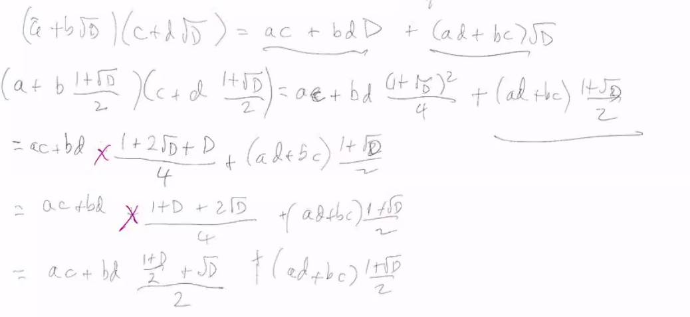
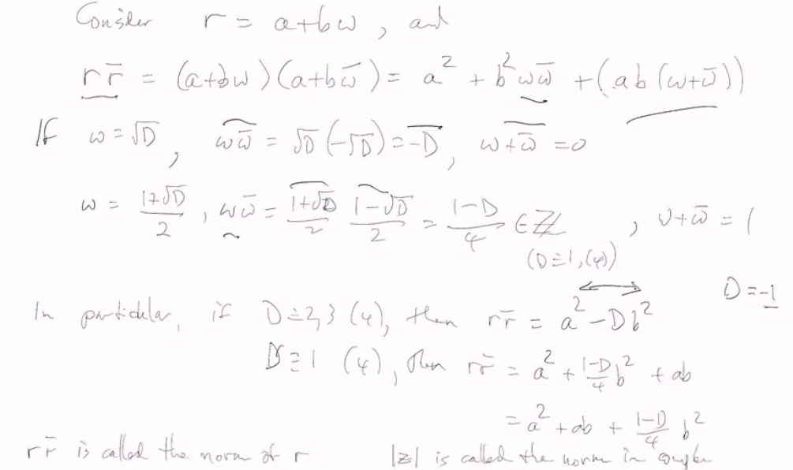
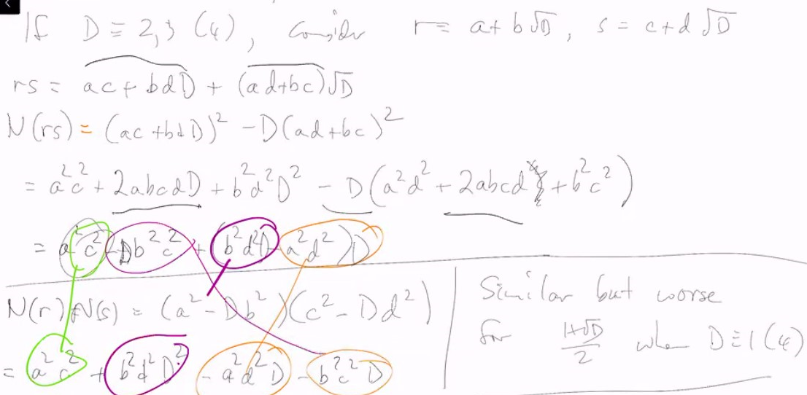
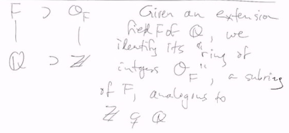
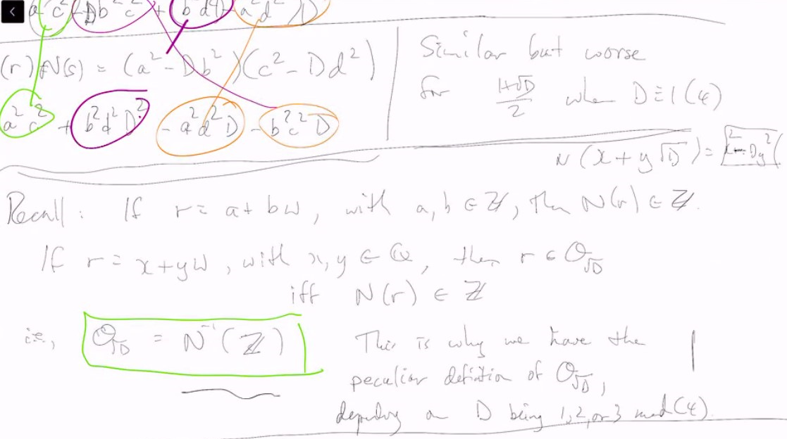
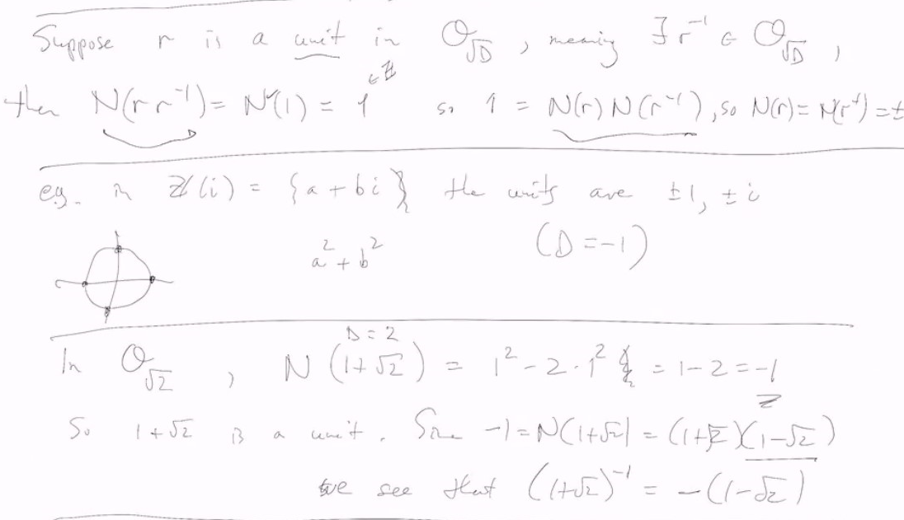
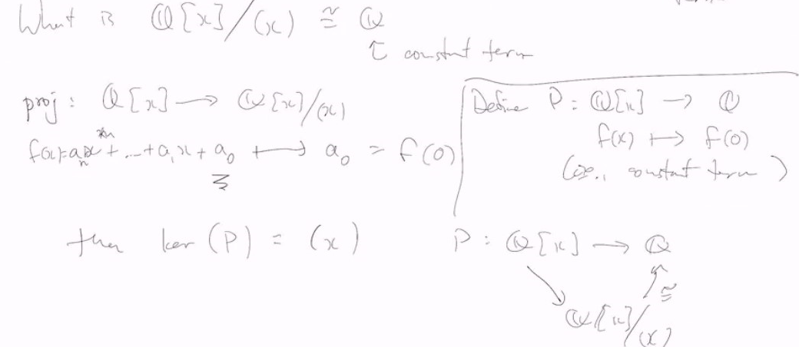
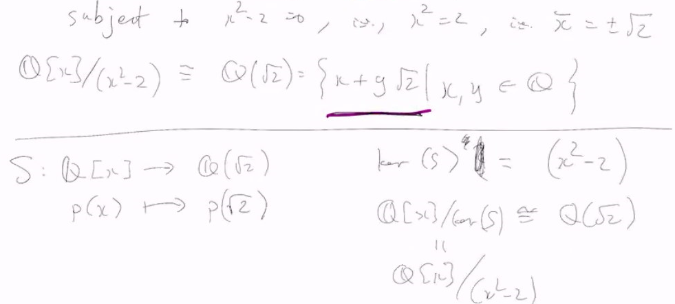

# Lec 21

### Example:
* In $Z/12Z$
  * $\overline{3}, \overline{4}$ are non-zero
  * $\overline{3}* \overline{4} = \overline{0}$

* In $Z/9Z$,
  * $\overline{3}$ is also a zero divisor

### Definition: Zero Divisior
* If $a, b \in \Reals$, $a \neq 0 \neq b$
  * but $ab=0$
  * then they are called "zero divisors"
    * can't happen in a field

### Definition: integral domain
* If $\reals$ is a commutative ring with identity that has 
  * no zero divisors
    * then $R$ is called **integral domain**
      * because they look like integer

### Example
* Suppose $D \in Z$ is not a sqaure
  * so $\sqrt{D}$ is not a rational number
* If $D$ is divisible by a square $d^2$, with $d > 1$
  * then we can consider $\frac{D}{d^2}$ instead because $\sqrt{\frac{D}{d^2}} = \frac{1}{d}\sqrt{D}$
* So we can divide out any sqaures from $D$
  * where we can $D$ a **square-free** number
    * (If $D = p_1p_2...p_n$) as the result of prime factorization

* Suppose $D$ is square free but non-square
  * we let $\omega = \sqrt{D}$ if $D \equiv 2,3 \mod 4$
    * or $\omega = \frac{1 + \sqrt{D}}{2}$ if $D \equiv 1 \mod 4$
  * we let $\Theta_{\sqrt{D}} = Z[\omega] = \{a + b \omega : a, b \in Z\}$
  * interestingly: $\omega$ is working! but we don't want the simple definition (that let everything be $\sqrt{D}$) later we will see
    * 
    * the part $\frac{\frac{1 + D}{2} + \sqrt{D}}{2}$ is still the form we want
    * actually it is better to see as $\frac{D - 1 + 2 + 2\sqrt{D}}{4}$ and $D-1$ divisible by 4

***
* Recall: In $\Complex$, if $z=a + bi$ then $\overline{z} = a - bi$, and $z\overline{z} = a^2 + b^2 \neq 0$ unless $z = 0$
* Analgously, we'll change $\sqrt{D} \rightarrow -\sqrt{D}$
  * thus $\overline{\omega} = - \sqrt{D}$ or $\frac{1 - \sqrt{D}}{2}$
  * Consider $r = a + b\omega$ and 
    * $r \overline{r} = a^2 + b^2 \omega \overline{\omega} + ab(\omega + \overline{\omega})$
    * we can verify that 
    * 

### Definition:
* $r\overline{r}$ is called the norm of $r$
  * $|z|$ is called the norm in complex analysis
* But here, norm means $|z|^2$
* $N(a+bw) = a^2 - Db^2$ when $D \equv 2,3 \mod 4$
  * $N(a+bw) = a^2+ab+\frac{1-D}{4}b^2$ when $D \equiv 1 \mod 4$

### Fact: Norm is multiplicative homomorphism
* $N$ is multiplicative  homomoprhism
* $N(rs) = N(r)N(s)$
  * 

### Recall:
* If $r = a+bw$ with $a, b \in Z$ then $N(r) \in Z$
* If $r = x+yw$ with $x,y \in Q$
  * then $r \in Q_{\sqrt{D}} \iff N(r) \in Z$
* Thus $Q_{\sqrt{D}} = N^{-1}(Z)$
  * this is why we have the peculiar definition of $Q_{\sqrt{D}}$ dependending on $D$ being $1,2,3 \mod 4$
    * i.e. the part where we have inconsistent definition of $\omega$

***
### Example: unit
* Suppose $r$ is a unit in $Q_{\sqrt{D}}$
  * meaning $\exists r^{-1} \in Q_{\sqrt{D}}$ 
  * thus $N(r)*N(r^{-1}) = N(rr^{-1}) = N(1) = 1$
    * thus $N(r) = N(r^{-1}) = 1$ or $-1$ 
    * and actually it is iff
    * $r$ is unit iff $N(r) = 1$ or $-1$

### Example
* in $Z(i) = \{a+bi\}$, the units are $1,-1,i,-i$
* In $Q_{\sqrt{2}}$, $N(1+\sqrt{2}) = -1$
  * thus $(1+\sqrt{2})$ is a unit
    * Since $-1 = N(1+\sqrt{2}) = (1+\sqrt{2})(1- \sqrt{2})$, and we know the inverse of $1 + \sqrt{2}$

***
*Algebraic Number theory*

### definition: Quotient Rings
* If $I$ is two-sided ideal in a commutative ring $R$
  * then we can define the quotient $R/I$
    * we start with the underlying addition groups 
      * $(R, +) \supseteq (I, +)$
    * So $(R, +)/(I,+)$ is a group (as $(R, +)$ is abelian, so $(I, +) \triangleleft (R, +)$)
* Multiplication?
  * $(r+I)(s+I) = rs + I$
    * to make this work, we need $I$ to be presented by multipliction by $R$
      * i.e. we need $I$ to be an ideal
      * this is the reason for the definition of an ideal
    * So $R/I$ is a ring
    * Moreover, if $R$ has an identity, so does $R/I$

### Example:
1. $Z/mZ$ for any $m > 1$, finite
2. In $Q[x]$, let $I = (x) = \{a_nx^n + ... a_1x : a_i \in Q\}$ all polynomial without constant terms
   1. What is $Q[x]/(x) \cong Q$ which is contant term
      1. $proj : Q[x] \rightarrow Q[x]/(x)$
         1. $f(x) =a_nx^n + ... + a_0 \mapsto a_0 = f(0)$
         2. 
      2. this reflects the first isomorphism theorem 
  
### Theorem: (In the book!)
* Isomorphism Theorems also work for rings $T : R \rightarrow R'$
  * First Isomorphism: $image(T(R)) \cong R/\ker(T)$ 
  * Also analogues to the other isomorphism theorems

***
### Example
* $Q[x] /(x^2 - 2)$
  * take an example, $p(x) = x^5 + 2x^3 - x + 7 = (x^3 + 4x)(x^2 - 2) + 7x - 7 \equiv 7x-7$
* Similarly, every element of $Q[x]/x^2 - 2$ has a representative that has degree 0 or 1
  * i.e. $ax+b$
* As a set $Q[x]/(x^2-2) \cong \{ax+b : a, b \in Q\}$
  * subject to $x^2 - 2$
  * 
  * better thinking about the quoteint form, and since we are looking at the remainder (as representative), $x^2-2 = 0$

### Example
* In $F[x,y]$, $F$ a field
  * consider $I=(x)$, what is $F[x,y]/(x)$? $F[y]$ terms
* In $F_2[x] =\{0,1\}[x]$
  * $p(x) = x^3 + 1 = (x+1)(x^2 + x + 1)$
* Evaluation map: For $a \in F$, $E_a : p(x) \mapsto p(a)$, ker$(E_a) = (x-a)$
  * $F[x]/(x-a) \cong F$
    * this is surjective because you can have constant polynomials
* 