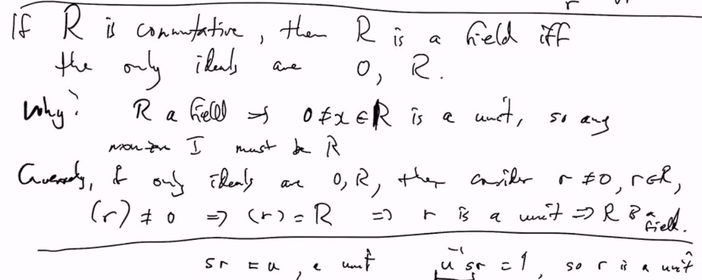

# Lec 22
## Ring! is **not very coherent**
* is **not very coherent** because we always have to discuss different things
* Commutative Ring, Ring without zero divisor
* Use example to remember hypothesis instead of remembering the proofs themselves

*** 
* $R$ with $1 \neq 0$
* $A \subseteq R$, $(A)$ = smallest ideal containing set $A$
  * same thing as $\bigcap_{I \supseteq A} I$

***
* $A = \{a\}$ thus $(A) = (a)$ = principal ideal
* $A = \{a_1,..,a_n\}$ $(a_1,..,a_n)=$ finitely generated ideal

### Definition: (The following summation is important)
* $RA = \{r_1a_1 + ... + r_ka_k : r_i \in R_i, a_i \in A \}$
* 
  * where $RA$ is left ideal generated by $A$ and $AR$ is right ideal generated by $A$
  * and $RAR=(A)$
### Example: Remember that: taking sum can give you all $R$
  * $R = M_n(F)$ $n\times n$ ,matrices over a field $F$
  * Let $a = E_{ij}$ (1 on ij-th position, o/w 0)
    * $RE_{ij}R$ gives you all $R$
    * if you don't take sum
    * 

***
* If $R$ is commutative, $RA = AR = RAR$
  * and $(a) = \{ra | r \in R\}$
### Example
* $R = Z[x]$; $I = (x, 2)$
* Turns out: $I = \{p(x) = a_nx^n + a_{n-1}x^{n-1} + .. + a_1 x + a_0$ where $2 | a_0 \}$ 
* But $I$ is not principal:
* Proof. suppose $(x,2) = (q(x))$
  * $2 \in (x,2) => 2 = r(x)q(x)$ thus $q(x) = +-1, +-2$. Obviously cannot be $+-1$ (otherwise this ideal will have $q = +- 1$), but $x \in (x,2)$ we cannot write $x$ with only 2
***
* In $R = Z$, every ideal is principal, $(n) = (-n)$
* Not like above, there is some ideal not principal
### Remark
* Ideal $I = R$ iff $I$ contains a unit (this *unit* means has an inverse)
  * $u \in I$ means

***
### Prop: Ideal $I = R$
* if $R$ is commutative, then $R$ is a field iff
  * the only ideals are $0, R$
* Why? 
* $R$ is a field, then $0 \neq x \in R$ is a unit,
  * so any non-zero ideal must be $R$
* Conversely, if only ideals
* 

***
### Say $R$ any ring (not necessarily with unit)
### Definition: 
* An ideal $M$ of $R$ is a maximal ideal
  * if there is no ideal $I$ s.t. $M \subsetneq I \subsetneq R$
***
### Depending in $R$, there may not be any maximal ideals
* Book has an example as Rational
### Prop:
* If $R$ has $1 \neq 0$, then any ideal $R \neq I \neq 0$
  * is contained in a maximal ideal
***
### Prop:
* if $R$ is commutative
  * an ideal $M$ is maximal
  * iff $R/M$ is a field
  * 
***
* e.g. $R = Z$ all ideals are principal $(n)$
* $Z / nZ$ is a field iff $n$ is a prime
* The maximal ideals are $(p)$, p = prime

***
* In $Z[x], I = (x,p)$, $Z[x] / I \cong Z/pZ$ which is a field if $p$ prime
  * Thus $(x,p)$ is maximal iff $p$ is prime
  * We know $(x,6) \subseteq (x,3)$ and $(x,6) \subseteq (x,2)$

***
### Definition:
* If $R$ commutative, an ideal $P$ is a prime ideal if :
  * $a \cdot b \in P \implies a \in P$ or $b \in P$ (or both)
### Example:
* In $R = Z$, $P = (n)$ for $(6)$ you cannot see 2 or 3 inside
  * $(n) \subseteq Z$ is a prime ideal iff $n$ is a prime number
***
### Ring:
* $R$ commutative : An ideal $P$ is prime
  * iff $R/P$ is an integral domain (no zero divisors)
* In $Z$, $Z/ (6) \cong Z/6Z$ as $2 \cdot 3 = 0$ are zero divisors

#### Corollary:
* a maximal ideal implies a prime ideal
  * because field is automatically a integral domain
* but the converse is not true
  * can check in $Z[x]$ can check $(x)$ is prime
    * not maximal $(x) \subseteq (x,2)$
    * we know $Z[x]/(x) \cong Z$
  * but in the integers, prime ideal is exactly 
  * if $p,q \not \in (x)$ i.e. has non-zero constant term
    * then $pq \not \in (x)$