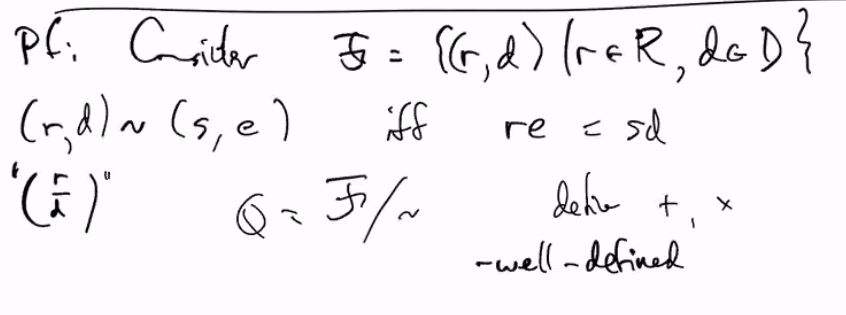

# Lec 23
### Proposition: Prime Ideal 
* An Ideal is prime iff the quotient is integral
* **(With ring with identity $1 \neq 0$)**

### Example:
* $Q : \frac{a}{b}$ as by quotient of an equialence of $Z^2$ 

### Example: Commutativity ring $R$ (possibly without $1$)
* Catch: If $R$ has zero divisors, then the quotient part is in trouble
  * say $bd = 0$ but $b \neq 0 \neq d$. 
  * thus shouldn't allow zero disvisiors for denominators
  * also the allowable denominators should be closed under multiplication

### Theorem: $R$ commutative ring (possibly without 1)
* Suppose $D \subseteq R$ s.t.  $D$ doesn't contain any zero divisors
  * $D$ doesn't have to be a ring
  * and $D$ is closed under multiplcation
* Then there is a commutative ring with 1 called $Q$ that contains $R$ and in which **every element of $D$** is a unit
  * i.e. for any $d \in D$, there is $1/d = d^{-1} \in Q$
    * (If $R$ is integral then this construct is a field)
    * (but why $Q$ is not a field?) Because we can have zero divisior
Moreover
1. $Q = \{ad^{-1} : a \in R, d \in D\}$
   1. if $D = R \ \{0\}$, then $Q$ is a field
      1. because $ad^{-1}$ has inverse $da^{-1}$ unless $a = 0$
   2. Q is the ring of fractions of $R$ (relative to $D$)
      1. field of fractions if $D = R \ \{0\}$
2. Uniquesness:
   1. $Q$ is the smallest ring containing $R$ in which all elements of $D$ are units
      1. specifically if $S$ a commutative ring with unit and $\phi:R \rightarrow S$ is an injective homomorphism
         1. then there is $\Phi|_R = \phi$
         2. and $\Phi$ is injective somehow
