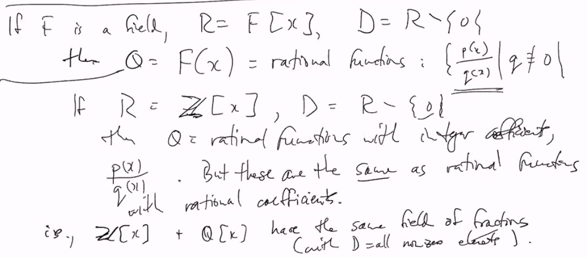
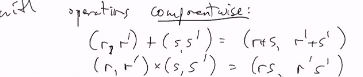
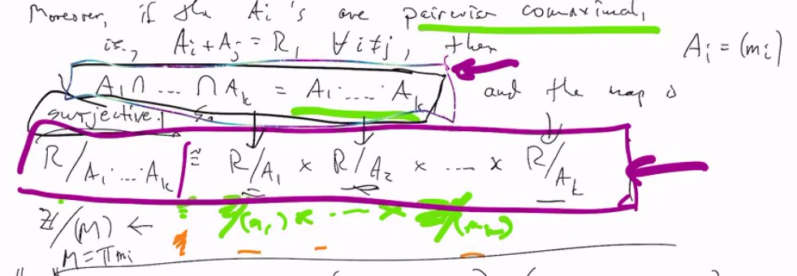

# Lec 24
### Example:
* $R = Z, D = Z \ \{0\}$
  * then $Q = \mathbb{Q}$
* If $F$ is a field, $R = F[x]$, $D = R \ \{0\}$
  * then $Q = F(x)=$ rational functions: $\{\frac{p(x)}{q(x)} | q \not \equiv 0\}$
  * If $R = Z[x], D = R\ \{0\}$
    * then $Q =$ rational functions with integer coefficient
    * but these are the same as rational functions with rational coefficient
      * i.e. $Z[x] , Q[x]$ has the same field of fractions with
      *   
      *   with $D=$ all non-zero elements 
  *   the reason behind it is fraction of $Z$ contains $Q$
*   If $R = 2Z$ even integers
    *   (commutative without 1)
    *   then with $D = R \{0\}$ we get
    *   $Q = \{\frac{2m}{2n} : m,n \in Z, n \neq 0\} = \{\frac{m}{n} : m,n \in Z, n \neq 0\} \ni 1$
        *   this is the example that $R$ without identity turns into fraction of field with identity
*  Given a commutative ring $R$
   *  and $d \in R$ s.t. $d \neq 0$
   *  and $d$ not  a zero divisor
      *  Let $D = \{d, d^2, d^3 ...\}$
   *  $Q = R[\frac{1}{d}] = \{a_n\frac{1}{d^n} + ... + a_1\frac{1}{d} + a_0 : a_i \in R\}$
### Example: localization
* In $Z$, choose a prime $p \in Z$
  * let $D = \{n \in Z : p \not | n\}$
    * note: if $m, n \in D$, i.e. $p \not | m$, $p \not | n$
    * then $p \not | mn$
      * thus $D$ is closed under multiplication
  * Then $Q \supseteq Z$, IN $Q$, every prime number $q \neq p$ is invertible
    * In $Q$, $(q) = Q$, for every $q \neq p$ because such a $q$ is a unit
    * also $(p)$ is a prime ideal and it is the only one
    * Moreover, $(p), (p^2),(p^3),...$ are **the only** ideals of $Q$
***
### Chinese Remainder Theorem (At a Ring Level)
* Simple form:
  * If $(m,n) = 1$
    * and $0 \le a < m, 0 \le b < n$
  * then $\exists ! k, 0 \le k < mn$
    * s.t. $k \equiv a \mod m$
      * and $k \equiv b \mod n$

***
### Example:
* m = 6, n = 5, a = 4, b = 2
  * want $0 \le k < 30$
    * s.t. $k \equiv 4 (6)$ $k \equiv 2 (5)$
* m = 2, n = 6, $(2,6) = (2)$
  * so $(m,n) = 1$ means $(m,n) = (1)$
  * a = 1, b = 4
    * mod 12: 
      * 4, 10 netiher is 1 mod 2
  * a = 0, both are 0 mod 2
### Chinese Remainder Theorem (more general)
* More generally
  * if $m_1,...,m_r$ are pairwise relatively prime
    * i.r. $(m_i , m_j) = 1$ for all $i \neq j$
  * and $0 \le a_i < m_i$ for all $i = 1,..,r$
    * Then modulo $M=\Pi_{i=1}^r m_i$ there is exactly one $k$
    * $0 \le k < M$ s.t. $k \equiv a_i \mod m_i$ for all $i = 1,..,r$
      * follows by induction from $r = 2...$ 
***
* For the rest of this lecture, $R$ is ommutative ring with 1

### Definition: Product Ring
* If $R, R'$ are two such rings, we define
  * $R \times R' = \{(r, r') : r \in R, r' \in R'\}$
  * with operations component wise
  * 
* So $R \times R'$ is a ring,
  * its zero is $(0, 0)$ unit as $(1,1')$

### Definition: comaxiomal
* $A, B$ are comaximal if $A + B = R$
  * a generalization of relatively prime in $Z$

### CRT: Chinese Remainder Theorem 
* Suppose $A_1,...,A_k$ are ideals in $R$
  * Define a map $R \rightarrow R / A_1 \times R / A_2 ... \times R / A_k$
  * $r \mapsto (r+A_1,..,r+A_k)$
* Then this map is a ring homomorphism (obvious as each component is homomorphism)
* with kernel $= A_1 \cap A_2..\cap A_k$
* Moreover
  * if the $A_i's$ are pairwise comaximal  (i.e. $A_i + A_j = R$)
    * then 
      1. $A_1\cap A_2...\cap A_k = A_1 \cdot ...\cdot A_k$
      2. and the map is surjective 
      3. $R/(A_1\cdot A_2 ... A_k) \cong R/A_1 \times R/A_2 \times ... R/A_k$
       1. 
          1. Purple box is implying the Chinese Remainder Theorem, as left hand side is the unique $k$, right hand side has each component $a_i$ 
* Pf:
  * kernel?
    * $r \mapsto (0,..,0) = (0+A_1,..,0+A_k) = (A_1,..,A_k)$ thus $r \in \bigcap A_i$
      * so kernel is $\bigcap A_i$
  * Suppose $A_i$ are pairwise comaximal
    * First with 2 ideals
      * i.e. $k=2$
    * $A_1 + A_2 = R$ s.t. $x \in A_1, y \in A_2, x + y = 1$
  * If $z \in A_1 \cap A_2$, then $z = z \cdot 1 = zx + zy \in A_1 A_2$
    * thus $A_1 \cap A_2 \subseteq A_1 A_2$
    * The other direction is trivial, 
    * and thus $A_1 \cap A_2 = A_1 A_2$
    * Then it is all easy induction for all $k$
  * Need to show the map is surjective
    * as above, only to show k = 2, x + y = 1 with $x \in A, y \in B$
    * $x \mapsto (0,1)$ and $y \mapsto (1,0)$
    * so to find $ay+bx \mapsto (ay+A, bx + B) = (a+A, b + B)$
    * leave to you about general $k$
  * Now we know kernel $=A_1 \cap A_2... \cap A_k = A_1 \cdot A_2 .. \cdot A_k$
    * so $R / (A_1 ... A_k) \cong R/A_1  \times ... \times R/A_k$
      * is proved by first isomorphism theorem
        * because surjective
### Corollary
* Suppose $n = p_1^{\alpha_1} ..  p_k^{\alpha_k}$, $p_i$'s distinct primes and $\alpha_1 > 0$
* then $Z/nZ \cong_{\text{ as ring }} Z/p_1^{\alpha_1}Z \times ... Z/p_k^{\alpha_k}Z$
  * $(Z/nZ)^\times \cong_{\text{ as ring }} (Z/p_1^{\alpha_1}Z)^\times \times ... (Z/p_k^{\alpha_k}Z)^\times$
    * $(Z/nZ)^\times$ means set of units
    * the times $\times$ on supscript means units
      * other $\times$ means product
### Recall: Euler function: $\phi$ function
* $\phi(n) = |(Z / nZ)^\times| =$ number of units
  * $=\phi(p_1^{\alpha_1}) \cdot ... \cdot \phi(p_k^{\alpha_k})$
* then what is $\phi(p^a)$?
  * all the unit inside , that is $p,2p,3p,..$
  * thus $\phi(p^a) =$ \# of units = $p^{a-1}(p-1)$
* $\phi(n) = p_1^{\alpha_1}(1-\frac{1}{p_1}) ... p_k^{\alpha_k}(1-\frac{1}{p_k}) = n \prod(1 - \frac{1}{p_i})$
* Also
  * if $(m,n) = 1$, $\phi(mn) = \phi(m)\phi(n)$
    * a function with this property is called multiplicative function
      * only distribute multiplication for coprime