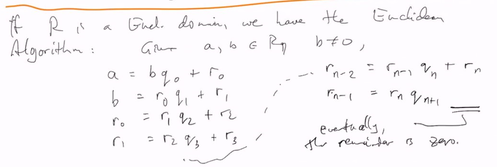

# Lec 25

### Here $R$ will always commutative and integral domain (unit and without zero divisor)
### Euclidean Algorithm

### Defintition: Norm
* A function $N : R \rightarrow \natnums_0 = \natnums \cup \{0\}$
  * is called a norm
    * provided $N(0) = 0$
* if $N(a) > 0$ for arbitrary $a \neq 0$ then $N$ is  positive norm

### Definition : Euclidean Domain
* $R$ is a Euclidean Domain
  * iff $\exisst a, N,$ s.t. "Not necessarily positive norm"
    * $\forall a,b \in R$ where $b \neq 0$ 
      * $\exists q, r$ s.t. $a = bq+r$ where $q$ is called quoteint, $r$ remainder
        * and $N(r) < N(b)$ unless $r = 0$
* Note: If $R$ is a Euclidean Domain "With a positive norm"
  * then there might be more than one norm that works
    * In fact, if $R$ is a euclidean domain w.r.t. $N$
      * then it is also a euclidean domain w.r.t $mN$ for arbitrary $m \in \natnums$ here $\natnums$ excludes 0

### Theorem:
* If $R$ is a Euclidean domain, we have the Euclidean alg:
  * given $a, b \in R, b \neq 0$
    * 
    * assume $r_n$ is the last non-zero remainder
      * ex in $\reals = Z$ $(a,b)$ ideal $(a,b) \subseteq (r_n)$
      * we can see that $r_{n-1}$ is also a multiple of $r_n$, then so is $r_{n-2}$ then ... both $a, b$ are
***
### Example:
* Any field is a Euclidean domain (don't need remainder)
* $Z$ is a Euclidean Domain 
* $F[x]$, $F$ any field, 
  * the norm is $N(f(x)) =$ degree of $f(x)$
    * if $f(x), g(x) \in F[x]$, $g(x) \neq 0$
      * then by long division, $f(x) = g(x)q(x) + r(x)$
        * for some $q(x), r(x)$ with deg(r(x)) < deg(g(x))
* Note: That the argument given above for $Z$ applies here to show that any ideal in $F[x]$ is principal
  * basically euclidean alg for Z gives a proof of PID
  * the number with smallest norm

### Defeinition: Principal Ideal Domain (PID)
* An integral domain in which every ideal is principal
  * is called PID

### Theorem: ED => PID 
* If $R$ is a Euclidean domain, then every ideal of $R$ is principal

### Example
* We saw that in $Z[x]$, $(x,p)$ is not principal if $p$ is prime
  * So $Z[x]$ is not a PID, so $Z[x]$ is not ED as well
  * so there are ring polynomial 
* It is easy to see that to check a ring is not a euclidean domain we need to enumerate all norm, which is impossble to do
  * but if we can show it is not a PID, then we can see it is not a euclidean domain easier
* $Z[i] = \{x + iy : x,y \in Z\}$ is in fact Euclidean, using the usual norm
  * $N(x + iy) = x^2 + y^2$
  * $Z[\sqrt{-5}] = \{x + \sqrt{-5} y : x, y \in Z \}$, not a PID
  * $Z[(1+\sqrt{-19})/2]$ is PID but not Euclidean

