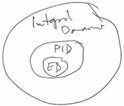

# Lec 26
# No semi-direct product; no fund theorem of abelian in TT3

### Mistake last week
* The true statement of Euclidean Alg.
  * $a = bq + r$ where
    * either $r = 0$ or $N(r) < N(b)$
### Example:
* Any field $F$ is a Euclidean with $N = 0$

### Definition: Divides
* For $R$ commutative
* If $a, b \in R$, $b \neq 0$
  * then we say $a$ is a multiple of $b$
    * if there is $y \in R$ s.t. $a = by$
  * in this case, we say $b$ divides $a$, $b | a$

### Definition:
* If $u, v \in R$ then $d$ is a greatest common divisor
  * $gcd$ of $u,v$ if
    1. $d| u, d| v$
    2. for arbitrary $d' | u, d' | v$  then $d' | d$ 
* Note : 
1. gcd is not in general unique
2. it is not the case that $a | b$ then $N(a) < N(b)$
### Trnaslation definition of gcd to "ideals"
* Given $a, b \in R$
  * let $I = (a,b) =$ ideal generated by $a,b$
    *  then $d = gcd(a,b)$ 
       *  when: for any $d'$ s.t. $I \subseteq (d')$ 
          *  $I \subseteq (d) \subseteq (d')$ 
       *  i.e. $I \subseteq (d) \subseteq (d')$
    *  smallest principal ideal contains $I$
*  But for some rings, gcd doesn't exist

### Prop:
* If $(a,b)$ is a prinicpal ideal $(d)$
  * then $d$ is one $gcd(a,b)$ (because there can be multiple gcds)

### Prop:
* In any integral domain $R$ (commutative and with unit!), if $(d) = (d')$
  * with $d, d' \in R$
    * then $d = ud'$ for some unit $u \in R^\times$
* If $d,d'$ are both $gcd(a,b)$ then $d= ud'$ for unit $u$

* Pf.
  * $(d) = (d')$ then $d = xd', d' = yd$ some $x, y \in R$, and thus $d = x y d$ so $(1-xy)d = 0$ thus $xy=1$ and $x,y$ are units 
    * unless $d = d' = 0$, holds trivially 

### Theorem: 
* If $R$ is a Euclidean Domain, given non-zero $a, b \in R$
  * we can perform the Euclidean Algorithm
    * if we let $d =$ last nonzero remainder, $r_n$
      * then $d$ is a $gcd(a,b)$
        * and $(a,b) = (d)$
  * In particular, $d=ax+by$ for some $x,y \in R$
* THis is different from Bezout Identity that
  * it applies to not only 1 (relatively prime)
  * and it is not iff
There is something called Bezout Domain, and on monic polynomial we can do something similar

***
### Definition
* a principal ideal domain PID is an integral domain
  * in which every ideal is principal
### Example
* Integers, $F[x]$
  * doesn't include $\mathbb{Z}[x], \mathbb{Z}[\sqrt{-5}]$
    * but $\mathbb{Z}[i]$ is actually ED $N(x)= |x|$ and thus PID
    * $(2,3i)$ is not

### Fact:
* $\mathbb{Z}[\frac{1 + \sqrt{-19}}{2}]$ is a PID 
  * but not a euclidean domain!!

### Prop:
* In a PID, a prime ideal must be maximal 
  * i.e. prime => maximal

Note
* Recall that in $F[x,y]$, $(x)$ is prime but not maximal, as it is contained in $(x) \subsetneq (x,y)$ 
  * this also means $F[x,y]$ not a PID
    * and thus $F[x_1,x_2,..,x_n]$ not a PID
    * But $F[x]$ is a PID
* pf. Suppose $(p)$ is a prime ideal, suppose it is not maximal, thus $(p) \subsetneq (m) \neq R$
    * thus $p \in (m)$ and thus $p = mx$ and thus $mx \in (p)$, since $(p)$ prime, thus $m \in (p)$ or $x \in (p)$
      * if $m \in (p)$, then $(m) = (p)$
      * if $x \in (p)$ thus $x = py$ and thus $mx = p = mpy$ thus $my = 1$ thus $y,m$ are both unit, thus $(m) = R$ again contradiction
### Corollary:
* Suppose $R$ is an integral domain
  * and if $R[x]$ is a PID, then $R$ is a field
* Pf: Consider $\phi: R[x] \rightarrow R := x \mapsto 0$ surjection
  * ker$(\phi) = (x)$ is prime
    * because $R/I$ is integral domain iff $I$ is a prime
    * , thus $(x)$ is maximal
  * Thus $R[x]/(x)$ is a ring/maximal ideal which is a field
***
* it is possible to have $(x)$ is not prime ideal and $R$ is zero divisor
  * say $(x+c)(x+d) \in (x)$ where $cd=0$
  * thus $R$ has to be an integral domain for the above corollary to hold

### PIDs' are not always Euclidean Domain
* the above fact
* 
***
* $(x,2) = \{p(x)*x + q(x)*2\} \subseteq Z[x]$ is not principal and thus $Z[x]$ is not pid
  * say $(2,x)$ is principal $=(d(x))$, thus $2 = q(x)d(x)$ which means $d(x),q(x)$ are both constants, that makes $x \not \in (d(x)) = (2,x)$ a contradiction
  * $(x,2) \neq (x+2)$
  * $F[x]$ is a Euclidean domain => PID
    * say $(x,2) =(1)$

***
* $Z[\sqrt{-5}]$ is not a PID, a lot of time $Z[\sqrt{d}]$ is pid but a lot of time it is not
  * it is because of some number theory

***
Test will cover until Thursday