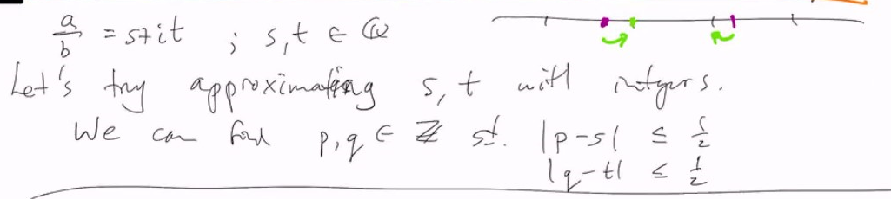
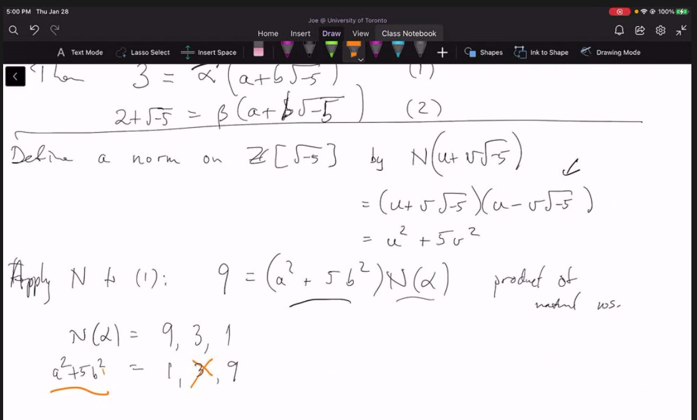
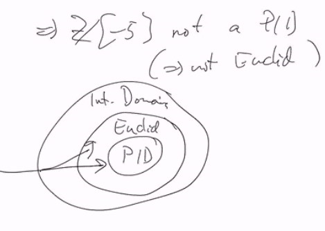

# Lec 27

## Announcement
* UFD is not going to be tested, no worry

## Ideal Multiplication
* $RI = I$? $RI \subseteq I$
* Basically $(r+I)(s+I) = rs +I$ is not set equality...
  * because RHS is not "surjectively mapped"
* Basically say $I = 3Z \subset X$, $(0+I)(0+I) = 9Z \neq 3Z = I$??

## $Z[i]$ is Gaussian Integers
* is a Euclidean domain, 
* $Z[i] \subseteq \Complex$
  * the norm is $N(a+bi) = a^2 + b^2$

***
* Given $a,b \in Z[i], b \neq 0$ then as complex numbers
  * we can devide $\frac{a}{b} \in \Complex$, but it may not be in $Z[i]$
* Still we can write $\frac{a}{b} = s + it$, with $s, t \in \mathbb{Q}$
  * 
  * $\frac{a}{b} = s + it = [p + iq] + (s-p) + (t-q)i$
    * where $[p+iq] \in Z[i]$
  * thus $a = b(p+iq) + b((s-p) + (t-q)i)$
    * each term above is in the ring (as $a - b(p+iq)$ is in the ring)
      * recall $N : \Complex \rightarrow \reals$ is multiplicative
      * Thus $N(b((s-p) + (t-q)i)) = N(b) ((s-p)^2 + (t-q)^2)$
        * $\le \frac{1}{2} N(b) < N(b)$ as above we bound $|p-s| \le \frac{1}{2}, |q-t| \le \frac{1}{2}$

***
* $Z\sqrt{-d}$ for $-d \in \{-2,-3,-7,-11\}$ can apply this argument and we will know it is Euclidean Domain
  * but not for $Z[\sqrt{-5}]$
## $Z[\sqrt{-5}]$ is not Euclidean
* actually $Z[\sqrt{-5}]$ is not a PID
  * $(3, 2+ \sqrt{-5})$ is not principal
    * suppose it is, say $(3, 2+ \sqrt{-5}) = (a+b\sqrt{-5})$
    * then 
    * 
* Then we define a norm $Z[\sqrt{-5}]$ by $N(u+v\sqrt{-5}) =(u+v\sqrt{-5})(u-v\sqrt{-5}) = u^2 + 5v^2$
  * read the book

### $Z[\frac{1 + \sqrt{-19}}{2}]$ is a PID but not euclidean
* proper includion
* thus we have field properly included in ED which are properly included PID included by
* 
  * it is again swapped